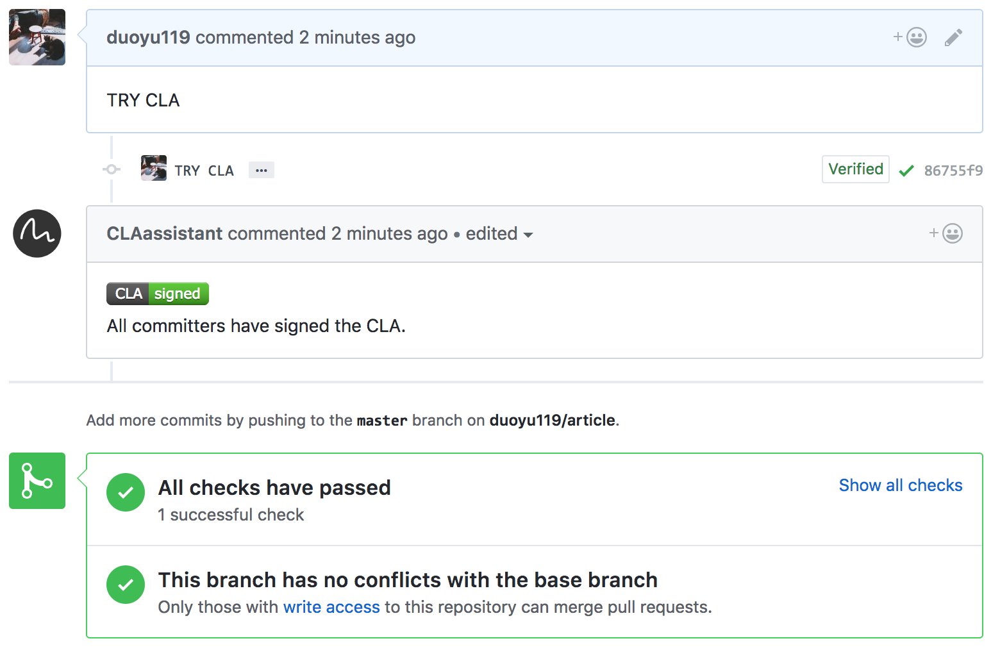

# The Contributor License Agreement

Tencent defines the legal status of the contributed code in a *Contributor License Agreement* (CLA).

Only original source code from CLA signatories can be accepted into TARS. 

------

## What am I agreeing to? 

This CLA allows either an individual or an entity (the "**Corporation**") to Submit Contributions to Tencent, to authorize Contributions Submitted by its employees or agents to Tencent (in the case of a Corporation), and to grant copyright and patent licenses thereto. 

It is important to read and understand this legal agreement.

## How do I sign?

1. Create a pull request, the system will remind you the CLA is not signed yet. Click the url. You will recive an email at the same time. 

2. Click to sign in with Github to agree.

3. That's it, for real!

## Ensure your Github e-mail address matches address used to sign CLA

Your Github email address **must match** the same address you use when signing the CLA. Github has [documentation](https://help.github.com/articles/setting-your-commit-email-address-on-github/) on setting email addresses.

You must also set your [git e-mail](https://help.github.com/articles/setting-your-email-in-git) to match this e-mail address as well.

If you've already submitted a PR you can correct your user.name and user.email and then use use `git commit --amend --reset-author` and then `git push --force` to correct the PR.
