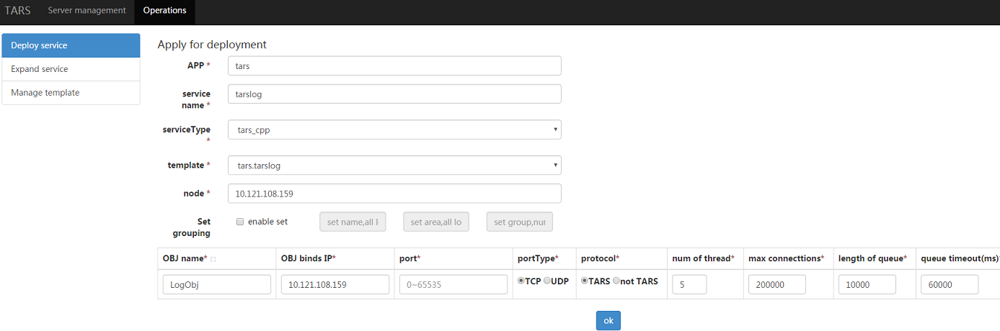
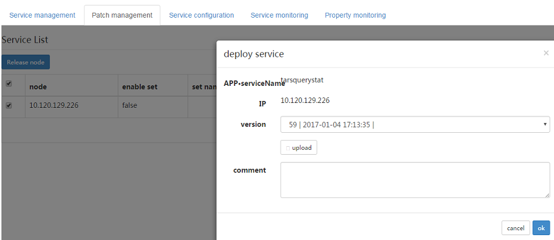

[点我查看中文版](Install.zh.md)  

[View History](ChangeList.md)

# Content  
> * [Dependent Environments](#chapter-1)  
> * [Install develop environment for C++](#chapter-2)  
> * [Tars framework Installation](#chapter-3)  
> * [Tars-web Description ](#chapter-4)
> * [Tars expansion and update](#chapter-5)  

This document describes the steps to deploy, run, and test Tars framework.

If you use Tars for production environment, the deployment steps are similar, but you need pay attention to fault-tolerance. You can join us for discussion in the QQ group code 579079160.  
  
## 1. <a id="chapter-1"></a>Dependent environments  
  
Software | Software requirements  
------|--------  
linux kernel version: | 2.6.18 or later (Dependent OS)  
gcc version: | 4.8.2 or later、glibc-devel（Dependent c++ framework tools）  
bison version: | 2.5 or later（Dependent c++ framework tools）  
flex version: | 2.5 or later（Dependent c++ framework tools）  
cmake version: | 2.8.8 or later（Dependent c++ framework tools）  
mysql version: | 4.1.17 or later（dependency of framework running）  
rapidjson version: | 1.0.2 or later（dependency of C++ framework）  
nvm version: | 0.35.1 or later（Dependent web management system, auto install while deploying）  
node version: | 12.13.0 or later（Dependent web management system, auto install while deploying）  
  
Hardware requirements: a machine running Linux.  
  
### 1.1. Install glibc-devel  
  
Install all dependency: gcc, glibc, bison, flex, cmake. 
  
For example, run this command in Centos:  
``` bash 
yum install glibc-devel gcc gcc-c++ bison flex cmake
```  
  
### 1.2. Install mysql  

There are two ways to install mysql. One is via source code and the other one is via yum. Both procedures are described below.

### 1.2.1 Install mysql via source code  
This step installs mysql via source code in order to set up configurations manually.  

Before installation, check whether ncurses and zlib have been installed. Execute these commands if not exist:  
```  bash
yum install ncurses-devel  
yum install zlib-devel  
```  
  
set the installation directory, switch to user root.  
```  bash
cd /usr/local  
mkdir mysql-5.6.26  
chown ${normal user}:${normal user} ./mysql-5.6.26  
ln -s /usr/local/mysql-5.6.26 /usr/local/mysql  
```  
  
Download mysql source (mysql-5.6.26), set charset to utf-8.  
```  bash
cd ${mysql_folder}  
wget https://dev.mysql.com/get/Downloads/MySQL-5.6/mysql-5.6.26.tar.gz  
tar -zxvf mysql-5.6.26.tar.gz  
cmake . -DCMAKE_INSTALL_PREFIX=/usr/local/mysql-5.6.26 -DWITH_INNOBASE_STORAGE_ENGINE=1 -DMYSQL_USER=mysql -DDEFAULT_CHARSET=utf8 -DDEFAULT_COLLATION=utf8_general_ci  
make  
make install  
```  
  
**Attention: If you use C++ to develop Tars service, please compile mysql as static library.**  
  
Now you can compile Tars framework of C++ version.  
  
If you need build runtime environment for Tars framework, pelease switch to mysql administrator user and config mysql with following steps:  
```bash  
yum install perl  
cd /usr/local/mysql  
useradd mysql  
rm -rf /usr/local/mysql/data  
mkdir -p /data/mysql-data  
ln -s /data/mysql-data /usr/local/mysql/data  
chown -R mysql:mysql /data/mysql-data /usr/local/mysql/data  
cp support-files/mysql.server /etc/init.d/mysql  
yum install -y perl-Module-Install.noarch  
perl scripts/mysql_install_db --user=mysql  
vim /usr/local/mysql/my.cnf  
```  
Here is an example of my.cnf:  
**Tips: As the system will load /etc/  
rm -rf /etc/my.cnf  
my.cnf first,you may delect the /etc/my.cnf or copy the essential information from the following example and paste to /ect/my.cnf. Otherwise it will not work.  
  
```bash  
[mysqld]  
  
# Remove leading # and set to the amount of RAM for the most important data  
# cache in mysql. Start at 70% of total RAM for dedicated server, else 10%.  
innodb_buffer_pool_size = 128M  
  
# Remove leading # to turn on a very important data integrity option: logging  
# changes to the binary log between backups.  
log_bin  
  
# These are commonly set, remove the # and set as required.  
basedir = /usr/local/mysql  
datadir = /usr/local/mysql/data  
# port = .....  
# server_id = .....  
socket = /tmp/mysql.sock  
  
bind-address=${your machine ip}  
  
# Remove leading # to set options mainly useful for reporting servers.  
# The server defaults are faster for transactions and fast SELECTs.  
# Adjust sizes as needed, experiment to find the optimal values.  
join_buffer_size = 128M  
sort_buffer_size = 2M  
read_rnd_buffer_size = 2M  
  
sql_mode=NO_ENGINE_SUBSTITUTION,STRICT_TRANS_TABLES  
  
```  
Start mysql  
```  sql
service mysql start  
chkconfig mysql on  
```  
Stop mysql  
``` sql
service mysql stop  
```  
Add mysql execution path to environment variable for path.  
``` bash 
vim /etc/profile  
PATH=$PATH:/usr/local/mysql/bin  
export PATH  
```  
Modify root's password  
```  bash
./bin/mysqladmin -u root password 'root@appinside'  
./bin/mysqladmin -u root -h ${hostname} password 'root@appinside'  
```  
  
  
Add mysql dynamic library path to environment variable for path.  
```  bash
vim /etc/ld.so.conf  
/usr/local/mysql/lib/  
ldconfig  
```  
========================  
  
The master-slave configuration for mysql can be found in the Internet.  
  
Grant authority to master  
```  sql
GRANT REPLICATION SLAVE ON *.* to 'mysql-sync'@'%' identified by 'sync@appinside'  
```  
Configure slave for replication:  
```  bash
change master to master_host='${slave Ip}',master_user='mysql-sync',master_password='sync@appinside' ,master_log_file='iZ94orl0ix4Z-bin.000004',master_log_pos=611;  
stop slave  
start slave  
show master status\G;  
show slave status\G;  
```  
  
### 1.2.2 Install mysql via yum  
This step allows you to download the mysql official yum repository.
  
The install scripts named mysql_install_db.sh included in version 5.6 have been deleted after version 5.7. Therefore, here comes the yum installation.  

The installation via yum is an easier way but with that you cannot adjust configs manually. If that is not what you want, the source code method is recommended.  

You can download mysql using wget. Below is an example downloading version 5.7, but you can change it to the desired version.
```  bash
wget -i -c http://dev.mysql.com/get/mysql57-community-release-el7-10.noarch.rpm  
yum -y install mysql57-community-release-el7-10.noarch.rpm  
yum -y install mysql-community-server  
yum -y install mysql-devel  
```  
If you have problems to install mysql with the above step, add the new mysql repository to local server with this yum command and then re-run the previous commands.  

```  bash
sudo yum localinstall https://dev.mysql.com/get/mysql57-community-release-el7-10.noarch.rpm  
```  
### 1.2.2.1 Configure mysql  

After installing mysql, start and check its status.  
  
```  sql
systemctl start mysqld.service  
systemctl status mysqld.service  
```  
  
mysql started and it's using port 3306 for the connection.  
  
Configure the mysql root password. mysql will generate a strong default password when it is started for the first time. The default password is shown in mysqld.log file. You can use the grep command below for showing the default mysql password.  
  
```  bash
grep "password" /var/log/mysqld.log  
```  
  
Connect to the mysql shell with the default password.  

You can't operate until changing the password. If your mysql version is later than 5.7, there are two ways to configure the strong password rules as follows:  

1. Set up a strong password  
2. Change the password rules as follows  
   
```  bash
set global validate_password_policy=0;  
set global validate_password_length=1;  
```  

Now replace the default password with a new password with a six-character minimum restriction.  

```  sql
ALTER USER 'root'@'localhost' IDENTIFIED BY '${your passwd}';  
flush privileges;  
```  
  
# 2. <a id="chapter-2"></a>Install develop environment for C++(Install TarsFramework necessary)

**Only install TarsFramework need this step, If you just write c++ service, You only need download tarscpp**

Download **TarsFramework** source code:
```  bash
cd ${source_folder}  
git clone https://github.com/TarsCloud/TarsFramework.git --recursive  
```  
  
Then change the directory to the build folder:   
```  bash
cd ${source_folder}  
git clone https://github.com/TarsCloud/TarsFramework.git --recursive  
cd ${source_folder}/TarsFramework/build  
chmod u+x build.sh  
./build.sh prepare  
./build.sh all  
```  
  
Be aware that the default mysql lib path that Tars use is /usr/local/mysql/ . If mysql is installed in a different path, please modify the files `TarsFramework/CMakeLists.txt` and `TarsFramework/tarscpp/CMakeLists.txt` directory before compiling. (You might change the mysql paths to:"/usr/include/mysql";"/usr/lib64/mysql")  
  
Recompile if needed.  
``` bash
./build.sh cleanall  
./build.sh all  
```  
  
Change to user root and create the installation directory.  
``` bash 
cd /usr/local  
mkdir tars  
chown ${normal user}:${normal user} ./tars/  
```  
  
Installation:
  
```  bash
cd ${source_folder}/build  
./build.sh install or make install  
```  

**The default install path is /usr/local/tars/cpp。**  
  
If you want to install on different path:  
```  
**modify tarscpp/CMakeLists.txt**  
**modify TARS_PATH in tarscpp/servant/makefile/makefile.tars**  
**modify DEMO_PATH in tarscpp/servant/script/create_tars_server.sh**  
```  

 
# 3 <a id="chapter-3"></a>Tars framework Installation 

## 3.1. Installation mode

**There are two Installation mode of TarsFramework:**

- centos7 automatic deploy, During the installation process, the network needs to download resources from the outside
- Make a docker image to complete the installation. The process of making a docker requires network download resources, but no external network is needed to start and run the docker image

**Tars Framework Installation Attentions:**

- During the installation process, because the tar web relies on nodejs, it will automatically download nodejs, NPM, PM2 and related dependencies, and set the environment variables to ensure that nodejs takes effect
- The version of nodejs currently downloads v12.13.0 by default
- If you have nodejs installed, you'd better uninstall it first

**Note: the compilation and installation of tarsframework needs to be completed**

Download tarsweb and copy to /usr/local/tars/cpp/deploy  (change dir name TarsWeb to web)

```
git clone https://github.com/TarsCloud/TarsWeb.git
mv TarsWeb web
cp -rf web /usr/local/tars/cpp/deploy/
```

for example, this is my files in /usr/local/tars/cpp/deploy:
```
[root@cb7ea6560124 deploy]# ls -l
total 52
-rw-rw-r-- 1 tars tars 1923 Nov  2 17:31 centos7_base.repo
-rwxrwxr-x 1 tars tars 1515 Nov  5 18:21 Dockerfile
-rwxrwxr-x 1 tars tars 2844 Nov  5 18:21 docker-init.sh
-rwxrwxr-x 1 tars tars  215 Nov  5 18:21 docker.sh
-rw-rw-r-- 1 tars tars  664 Nov  2 17:31 epel-7.repo
drwxrwxr-x 4 tars tars   30 Nov  2 17:31 framework
-rwxrwxr-x 1 tars tars 4599 Nov  8 09:41 linux-install.sh
-rw-rw-r-- 1 tars tars  191 Nov  2 17:31 MariaDB.repo
-rwxrwxr-x 1 tars tars  565 Nov  8 09:23 README.md
-rwxrwxr-x 1 tars tars  539 Nov  8 09:23 README.zh.md
-rwxrwxr-x 1 tars tars 9713 Nov  7 09:42 tars-install.sh
drwxrwxr-x 2 tars tars   44 Nov  7 10:04 tools
drwxr-xr-x 11 tars tars  4096 Oct 31 11:01 web
```

## 3.2. Basic description of TarsFramework

The framework can be deployed on a single machine or multiple machines. Multiple machines are in the mode of one master and many slaves. Generally, one master and one slave are enough:

- There can only be one master node and multiple slave nodes
- The master node will install by default: tarsadminregistry, tarspatch, tarsweb, and tarslog. These services will not be installed on the slave node
- The tarsAdminRegistry can only be a single point because it has publishing status)
- The tarslog can only be a single point, otherwise the remote logs will be scattered on multiple machines
- In principle, tarspatch and tarsweb can be multi-point. If they are deployed to multi-point, the /usr/local/app/patches directory needs to be shared among multiple computers (for example, through NFS). Otherwise, the service cannot be published normally
- You can later deploy the tarslog to a large hard disk server
- In practice, even if the master and slave nodes are hung, the normal operation of services on the framework will not be affected, only the publishing will be affected

After install, there will be five databases created: db_tars, db_tars_web, db_user_system, tars_stat and tars_property.  
  
- db_tars is the core database for framework, it consists of services info, service templates and service configuration, etc.  
- db_tars_web is the core database for tars web
- db_user_sysetm is user auth system for web
- tars_stat is the database for service monitor data.  
- tars_property is the database for service properties monitor data.  

After install, you will see the output of the install script:

```
 2019-10-31 11:06:13 INSTALL TARS SUCC: http://xxx.xxx.xxx.xxx:3000/ to open the tars web. 
 2019-10-31 11:06:13 If in Docker, please check you host ip and port. 
 2019-10-31 11:06:13 You can start tars web manual: cd /usr/local/app/web; npm run prd 
```
Open browser: http://xxx.xxx.xxx.xxx:3000/, If it goes well, you can see the web management platform.

**Note: after execution, you can check whether the nodejs environment variable is effective: node -- version. If the output is not v12.13.0, it means that the nodejs environment variable is not effective**

**If not, manually execute in centos: source ~/.bashrc or in ubuntu: source ~/.profile**

## 3.3. centos7 or ubuntu automatic deploy

enter /usr/local/tars/cpp/deploy, run:
```
chmod a+x linux-install.sh
./linux-install.sh MYSQL_HOST MYSQL_ROOT_PASSWORD INET REBUILD(false[default]/true) SLAVE(false[default]/true)
```

MYSQL_HOST: mysql ip address

MYSQL_ROOT_PASSWORD: mysql root password, note that root should not have special characters, for example: !, otherwise, there is a problem with shell script recognition, because it is a special character.

INET: The name of the network interface (as you can see in ifconfig, such as eth0) indicates the native IP bound by the framework. Note that it cannot be 127.0.0.1

REBUILD: Whether to rebuild the database is usually false. If there is an error in the intermediate installation and you want to reset the database, you can set it to true

SLAVE: slave node


For example, install three machines and one mysql(suppose: Master [192.168.7.151], slave [192.168.7.152], MySQL: [192.168.7.153])

Execute on the master node (192.168.7.151)

```
chmod a+x linux-install.sh
./linux-install.sh 192.168.7.153 tars2015 eth0 false false
```

Execute on the slave node (192.168.7.152)

```
chmod a+x linux-install.sh
./linux-install.sh 192.168.7.153 tars2015 eth0 false true
```

Refer to screen output for errors during execution. If there is an error, it can be executed repeatedly (usually download resource error)


## 3.4. Make docker

Objective: make the framework into a docker, and start the docker

make docker:
```
chmod a+x docker.sh
./docker.sh v1
```
docker finished, you can see the docker:tar-docker:v1

```
docker ps
```

You can publish the docker image to your machine and execute:

```
docker run -d --net=host -e MYSQL_HOST=xxxxx -e MYSQL_ROOT_PASSWORD=xxxxx \
        -eREBUILD=false -eINET=enp3s0 -eSLAVE=false \
        -v/data/tars:/data/tars \
        -v/etc/localtime:/etc/localtime \
        tars-docker:v1
```

MYSQL_HOST: mysql ip address

MYSQL_ROOT_PASSWORD: mysql root password

INET: The name of the network interface (as you can see in ifconfig, such as eth0) indicates the native IP bound by the framework. Note that it cannot be 127.0.0.1

REBUILD: Whether to rebuild the database is usually false. If there is an error in the intermediate installation and you want to reset the database, you can set it to true

SLAVE: slave node

Map three directories to the host:
- -v/data/tars:/data/tars, include tars application log, web log, patch directory

**If you want to deploy multiple nodes, just execute docker run... On different machines. Pay attention to the parameter settings**

**Here, you must use --net=host to indicate that the docker and the host are on the same network**

## 3.5. Core module

Tars Framework is ultimately made up of several core modules, such as:

```
[root@VM-0-7-centos deploy]# ps -ef | grep app/tars | grep -v grep
root       368     1  0 09:20 pts/0    00:00:25 /usr/local/app/tars/tarsregistry/bin/tarsregistry --config=/usr/local/app/tars/tarsregistry/conf/tars.tarsregistry.config.conf
root      9245 32687  0 09:29 ?        00:00:13 /usr/local/app/tars/tarsstat/bin/tarsstat --config=/usr/local/app/tars/tarsnode/data/tars.tarsstat/conf/tars.tarsstat.config.conf
root     32585     1  0 09:20 pts/0    00:00:10 /usr/local/app/tars/tarsAdminRegistry/bin/tarsAdminRegistry --config=/usr/local/app/tars/tarsAdminRegistry/conf/tars.tarsAdminRegistry.config.conf
root     32588     1  0 09:20 pts/0    00:00:20 /usr/local/app/tars/tarslog/bin/tarslog --config=/usr/local/app/tars/tarslog/conf/tars.tarslog.config.conf
root     32630     1  0 09:20 pts/0    00:00:07 /usr/local/app/tars/tarspatch/bin/tarspatch --config=/usr/local/app/tars/tarspatch/conf/tars.tarspatch.config.conf
root     32653     1  0 09:20 pts/0    00:00:14 /usr/local/app/tars/tarsconfig/bin/tarsconfig --config=/usr/local/app/tars/tarsconfig/conf/tars.tarsconfig.config.conf
root     32687     1  0 09:20 ?        00:00:22 /usr/local/app/tars/tarsnode/bin/tarsnode --locator=tars.tarsregistry.QueryObj@tcp -h 172.16.0.7 -p 17890 --config=/usr/local/app/tars/tarsnode/conf/tars.tarsnode.config.conf
root     32695     1  0 09:20 pts/0    00:00:09 /usr/local/app/tars/tarsnotify/bin/tarsnotify --config=/usr/local/app/tars/tarsnotify/conf/tars.tarsnotify.config.conf
root     32698     1  0 09:20 pts/0    00:00:14 /usr/local/app/tars/tarsproperty/bin/tarsproperty --config=/usr/local/app/tars/tarsproperty/conf/tars.tarsproperty.config.conf
root     32709     1  0 09:20 pts/0    00:00:12 /usr/local/app/tars/tarsqueryproperty/bin/tarsqueryproperty --config=/usr/local/app/tars/tarsqueryproperty/conf/tars.tarsqueryproperty.config.conf
root     32718     1  0 09:20 pts/0    00:00:12 /usr/local/app/tars/tarsquerystat/bin/tarsquerystat --config=/usr/local/app/tars/tarsquerystat/conf/tars.tarsquerystat.config.conf
```

- for master node: tarsAdminRegistry tarsnode tarsregistry tars-web must be alive, Other Tar services will be automatically pulled up by tarsnode
- For the slave node: tarsnode tarsregistry to be alive, other Tars services will be pulled by tarsnode起
- Tars web is a service implemented by nodejs, which consists of two services. For details, see the following chapters
- To ensure that the core service is started, it can be controlled through check.sh and configured in crontab

master:(add to contab)

```
* * * * * /usr/local/app/tars/check.sh master
```

slave:(add to contab)
```
* * * * * /usr/local/app/tars/check.sh 
```

**If you configure check.sh, you don't need to configure the tarsnode monitoring in the following chapters**


# 4. <a id="chapter-4"></a>Tars-web Description

## 4.1 Module description

After the tars framework is deployed, the tar web will be installed on the host node (the slave node will not be installed). The tar web is implemented by nodejs and consists of two services

view the modules of the tar Web:

```
pm2 list
```

Output:
```
[root@8a17fab70409 data]# pm2 list
┌────┬─────────────────────────┬─────────┬─────────┬──────────┬────────┬──────┬──────────┬──────────┬──────────┬──────────┬──────────┐
│ id │ name                    │ version │ mode    │ pid      │ uptime │ ↺    │ status   │ cpu      │ mem      │ user     │ watching │
├────┼─────────────────────────┼─────────┼─────────┼──────────┼────────┼──────┼──────────┼──────────┼──────────┼──────────┼──────────┤
│ 0  │ tars-node-web           │ 0.2.0   │ fork    │ 1602     │ 2m     │ 0    │ online   │ 0.1%     │ 65.1mb   │ root     │ disabled │
│ 1  │ tars-user-system        │ 0.1.0   │ fork    │ 1641     │ 2m     │ 0    │ online   │ 0.1%     │ 60.1mb   │ root     │ disabled │
└────┴─────────────────────────┴─────────┴─────────┴──────────┴────────┴──────┴──────────┴──────────┴──────────┴──────────┴──────────┘
```

**If PM2 cannot be found, the environment variable does not take effect. Please execute: CentOS: source ~ /. Bashrc or Ubuntu: source ~ /. Profile first. This file will be written during installation**

- tars-node-web: Tar Web homepage service, default binding 3000 port, Source code corresponding web directory

- tars-user-system: The authority management service is responsible for managing all relevant authorities, and is bound to port 3001 by default, Source code corresponding web/demo directory

tars-node-web calls tars-user-system to complete the relevant permission verification

Both web and demo are implemented by nodejs + Vue. If the viewing module in PM2 list fails to start, you can start it manually to locate the prompt:

**The web is implemented by nodejs + Vue. The final installation and operation directory is as follows:**

```
/usr/local/app/web
```

If pm2 list shows that tars-node-web and tars-user-system fail to start, you can enter the directory to locate the problem:

```
cd /usr/local/app/web/demo; npm run start
cd /usr/local/app/web; npm run start
```

npm run start starts the service. You can observe the output of the console. If there is a problem, you will be prompted

**Suggestions for formal operation: pm2 start tars-node-web; pm2 start tars-user-system**

## 4.2 Permission specification


After tar web is set up by default, there is an admin account by default. The password of the admin user needs to be changed for the first login.

Admin users can create other users and authorize other users (three kinds of permissions admin, operator, developer)

The capabilities of the three permissions are different. Admin permission has super management permission, operator operation and maintenance permission (including developer permission, which can be published), and developer (view)

Permissions can be precise to application or service level

## 4.3 Deployment instructions

The tars-node-web & tars-user-system is deployed on the same machine by default, and both are bound with 0.0.0.0 (that is, 127.0.0.1)

The tars-node-web accesses tar user system through localhost (127.0.0.1). If 127.0.0.1 is not bound, it has no permission. At this time, you need to modify the configuration of tar-user-system module (demo/config/loginConf.js), and open the white list: ignoreips

The login state of tars-node-web & tars-user-system is passed through a cookie, so it needs to be deployed under the same domain name.

If nginx agent is hung in front of the tars-node-web & tars-user-system and accessed through different domain names, two environment variables need to be specified to facilitate web demo interoperability

For example, the web's nginx entry domain name is http://user.tar.com, and the demo's nginx domain name is http://auth.tar.com, so you need to set the environment variable on the server:

```
export USER_CENTER_HOST=http://auth.tars.com
export COOKIE_DOMAIN=.tars.com
```

**COOKIE_DOMAIN must has .**

After setting the environment variable, you can access the tars-node-web & tars-user-system normally

# 5. <a id="chapter-5"></a>Tars Framework expansion and  update

## 5.1 Auto Update

- For the framework installed in the form of docker, it is recommended to update the docker as a whole, which is the most convenient way. Just upgrade the docker and restart it (Note: do not set rebuild to true, the database will be reset!!!)
- Using the linux-install.sh installation framework through source compilation, you can re execute linux-install.sh (Note: do not set rebuild to true, the database will be reset!!!)
- The expansion and update of tarsnode can be installed and updated online on the web platform (> = 1.3.1)

**If you need to update manually, you can refer to the following chapters to update each module manually**

## 5.2 tarsnode installation and update

After the successful installation of core infrastructure services, if you need to deploy services based on the tar framework on other machines, you need to install tarsnode on other node machines and connect to the framework before expanding and deploying services through the management platform.

If the service is only deployed on a machine for testing, this step can be ignored first, and then executed when the capacity needs to be expanded.

Create the deployment directory as follows:

```  shell
cd /usr/local/app
mkdir tars
chown ${normal user}:${normal user} ./tars/
```

copy tarsnode in master node to /usr/local/app/tars/ in this node

modify /usr/local/app/tars/tarsnode/conf/tars.tarsnode.config.conf

change localip to the ip of this machine

At the same time, change the IP of registry into the IP of TarsFramework machines
```
locator=tars.tarsregistry.QueryObj@tcp -h xxx2 -p 17890:tcp -h xxx2 -p 17890
```

Then execute the script and start the tarsnode
```
/usr/local/app/tars/tarsnode/util/start.sh
```

Configure a process monitoring in crontab to ensure that the tars framework service can be restarted after an exception occurs.

```
* * * * * /usr/local/app/tars/tarsnode/util/monitor.sh
```

**Note: the servers of the previously installed framework also needs to increase the monitoring of tarsnode**


## 5.3 Tar-web Update

**Update steps**

- Download the latest tars web code, overwrite: /usr/local/app/web
- modify web config: web/config/webConf.js, web/config/tars.conf, modify mysql host, user, password in dbConf, and registry.tars.com to tars framework ip
- moidfy demo config: web/demo/config/webConf.js, modify mysql host, user, password in dbConf
- modify web config: web/config/webConf.js, modify host to local machine ip
- cd web; npm install; cd demo; npm install
- restart web modules: pm2 restart tars-node-web; pm2 restart tars-user-system

**If db_tars_web and db_user_system are not exist in db, then create db first by web/sql/db_tars_web.sql and web/demo/sql/db_user_system.sql**

```
mysql -hxxx -pxxx -e 'create database db_tars_web'
mysql -hxxx -pxxx db_tars_web < web/sql/db_tars_web.sql

mysql -hxxx -pxxx -e 'create database db_user_system'
mysql -hxxx -pxxx db_user_system < web/sql/db_user_system.sql

```

## 5.4 Framework basic service update

There are two types of framework service installation:

One is core infrastructure services, which must be deployed manually,

```
Manually deployed core infrastructure services: tarsAdminRegistry, tarsregistry, tarsnode, tarsconfig, tarspatch

The installation package can be manually released (but cannot be released through the management platform)

make tarsAdminRegistry-tar
make tarsregistry-tar
make tarsconfig-tar
make tarspatch-tar

```

The update of the above package, such as uploading to the corresponding service, after decompression, overwrites the executable program under bin directory, such as updating tarsregistry:

```
tar xzf tarsregistry.tgz
cp -rf tarsregistry/bin/tarsregistry /usr/local/app/tars/tarsregistry/bin/tarsregistry
/usr/local/app/tars/tarsregistry/bin/util/start.sh
```

One is common basic service, which can be published through the management platform (just like common service).

```
Common basic services deployed through the management platform:：tarsstat, tarsproperty,tarsnotify, tarslog，tarsquerystat，tarsqueryproperty

After the package is manually released, it is released through the management platform:

make tarsstat-tar
make tarsnotify-tar
make tarsproperty-tar
make tarslog-tar
make tarsquerystat-tar
make tarsqueryproperty-tar
```
See Section 5.5 for details.


**Note that when deploying the management platform, you can select the correct service template (it is available by default. If there is no corresponding template, you can create it on the management platform. For specific service template content, please refer to the file under the source directory deploy/sql/template)**

### 5.5. Install general basic service for framework  


#### 5.5.1 Deploy and patch tarsnotify  
  
By default, tarsnofity is ready when install core basic service:  
  
  
  
Upload patch package：  
  
  
  
### 5.5.2 Deploy and patch tarsstat  
  
Deploy message:  
  
  
  
Upload patch package：  
  
  
  
### 5.5.3 Deploy and patch tarsproperty  
  
Deployment message:  
  
  
  
Upload patch package：  
  
  
  
#### 5.5.4 Deploy and patch tarslog  
  
Deployment message:  
  
  
  
Upload patch package：  
  
  
  
### 5.5.5 Deploy and patch tarsquerystat  
  
Deployment message:  
**Pay attention: please select non-Tars protocol, because web platform use json protocol to get service monitor info.**  
  
  
  
  
Upload patch package：  
  
  
  
#### 5.5.6 Deploy and patch tarsqueryproperty  
  
Deployment message:  
**Pay attention: please select non-Tars protocol, because web platform use json protocol to get service monitor info.**  
  
  
  
Upload patch package：  
  
  
  
Finally,there are some paths you may need to check for troubleshooting once the system doesn't work as you wish.  
(1) ${TarsWeb}/log  
(2) /usr/local/app/tars/app_log/tars

