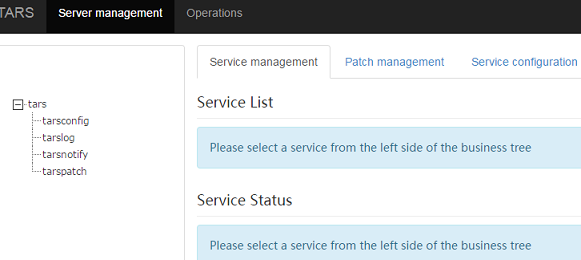
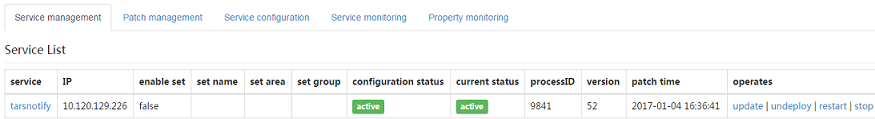
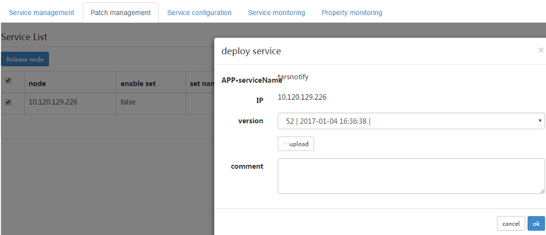
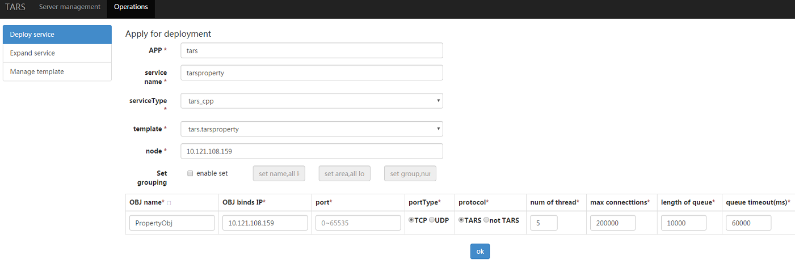
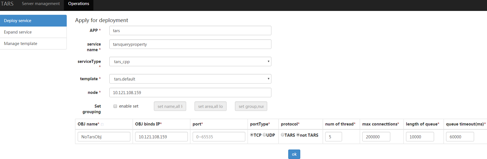
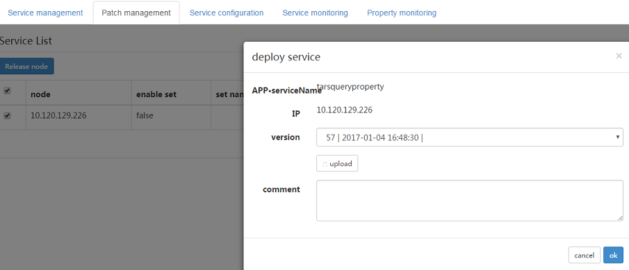

[点我查看中文版](Install.zh.md)

# Contents
> * [Environment Dependence](#chapter-1)
> * [Introduction of Tars's development environment installation](#chapter-2)
> * [Installation of Tars's DB environment](#chapter-3)
> * [Deploymen of the runtime environment for Tars framework](#chapter-4)


This doc described the steps of deploying Tars framework, aimed to make users have a whole cognition of deploy, running and test Tars framework.

If you use Tars for production environment, the deployment steps is similar, but you need pay more attention to fault-tolerant. You can join us for discussion, the QQ group code is 579079160.

# 1. <a id="chapter-1"></a>Dependent environments

Software | Software requirements
------|--------
linux kernel version:   |	2.6.18 or later (Dependent OS)
gcc version:            |   4.8.2 or later、glibc-devel（Dependent c++ framework tools）
bison version:          |	2.5 or later（Dependent c++ framework tools）
flex version:           |	2.5 or later（Dependent c++ framework tools）
cmake version:          |   2.8.8 or later（Dependent c++ framework tools）
mysql version:          |   4.1.17 or later（dependency of framework running）
rapidjson version:      |   1.0.2 or later（dependency of C++ framework）
nvm version:            |   0.33.11 or later（Dependent web management system）
node version:           |   8.11.3 or later（Dependent web management system）

Hardware requirements: a machine running Linux.

## 1.1. Install glibc-devel

If you don't have glibc, please install it first.

For example, run this command in Centos:
```
yum install glibc-devel
```

## 1.2. Install cmake

Cmake is the tool for compile tars.

Download cmake-2.8.8 source code, unzip:
```
tar zxvf cmake-2.8.8.tar.gz
```
Enter directory:
```
cd cmake-2.8.8
```
Steps as following(may `sudo root` first ):
```
./bootstrap
make
make install
```

## 1.3. Install mysql
Before installation, check whether ncurses and zlib have been installed. Execute these commands if not exist:
```
yum install ncurses-devel
yum install zlib-devel
```

set the installation directory, switch to user root.
```
cd /usr/local
mkdir mysql-5.6.26
chown ${normal user}:${normal user} ./mysql-5.6.26
ln -s /usr/local/mysql-5.6.26 /usr/local/mysql
```

Download mysql source (mysql-5.6.26), set charset to utf-8.
```
cmake . -DCMAKE_INSTALL_PREFIX=/usr/local/mysql-5.6.26 -DWITH_INNOBASE_STORAGE_ENGINE=1 -DMYSQL_USER=mysql -DDEFAULT_CHARSET=utf8 -DDEFAULT_COLLATION=utf8_general_ci
make
make install
```

**Attention: If you use C++ to develop Tars service, please compile mysql as static library.**

Now you can compile Tars framework of C++ version.

If you need build runtime environment for Tars framework, pelease switch to mysql administrator user and config mysql with following steps:
```shell
yum install perl
cd /usr/local/mysql
useradd mysql
rm -rf /usr/local/mysql/data
mkdir -p /data/mysql-data
ln -s /data/mysql-data /usr/local/mysql/data
chown -R mysql:mysql /data/mysql-data /usr/local/mysql/data
cp support-files/mysql.server /etc/init.d/mysql
yum install -y perl-Module-Install.noarch
perl scripts/mysql_install_db --user=mysql
vim /usr/local/mysql/my.cnf
```
Here is an example of my.cnf:

```cnf
[mysqld]

# Remove leading # and set to the amount of RAM for the most important data
# cache in MySQL. Start at 70% of total RAM for dedicated server, else 10%.
innodb_buffer_pool_size = 128M

# Remove leading # to turn on a very important data integrity option: logging
# changes to the binary log between backups.
log_bin

# These are commonly set, remove the # and set as required.
basedir = /usr/local/mysql
datadir = /usr/local/mysql/data
# port = .....
# server_id = .....
socket = /tmp/mysql.sock

bind-address={$your machine ip}

# Remove leading # to set options mainly useful for reporting servers.
# The server defaults are faster for transactions and fast SELECTs.
# Adjust sizes as needed, experiment to find the optimal values.
join_buffer_size = 128M
sort_buffer_size = 2M
read_rnd_buffer_size = 2M

sql_mode=NO_ENGINE_SUBSTITUTION,STRICT_TRANS_TABLES

```
Start mysql
```
service mysql start
chkconfig mysql on
```
Stop mysql
```
service mysql stop
```
Add mysql execution path to environment variable for path.
```
vim /etc/profile
PATH=$PATH:/usr/local/mysql/bin
export PATH
```
Modify root's password
```
./bin/mysqladmin -u root password 'root@appinside'
./bin/mysqladmin -u root -h ${hostname} password 'root@appinside'
```


Add mysql dynamic library path to environment variable for path.
```
vim /etc/ld.so.conf
/usr/local/mysql/lib/
ldconfig
```
========================

The master-slave configuration for mysql can be found in internet.

Grant authority to master
```
GRANT REPLICATION SLAVE ON *.* to 'mysql-sync'@'%' identified by 'sync@appinside'
```
Configure slave for replication
```
change master to master_host='${slave Ip}',master_user='mysql-sync',master_password='sync@appinside' ,master_log_file='iZ94orl0ix4Z-bin.000004',master_log_pos=611;
stop slave
start slave
show master status\G;
show slave status\G;
```

# 2. <a id="chapter-2"></a>Install develop environment for Tars
## 2.1. Install develop environment for web management system
For linux：

Nvm script installation provided by the official website

Execute the following command
```
wget -qO- https://raw.githubusercontent.com/creationix/nvm/v0.33.11/install.sh | bash
source ~/.bashrc
```

Install node and process manager pm2 for node applications with load function
```
nvm install v8.11.3
npm install -g pm2 --registry=https://registry.npm.taobao.org
```

## 2.2. Install develop environment for C++
Download TarsFramework source

Then change to build.
```
cd {$source_folder}/build
chmod u+x build.sh
./build.sh prepare
./build.sh all
```
**Be care that the default mysql lib path which Tars use is /usr/local/mysql/ .
If mysql is installed in different path, please modify the file CMakeLists.txt in `build` directory before compile.**

Recompile if needed
```
./build.sh cleanall
./build.sh all
```

Change to user root, create the installation directory.
```
cd /usr/local
mkdir tars
chown ${normal user}:${normal user} ./tars/
```

installation
```
cd {$source_folder}/build
./build.sh install or make install
```
**The default install path is /usr/local/tars/cpp。**

**If you want to install on different path：**
```
**modify tarscpp/CMakeLists.txt**
**modify TARS_PATH in tarscpp/servant/makefile/makefile.tars**
**modify DEMO_PATH in tarscpp/servant/script/create_tars_server.sh**
```

# 3. <a id="chapter-3"></a>Initialize the db environment for Tars
## 3.1. Add user
```sql
grant all on *.* to 'tars'@'%' identified by 'tars2015' with grant option;
grant all on *.* to 'tars'@'localhost' identified by 'tars2015' with grant option;
grant all on *.* to 'tars'@'${hostname}' identified by 'tars2015' with grant option;
flush privileges;
```
**Attention: Modify ${'localhost'} to real hostname from /etc/hosts.**

## 3.2. Create DB
Search the ip in the script under `framework/sql`,and replace with the above ip.

```
sed -i "s/192.168.2.131/${your machine ip}/g" `grep 192.168.2.131 -rl ./*`
sed -i "s/db.tars.com/${your machine ip}/g" `grep db.tars.com -rl ./*`
```

Execute
```
chmod u+x exec-sql.sh
./exec-sql.sh
```

After execution of the script, there will be three databases created: db_tars, tars_stat and tars_property.

db_tars is the core database for framework, it consists of services info, service templates and service configuration, etc.
tars_stat is the database for service monitor data.

tars_property is the database for service properties monitor data.

# 4. <a id="chapter-4"></a>Build runtime environment for Tars framework

## 4.1. Packing the basic framework service


There are two kinds of framework services: 
One is basic core service(required), must be deployed by yourself.
The other is basic general service, must be patched by management system.

```
The basic core services: 
tarsAdminRegistry, tarsregistry, tarsnode, tarsconfig, tarspatch
The basic general services:
tarsstat, tarsproperty,tarsnotify, tarslog，tarsquerystat，tarsqueryproperty
```
First get the core services package, change to build directory and input:
```
make framework-tar
```
Framework.tgz will be created in current directory
It contains tarsAdminRegistry, tarsregistry, tarsnode, tarsconfig and tarspatch deployment files.

Then make the general service package:
```
make tarsstat-tar
make tarsnotify-tar
make tarsproperty-tar
make tarslog-tar
make tarsquerystat-tar
make tarsqueryproperty-tar
```
The patch package can be deploy after the patch of management platform, see details in chapter 4.4

## 4.2. Install basic core service for framework
## 4.2.1. Install basic core service

Change to user root, and create the deploy directory for basic service:
```  shell
cd /usr/local/app
mkdir tars
chown ${normal user}:${normal user} ./tars/
```
Copy the framework service package to /usr/local/app/tars/ and unzip:
``` shell
cp build/framework.tgz /usr/local/app/tars/
cd /usr/local/app/tars
tar xzfv framework.tgz
```

Modify the configuration file in corresponding conf directory for each service, pay attention
to modify the ip address to your host's address:
``` shell
cd /usr/local/app/tars
sed -i "s/192.168.2.131/${your_machine_ip}/g" `grep 192.168.2.131 -rl ./*`
sed -i "s/db.tars.com/${your_machine_ip}/g" `grep db.tars.com -rl ./*`
sed -i "s/registry.tars.com/${your_machine_ip}/g" `grep registry.tars.com -rl ./*`
sed -i "s/web.tars.com/${your_machine_ip}/g" `grep web.tars.com -rl ./*`
```
Execute tars_install.sh script in directory /usr/local/app/tars/ to start tars framework service:
```
chmod u+x tars_install.sh
tars_install.sh
```
**If services are deployed on different machines, you need to deal with tars_install.sh script things manually.**

Deploy management platform and launch web management platform to deploy tarspatch (the management platform and tarspatch must in the same machine), change to user root and execute:
```
tarspatch/util/init.sh
```
**Play attention, after executing of above script, check if rsync alive.**

Deploy tarspatch on management platform.
Deploy tarsconfig on management platform.

you need configure monitor for tarsnode by crontab, ensure it'll be launched after crash:
```
* * * * * /usr/local/app/tars/tarsnode/util/monitor.sh
```

## 4.2.2. Install tarsnode before scale up

After success of basic core service installation, if you need to deploy tars-based service on different machine,
install tarsnode first.

If you only deploy service on a single machine, ignore this section.

The details are similar to those described in last section.
Change to user root, create the directory for deploy service in, as following:
```  shell
cd /usr/local/app
mkdir tars
chown ${normal user}:${normal user} ./tars/
```

Copy the framework service package to /usr/local/app/tars/:
``` shell
cp build/framework.tgz /usr/local/app/tars/
cd /usr/local/app/tars
tar xzfv framework.tgz
```
Modify the configuration file in corresponding conf directory for each service, don't forget
to modify the ip address to your host's address:
``` shell
cd /usr/local/app/tars
sed -i "s/192.168.2.131/${your_machine_ip}/g" `grep 192.168.2.131 -rl ./*`
sed -i "s/db.tars.com/${your_machine_ip}/g" `grep db.tars.com -rl ./*`
sed -i "s/registry.tars.com/${your_machine_ip}/g" `grep registry.tars.com -rl ./*`
sed -i "s/web.tars.com/${your_machine_ip}/g" `grep web.tars.com -rl ./*`
```
```
chmod u+x tarsnode_install.sh
tarsnode_install.sh
```

Configure a checking crontab for tarsnode,ensuring it's always alive:
```
* * * * * /usr/local/app/tars/tarsnode/util/monitor.sh
```

## 4.3. Install web management system

> The name of the directory where management system source code in is **web**

Modify the configuration file and change the IP address in the configuration file to the local IP address, as follows:
```
cd web
sed -i 's/db.tars.com/${your_machine_ip}/g' config/webConf.js
sed -i 's/registry.tars.com/${your_machine_ip}/g' config/tars.conf
```

Install web management page dependencies, start web
```
cd web
npm install --registry=https://registry.npm.taobao.org
npm run prd
```

Create log directory
```
mkdir -p /data/log/tars
```

Visit the website, input ${your machine ip}:3000 into browser:



## 4.4. Install general basic service for framework
### 4.4.1 Deploy and patch tarsnotify

By default, tarsnofity is ready when install core basic service:



Upload patch package：



### 4.4.2 Deploy and patch tarsstat

Deploy message:


Upload patch package：


### 4.4.3 Deploy and patch tarsproperty

Deployment message:



Upload patch package：


### 4.4.4 Deploy and patch tarslog

Deployment message:


Upload patch package：


### 4.4.4 Deploy and patch tarsquerystat

Deployment message:


**Pay attention: please select non-Tars protocol, because web platform use json protocol to get service monitor info.**

Upload patch package：


### 4.4.4 Deploy and patch tarsqueryproperty

Deployment message:



**Pay attention: please select non-Tars protocol, because web platform use json protocol to get service monitor info.**

Upload patch package：


