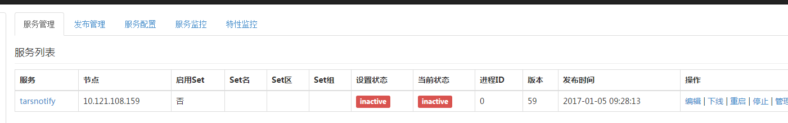
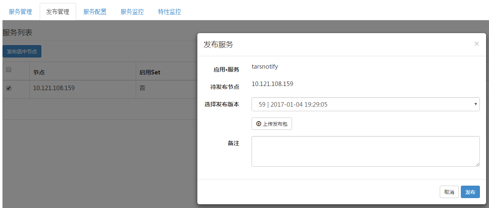
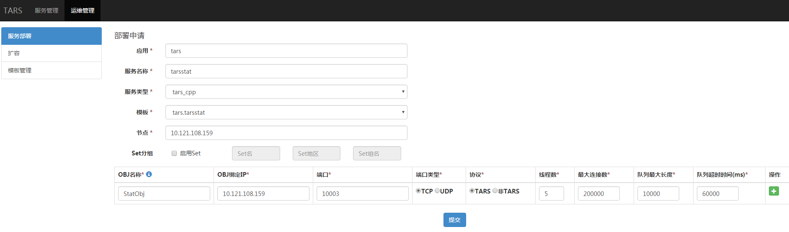
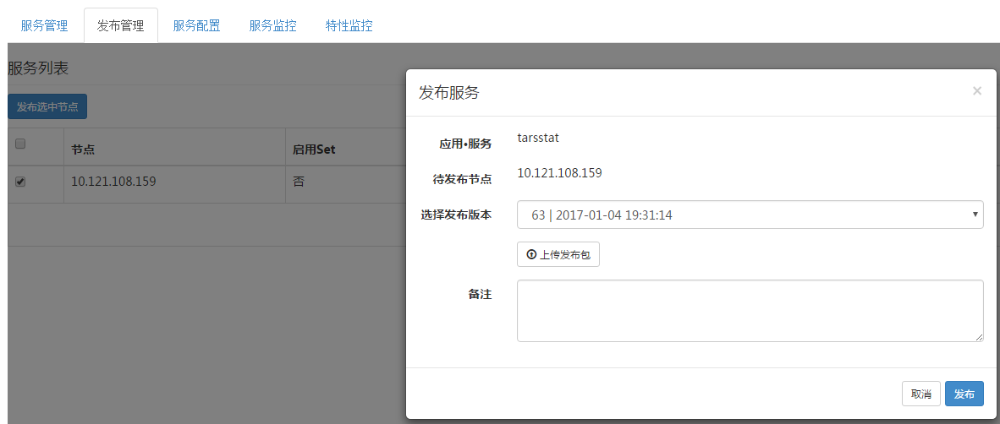
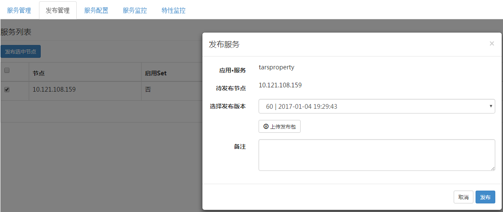
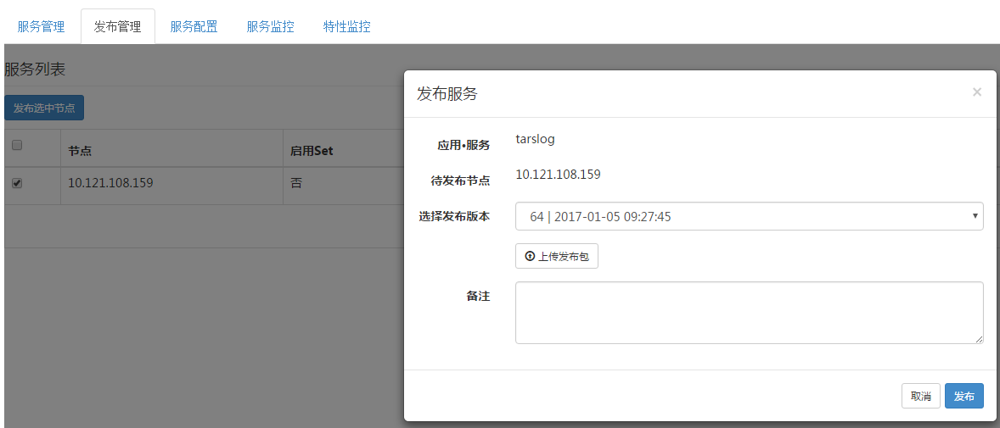
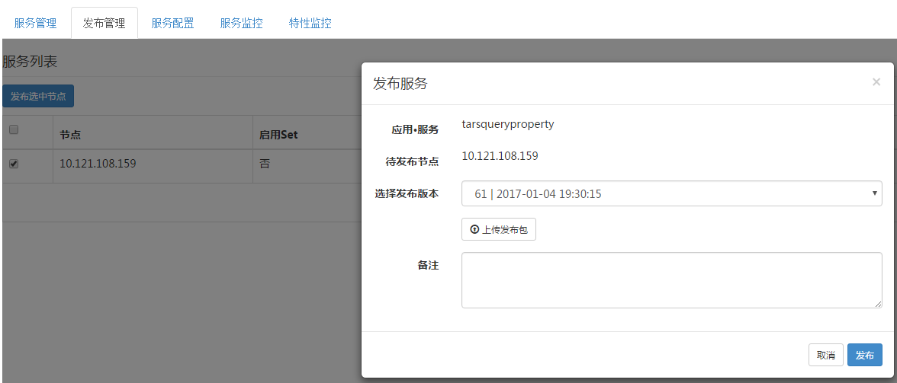

[Click me switch to English version](Install.md)

[查看变更历史](ChangeList.md)

# 目录
> * [依赖环境](#chapter-1)
> * [Tars C++开发环境](#chapter-2)
> * [Tars框架安装](#chapter-3)
> * [Tars-web说明](#chapter-4)
> * [框架扩容及更新](#chapter-5)

本安装文档描述在一台或多台服务器上安装搭建整个Tars框架的过程，目的是为了让用户对Tars框架的部署搭建、运行、测试等有个整体的认识。

如要用于线上环境，部署安装的原理是一样，不过需要更多考虑分布式系统下服务的部署需要有容错、容灾等的能力。若有需要，可以加入tars的qq技术交流群：579079160。

# 1. <a id="chapter-1"></a>依赖环境

软件 |软件要求
------|--------
linux内核版本:      |	2.6.18及以上版本（操作系统依赖）
gcc版本:          	|   4.8.2及以上版本、glibc-devel（c++语言框架依赖）
bison工具版本:      |	2.5及以上版本（c++语言框架依赖）
flex工具版本:       |	2.5及以上版本（c++语言框架依赖）
cmake版本：       	|   2.8.8及以上版本（c++语言框架依赖）
mysql版本:          |   4.1.17及以上版本（框架运行依赖）
rapidjson版本:      |   1.0.2版本（c++语言框架依赖）
nvm版本：           |   0.35.1及以上版本（web管理系统依赖, 脚本安装过程中自动安装）
node版本：          |   12.13.0及以上版本（web管理系统依赖, 脚本安装过程中自动安装）

运行服务器要求：1台普通安装linux系统的机器即可。

## 1.1. 编译包依赖下载安装介绍

源码编译过程需要安装:gcc, glibc, bison, flex, cmake

例如，在Centos7下，执行：
```
yum install glibc-devel gcc gcc-c++ bison flex cmake
```

## 1.2. Mysql安装
下面提供两种安装方式，源码安装和yum安装
### 1.2.1 源码安装

源码安装可以对数据库进行自定义。

安装前，确定系统是否安装了ncurses、zlib，若没有，可以执行：
```
yum install ncurses-devel
yum install zlib-devel
```

设置安装目录，切换至root用户
```
cd /usr/local
mkdir mysql-5.6.26
chown ${普通用户}:${普通用户} ./mysql-5.6.26
ln -s /usr/local/mysql-5.6.26 /usr/local/mysql
```

用utf8的安装方式
下载mysql源码（这里使用的是mysql-5.6.26）,用utf8的安装方式mysql，解压后编译：
下面增加了mysql-5.6.26的安装方式
```
cd ${mysql安装目录}
wget https://dev.mysql.com/get/Downloads/MySQL-5.6/mysql-5.6.26.tar.gz
tar -zxvf mysql-5.6.26.tar.gz
cmake . -DCMAKE_INSTALL_PREFIX=/usr/local/mysql-5.6.26 -DWITH_INNOBASE_STORAGE_ENGINE=1 -DMYSQL_USER=mysql -DDEFAULT_CHARSET=utf8 -DDEFAULT_COLLATION=utf8_general_ci
make
make install
```
**注意，对于用Tars的c++进行开发编译的服务，mysql建议采用静态库，源码编译，避免所有服务器都要安装mysql的动态库。**


对于在服务器用Tars的c++进行开发编译服务代码而言，经过上面步骤就可以进行编译安装Tars开发框架了。

若要是搭建Tars框架的运行环境，需要以下步骤，切换至root用户，对mysql进行配置。
```shell
yum install perl
cd /usr/local/mysql
useradd mysql
rm -rf /usr/local/mysql/data
mkdir -p /data/mysql-data
ln -s /data/mysql-data /usr/local/mysql/data
chown -R mysql:mysql /data/mysql-data /usr/local/mysql/data
cp support-files/mysql.server /etc/init.d/mysql
**如果/etc/目录下有my.cnf存在，需要把这个配置删除了**
rm -rf /etc/my.cnf
yum install -y perl-Module-Install.noarch
perl scripts/mysql_install_db --user=mysql
vim /usr/local/mysql/my.cnf
```
补充了上面删除my.cnf的命令
rm -rf /etc/my.cnf

给一个my.cnf配置实例：

```cnf
[mysqld]

# Remove leading # and set to the amount of RAM for the most important data
# cache in MySQL. Start at 70% of total RAM for dedicated server, else 10%.
innodb_buffer_pool_size = 128M

# Remove leading # to turn on a very important data integrity option: logging
# changes to the binary log between backups.
log_bin

# These are commonly set, remove the # and set as required.
basedir = /usr/local/mysql
datadir = /usr/local/mysql/data
# port = .....
# server_id = .....
socket = /tmp/mysql.sock

bind-address=${your machine ip}

# Remove leading # to set options mainly useful for reporting servers.
# The server defaults are faster for transactions and fast SELECTs.
# Adjust sizes as needed, experiment to find the optimal values.
join_buffer_size = 128M
sort_buffer_size = 2M
read_rnd_buffer_size = 2M

sql_mode=NO_ENGINE_SUBSTITUTION,STRICT_TRANS_TABLES

```
**注意将bind-address改为部署机器的IP**

启动mysql
```
service mysql start
chkconfig mysql on
```
结束mysql
```
service mysql stop
```
添加mysql的bin路径
```
vim /etc/profile
PATH=$PATH:/usr/local/mysql/bin
export PATH
```
修改root密码(采用root密码)
```
./bin/mysqladmin -u root password 'root@appinside'
./bin/mysqladmin -u root -h ${主机名} password 'root@appinside'
```
**注意${主机名}需要修改成自身机器的名称，可以通过查看/etc/hosts**


添加mysql库路径
```
vim /etc/ld.so.conf
/usr/local/mysql/lib/
ldconfig
```

mysql主从配置可以参考网上教程

master赋予权限:
```
GRANT REPLICATION SLAVE ON *.* to 'mysql-sync'@'%' identified by 'sync@appinside'
```
slave设置主备同步项
```
change master to master_host='${备机Ip}',master_user='mysql-sync',master_password='sync@appinside' ,master_log_file='iZ94orl0ix4Z-bin.000004',master_log_pos=611;
stop slave
start slave
show master status\G;
show slave status\G;
```
**注意${备机Ip}需要修改成备机数据库的Ip**


### 1.2.2 yum安装
在mysql 5.7版本之后删除了源码中的mysql_install_db.sh安装脚本，因此上述方法不适用。
yum安装相对便捷，但是没办法实现自定义安装。如果对自定义安装有需求的请使用源码安装。
#### 1.2.2.1 从yum repository安装mysql
```
wget -i -c http://dev.mysql.com/get/mysql57-community-release-el7-10.noarch.rpm
yum -y install mysql57-community-release-el7-10.noarch.rpm
yum -y install mysql-community-server
yum -y install  mysql-devel
```
这样mysql就安装好了
其中wget中的库地址可以根据需要替换版本号
如果wget无法安装，可以尝试按照下述步骤将mysql repository添加到本地服务，然后再重新执行上述命令
```
sudo yum localinstall https://dev.mysql.com/get/mysql57-community-release-el7-10.noarch.rpm
```
#### 1.2.2.2 设置mysql
启动mysql并查看运行状态

```
systemctl start  mysqld.service
systemctl status mysqld.service
```
mysql开始运行并通过3306端口进行连接。

通过yum安装mysql的话root账号会默认设置一个密码，可以通过下面的方式获得。
```
grep "password" /var/log/mysqld.log
```
使用这个密码登陆root的账户。mysql要求必须更改密码才能做数据库操作。
如果你安装的mysql版本是5.7及以上，mysql的密码设置有安全性要求(长度、大小写、特殊字符)，以下两种方式可以选择
1. 设置满足要求的密码
2. 通过下面的方式降低密码安全性规则
```
mysql> set global validate_password_policy=0;
mysql> set global validate_password_length=1;
```
修改之后只有6个字符的最小长度限制
接着修改密码
```
mysql> ALTER USER 'root'@'localhost' IDENTIFIED BY '${your password}';
```

# 2. <a id="chapter-2"></a>Tars C++开发环境(源码安装框架必备)

**源码安装框架才需要做这一步, 如果只是用c++写服务, 只需要下载tarscpp代码即可**
下载TarsFramework源码


```
cd ${source_folder}
git clone https://github.com/TarsCloud/TarsFramework.git --recursive
```


然后进入build源码目录
```
cd ${source_folder}/TarsFramework/build
chmod u+x build.sh
./build.sh prepare
./build.sh all
```

**编译时默认使用的mysql开发库路径：include的路径为/usr/local/mysql/include，lib的路径为/usr/local/mysql/lib/**

若mysql开发库的安装路径不在默认路径需要修改CMakeLists文件中mysql开发库的路径。CMakeLists在`${source_folder}/TarsFramework/`和`${source_folder}/TarsFramework/tarscpp/` 目录下各有一个同名文件。
修改文件中上述路径为本机mysql开发库的路径
(参考路径："/usr/include/mysql"；"/usr/lib64/mysql")。


如果需要重新编译
```
./build.sh cleanall
./build.sh all
```

切换至root用户，创建安装目录
```
cd /usr/local
mkdir tars
chown ${普通用户}:${普通用户} ./tars/
```

安装
```
cd ${source_folder}/build
./build.sh install或者make install
```
**默认的安装路径为/usr/local/tars/cpp**

**如要修改安装路径:**
```
**需要修改tarscpp目录下CMakeLists.txt文件中的安装路径。**
**需要修改tarscpp/servant/makefile/makefile.tars文件中的TARS_PATH的路径**
**需要修改tarscpp/servant/script/create_tars_server.sh文件中的DEMO_PATH的路径**
```

# 3 <a id="chapter-3"></a>Tars框架安装

## 3.1. 框架安装模式

**框架有两种模式:**

- centos or ubuntu一键部署, 安装过程中需要网络从外部下载资源
- 制作成docker镜像来完成安装, 制作docker过程需要网络下载资源, 但是启动docker镜像不需要外网

**框架安装注意事项:**

- 安装过程中, 由于tars-web依赖nodejs, 所以会自动下载nodejs, npm, pm2以及相关的依赖, 并设置好环境变量, 保证nodejs生效.
- nodejs的版本目前默认下载的v12.13.0
- 如果你本机以及安装了nodejs, 最好卸载掉

**注意:需要完成TarsFramework的编译和安装**

下载tarsweb并copy到/usr/local/tars/cpp/deploy目录下(注意目录名是web, 不要搞错!):

```
git clone https://github.com/TarsCloud/TarsWeb.git
mv TarsWeb web
cp -rf web /usr/local/tars/cpp/deploy/
```

例如, 这是/usr/local/tars/cpp/deploy下的文件:
```
[root@cb7ea6560124 deploy]# ls -l
total 52
-rw-rw-r-- 1 tars tars 1923 Nov  2 17:31 centos7_base.repo
-rwxrwxr-x 1 tars tars 1515 Nov  5 18:21 Dockerfile
-rwxrwxr-x 1 tars tars 2844 Nov  5 18:21 docker-init.sh
-rwxrwxr-x 1 tars tars  215 Nov  5 18:21 docker.sh
-rw-rw-r-- 1 tars tars  664 Nov  2 17:31 epel-7.repo
drwxrwxr-x 4 tars tars   30 Nov  2 17:31 framework
-rwxrwxr-x 1 tars tars 4599 Nov  8 09:41 linux-install.sh
-rw-rw-r-- 1 tars tars  191 Nov  2 17:31 MariaDB.repo
-rwxrwxr-x 1 tars tars  565 Nov  8 09:23 README.md
-rwxrwxr-x 1 tars tars  539 Nov  8 09:23 README.zh.md
-rwxrwxr-x 1 tars tars 9713 Nov  7 09:42 tars-install.sh
drwxrwxr-x 2 tars tars   44 Nov  7 10:04 tools
drwxr-xr-x 11 tars tars  4096 Oct 31 11:01 web
```

## 3.2. 框架部署说明

框架可以部署在单机或者多机上, 多机是一主多从模式, 通常一主一从足够了:

- 主节点只能有一台, 从节点可以多台
- 主节点默认会安装:tarsAdminRegistry, tarspatch, tarsweb, tarslog, 这几个服务在从节点上不会安装
- tarsAdminRegistry只能是单点(带有发布状态)
- tarslog也只能是单点, 否则日志会分散在多机上
- 原则上tarspatch, tarsweb可以是多点, 如果部署成多点, 需要把/usr/local/app/patchs目录做成多机间共享(可以通过NFS), 否则无法正常发布服务
- 可以后续把tarslog部署到大硬盘服务器上
- 实际使用中, 即使主从节点都挂了, 也不会影响框架上服务的正常运行, 只会影响发布
- 一键部署会自动安装好web(自动下载nodejs, npm, pm2等相关依赖), 同时开启web权限

部署完成后会创建5个数据库，分别是db_tars、db_tars_web、db_user_system、 tars_stat、tars_property。 

其中db_tars是框架运行依赖的核心数据库，里面包括了服务部署信息、服务模版信息、服务配置信息等等；

db_tars_web是web管理平台用到数据库

db_user_system是web管理平台用到的权限管理数据库

tars_stat是服务监控数据存储的数据库；

tars_property是服务属性监控数据存储的数据库；

无论哪种安装方式, 如果成功安装, 都会看到类似如下输出:

```
 2019-10-31 11:06:13 INSTALL TARS SUCC: http://xxx.xxx.xxx.xxx:3000/ to open the tars web. 
 2019-10-31 11:06:13 If in Docker, please check you host ip and port. 
 2019-10-31 11:06:13 You can start tars web manual: cd /usr/local/app/web; npm run prd 
```
打开你的浏览器输入: http://xxx.xxx.xxx.xxx:3000/ 如果顺利, 可以看到web管理平台

**注意: 执行完毕以后, 可以检查nodejs环境变量是否生效: node --version, 如果输出不是v12.13.0, 则表示nodejs环境变量没生效**
**如果没生效, 手动执行:  centos: source ~/.bashrc or ubuntu: source ~/.profile**

## 3.3. (centos or ubuntu)一键部署

进入/usr/local/tars/cpp/deploy, 执行:
```
chmod a+x linux-install.sh
./linux-install.sh MYSQL_HOST MYSQL_ROOT_PASSWORD INET REBUILD(false[default]/true) SLAVE(false[default]/true)
```

MYSQL_HOST: mysql数据库的ip地址

MYSQL_ROOT_PASSWORD: mysql数据库的root密码(注意root不要有太特殊的字符, 例如!, 否则shell脚本识别有问题, 因为是特殊字符)

INET: 网卡的名称(ifconfig可以看到, 比如eth0), 表示框架绑定的本机IP, 注意不能是127.0.0.1

REBUILD: 是否重建数据库,通常为false, 如果中间装出错, 希望重置数据库, 可以设置为true

SLAVE: 是否是从节点

举例, 安装两台节点, 一台数据库(假设: 主[192.168.7.151], 从[192.168.7.152], mysql:[192.168.7.153])

主节点上执行(192.168.7.151)
```
chmod a+x linux-install.sh
./linux-install.sh 192.168.7.153 tars2015 eth0 false false
```
主节点执行完毕后, 从节点执行:
```
chmod a+x linux-install.sh
./linux-install.sh 192.168.7.153 tars2015 eth0 false true
```

执行过程中的错误参见屏幕输出, 如果出错可以重复执行(一般是下载资源出错)

## 3.4. 制作成docker

目标: 将框架制作成一个docker, 部署时启动docker即可.

进入该目录, 执行生成docker:
```
chmod a+x docker.sh
./docker.sh v1
```
docker制作完毕: tar-docker:v1
```
docker ps
```

可以将docker发布到你的机器, 然后执行

```
docker run -d --net=host -e MYSQL_HOST=xxxxx -e MYSQL_ROOT_PASSWORD=xxxxx \
        -eREBUILD=false -eINET=enp3s0 -eSLAVE=false \
        -v/data/tars:/data/tars \
        -v/etc/localtime:/etc/localtime \
        tars-docker:v1
```

MYSQL_IP: mysql数据库的ip地址

MYSQL_ROOT_PASSWORD: mysql数据库的root密码

INET: 网卡的名称(ifconfig可以看到, 比如eth0), 表示框架绑定本机IP, 注意不能是127.0.0.1

REBUILD: 是否重建数据库,通常为false, 如果中间装出错, 希望重置数据库, 可以设置为true

SLAVE: 是否是从节点

映射三个目录到宿主机
- -v/data/tars:/data/tars, 包含了 tars应用日志, web日志, 发布包目录

**如果希望多节点部署, 则在不同机器上执行docker run ...即可, 注意参数设置!**

**这里必须使用 --net=host, 表示docker和宿主机在相同网络** 

## 3.5. 核心模块

无论是那种安装方式, 最终Tars Framework都是由几个核心模块组成的, 例如:

```
[root@VM-0-7-centos deploy]# ps -ef | grep app/tars | grep -v grep
root       368     1  0 09:20 pts/0    00:00:25 /usr/local/app/tars/tarsregistry/bin/tarsregistry --config=/usr/local/app/tars/tarsregistry/conf/tars.tarsregistry.config.conf
root      9245 32687  0 09:29 ?        00:00:13 /usr/local/app/tars/tarsstat/bin/tarsstat --config=/usr/local/app/tars/tarsnode/data/tars.tarsstat/conf/tars.tarsstat.config.conf
root     32585     1  0 09:20 pts/0    00:00:10 /usr/local/app/tars/tarsAdminRegistry/bin/tarsAdminRegistry --config=/usr/local/app/tars/tarsAdminRegistry/conf/tars.tarsAdminRegistry.config.conf
root     32588     1  0 09:20 pts/0    00:00:20 /usr/local/app/tars/tarslog/bin/tarslog --config=/usr/local/app/tars/tarslog/conf/tars.tarslog.config.conf
root     32630     1  0 09:20 pts/0    00:00:07 /usr/local/app/tars/tarspatch/bin/tarspatch --config=/usr/local/app/tars/tarspatch/conf/tars.tarspatch.config.conf
root     32653     1  0 09:20 pts/0    00:00:14 /usr/local/app/tars/tarsconfig/bin/tarsconfig --config=/usr/local/app/tars/tarsconfig/conf/tars.tarsconfig.config.conf
root     32687     1  0 09:20 ?        00:00:22 /usr/local/app/tars/tarsnode/bin/tarsnode --locator=tars.tarsregistry.QueryObj@tcp -h 172.16.0.7 -p 17890 --config=/usr/local/app/tars/tarsnode/conf/tars.tarsnode.config.conf
root     32695     1  0 09:20 pts/0    00:00:09 /usr/local/app/tars/tarsnotify/bin/tarsnotify --config=/usr/local/app/tars/tarsnotify/conf/tars.tarsnotify.config.conf
root     32698     1  0 09:20 pts/0    00:00:14 /usr/local/app/tars/tarsproperty/bin/tarsproperty --config=/usr/local/app/tars/tarsproperty/conf/tars.tarsproperty.config.conf
root     32709     1  0 09:20 pts/0    00:00:12 /usr/local/app/tars/tarsqueryproperty/bin/tarsqueryproperty --config=/usr/local/app/tars/tarsqueryproperty/conf/tars.tarsqueryproperty.config.conf
root     32718     1  0 09:20 pts/0    00:00:12 /usr/local/app/tars/tarsquerystat/bin/tarsquerystat --config=/usr/local/app/tars/tarsquerystat/conf/tars.tarsquerystat.config.conf
```

- 对于主机节点 tarsAdminRegistry  tarsnode  tarsregistry tars-web 必须活着, 其他tars服务会被tarsnode自动拉起
- 对于从机节点 tarsnode  tarsregistry 必须活着, 其他tars服务会被tarsnode拉起
- tars-web是nodejs实现的服务, 由两个服务组成, 具体参见后面章节
- 为了保证核心服务是启动的, 可以通过check.sh来控制, 在crontab 中配置

主机(add to contab):

```
* * * * * /usr/local/app/tars/check.sh master
```

从机(add to contab):
```
* * * * * /usr/local/app/tars/check.sh 
```

如果配置了check.sh, 就不需要配置后面章节中的tarsnode的监控了

# 4. <a id="chapter-4"></a>Tars-web说明

## 4.1 模块说明

Tars Framework部署好以后, 在主机节点上会安装tars-web(从机节点不会安装), tars-web采用nodejs实现, 由两个服务组成.

查看tars-web的模块:
```
pm2 list
```

输出如下:
```
[root@8a17fab70409 data]# pm2 list
┌────┬─────────────────────────┬─────────┬─────────┬──────────┬────────┬──────┬──────────┬──────────┬──────────┬──────────┬──────────┐
│ id │ name                    │ version │ mode    │ pid      │ uptime │ ↺    │ status   │ cpu      │ mem      │ user     │ watching │
├────┼─────────────────────────┼─────────┼─────────┼──────────┼────────┼──────┼──────────┼──────────┼──────────┼──────────┼──────────┤
│ 0  │ tars-node-web           │ 0.2.0   │ fork    │ 1602     │ 2m     │ 0    │ online   │ 0.1%     │ 65.1mb   │ root     │ disabled │
│ 1  │ tars-user-system        │ 0.1.0   │ fork    │ 1641     │ 2m     │ 0    │ online   │ 0.1%     │ 60.1mb   │ root     │ disabled │
└────┴─────────────────────────┴─────────┴─────────┴──────────┴────────┴──────┴──────────┴──────────┴──────────┴──────────┴──────────┘
```

**如果找不到pm2, 一般是环境变量没生效, 请先执行: centos: source ~/.bashrc or ubuntu: source ~/.profile, 安装过程中会写这个文件**

**tars-web由两个模块组成**
- tars-node-web: tars-web主页面服务, 默认绑定3000端口, 源码对应web目录
- tars-user-system: 权限管理服务, 负责管理所有相关的权限, 默认绑定3001端口, 源码对应web/demo目录

tars-node-web调用tars-user-system来完成相关的权限验证

**web采用nodejs+vue来实现, 最终的安装运行目录如下:**

```
/usr/local/app/web
```

如果pm2 list中查看模块启动不了, 可以进入改目录定位问题:

```
cd /usr/local/app/web/demo; npm run start
cd /usr/local/app/web; npm run start
```

npm run start 启动服务, 可以观察控制台的输出, 如果有问题, 会有提示.

**正式运行建议: pm2 start tars-node-web; pm2 start tars-user-system**


## 4.2 权限说明

tar-web默认起来后, 默认有一个admin账号, 第一次登录需要修改admin用户的密码

admin用户可以创建其他用户, 并给其他用户授权(三种权限admin, operator, developer)

三种权限的能力不同, admin权限拥有超级管理权限, operator运维权限(包含developer权限, 能发布), developer(查看)

权限可以精确到应用或者服务级别

## 4.3 部署说明

tars-node-web & tars-user-system默认是部署在同一台机器上, 并且都绑定了0.0.0.0 (即也绑定了127.0.0.1)

tars-node-web通过localhost(127.0.0.1)来访问tars-user-system, 如果未绑定127.0.0.1, 则无权限, 此时需要修改tars-user-system模块的配置(demo/config/loginConf.js), 开放白名单:ignoreIps

如果demo未绑定127.0.0.1, 则默认web过来的调用无权限, 此时需要修改demo/config/loginConf.js, 开放白名单:ignoreIps

web & demo 的登录态通过cookie传递, 因此需要部署在同一个域名下面

如果web & demo前面挂了nginx代理, 通过不同域名来访问, 则需要指定两个环境变量, 来方便web&demo互通

比如: web的nginx的入口域名是: http://user.tars.com, demo的nginx域名是: http://auth.tars.com, 那么需要在服务器上设定环境变量:

```
export USER_CENTER_HOST=http://auth.tars.com
export COOKIE_DOMAIN=.tars.com
```

**注意COOKIE_DOMAIN不要少了.**

设定环境变量后, 即可正常访问demo

# 5. <a id="chapter-5"></a>框架扩容及更新

## 5.1 自动更新

- 以docker形式安装的框架, 建议通过docker整体更新的方式来操作, 最为便捷, 只需要升级docker, 重启即可(注意: 务必不要设置REBUILD为true, 数据库会被重置!!!)
- 通过源码编译的方式使用linux-install.sh安装的框架, 可以重新执行linux-install.sh即可(注意: 务必不要设置REBUILD为true, 数据库会被重置!!!)
- tarsnode的扩容和更新可以在web平台(>=1.3.1)上在线安装和更新tarsnode

**如果需要手工更新, 可以参考一下章节, 手工更新各个模块**

## 5.2 tarsnode安装和更新(手工)

核心基础服务的安装成功后，如果需要在其他机器也能部署基于tars框架的服务，那么在通过管理平台扩容和部署服务前，需要在其他节点机上安装tarsnode并连接到框架上。

如果只是在一台机器部署服务进行测试，这一步可以先忽略，等到需要扩容时再执行。

具体步骤跟上一节很像，如下：

创建基础服务的部署目录，如下：
```  shell
cd /usr/local/app
mkdir tars
chown ${普通用户}:${普通用户} ./tars/
```

将主节点上的tarsnode copy到/usr/local/app/tars/

修改/usr/local/app/tars/tarsnode/conf/tars.tarsnode.config.conf

将localip换成自己的本机ip即可

同时将registry的ip换成TarsFramework框架的ip(可以是多个), 例如:
```
locator=tars.tarsregistry.QueryObj@tcp -h xxx2 -p 17890:tcp -h xxx2 -p 17890
```

然后执行脚本，启动tarsnode:
```
/usr/local/app/tars/tarsnode/util/start.sh
```

在crontab配置一个进程监控，确保TARS框架服务在出现异常后能够重新启动。
```
* * * * * /usr/local/app/tars/tarsnode/util/monitor.sh
```

**注意:之前安装的框架的服务器, 如果用check.sh做了监控, 则无需再配置tarsnode的监控了**

## 5.3 Tar-web更新

**更新步骤**
- 下载最新的Tars-web的代码, 覆盖 /usr/local/app/web
- 修改web配置文件: web/config/webConf.js, web/config/tars.conf, 修改db的ip为当前mysql ip, 修改tars的ip为当前环境的registry的ip
- 修改demo配置文件: web/demo/config/webConf.js, 修改dbip为当前环境的mysql ip
- 修改web配置文件: web/config/webConf.js, 修改host为当前主机ip

- cd web; npm install; cd demo; npm install
- 重启模块: pm2 restart tars-node-web; pm2 restart tars-user-system

**如果数据库中不存在db_tars_web 和 db_user_system, 请先创建db(web/sql/db_tars_web.sql, web/demo/sql/db_user_system.sql)**

```
mysql -hxxx -pxxx -e 'create database db_tars_web'
mysql -hxxx -pxxx db_tars_web < web/sql/db_tars_web.sql

mysql -hxxx -pxxx -e 'create database db_user_system'
mysql -hxxx -pxxx db_user_system < web/demo/sql/db_user_system.sql

```

## 5.4 框架基础服务更新

框架服务的安装分两种：

一种是核心基础服务(必须的)，必须手工部署的，
```
手工部署的核心基础服务：tarsAdminRegistry, tarsregistry, tarsnode, tarsconfig, tarspatch

可以手工出安装包(但是不能通过管理平台发布)

make tarsAdminRegistry-tar
make tarsregistry-tar
make tarsconfig-tar
make tarspatch-tar
```
上述包的更新, 比如上传到对应服务, 解压以后, 覆盖bin目录下的可执行程序, 比如更新tarsregistry:
```
tar xzf tarsregistry.tgz
cp -rf tarsregistry/bin/tarsregistry /usr/local/app/tars/tarsregistry/bin/tarsregistry
/usr/local/app/tars/tarsregistry/bin/util/start.sh
```

一种是普通基础服务(可选的)，可以通过管理平台发布的(和普通服务一样）。

```
通过管理平台部署的普通基础服务：tarsstat, tarsproperty,tarsnotify, tarslog，tarsquerystat，tarsqueryproperty

手工出包以后, 通过管理平台来发布

make tarsstat-tar
make tarsnotify-tar
make tarsproperty-tar
make tarslog-tar
make tarsquerystat-tar
make tarsqueryproperty-tar
```
具体参见5.5章节。

**注意在管理平台进行部署时，选择正确的服务模板即可（默认是有的，若没有相应的模版，可以在管理平台上创建，具体服务的模版内容可以参见源码目录deploy/sql/template目录下的文件）!**

## 5.5. 基础服务手工上传示意图


在执行上述的make语句后，/usr/local/app/TarsFramework/build就会生成几个*.tgz文件，例如tarslog.tgz, tarsnotify.tgz等等，这些文件就是下面章节中所需要部署的包文件。

### 5.5.1 tarsnotify部署发布

默认tarsnotify在安装核心基础服务时，部署信息已初始化了，安装完管理平台后，就可以看到，如下：



上传发布包后，发布如下：



### 5.5.2 tarsstat部署发布

部署信息如下：



上传发布包后，发布如下：



### 5.5.3 tarsproperty部署发布

部署信息如下：


上传发布包后，发布如下：



### 5.5.4 tarslog部署发布

部署信息如下：


上传发布包后，发布如下：



### 5.5.5 tarsquerystat部署发布

部署信息如下：


**注意在服务部署时，选择非Tars协议，因为Web是以json协议来获取服务监控的数据的**

上传发布包后，发布如下：


### 5.5.6 tarsqueryproperty部署发布

部署信息如下：


**注意在服务部署时，选择非Tars协议，因为Web是以json协议来获取属性监控的数据的**

上传发布包后，发布如下：



最后，在安装环境过程中，如果系统仍有问题，请到以下的目录查找日志文件分析问题所在：
(1) ${TarsWeb}/log  
(2) /usr/local/app/tars/app_log/tars


