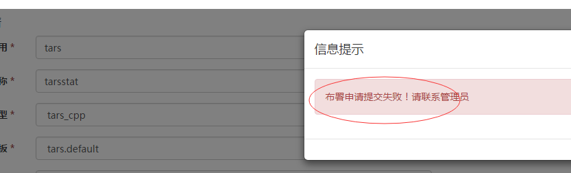
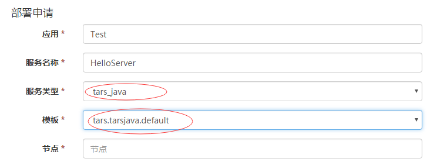
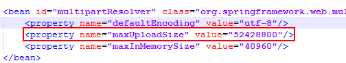
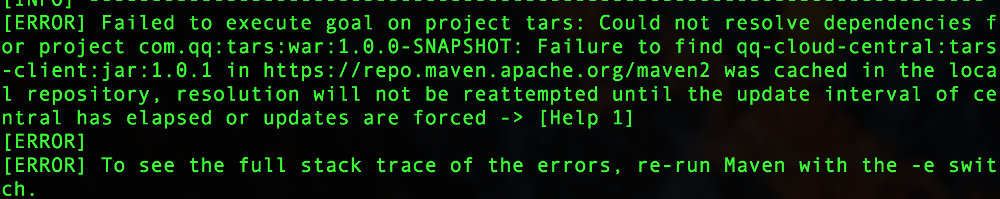
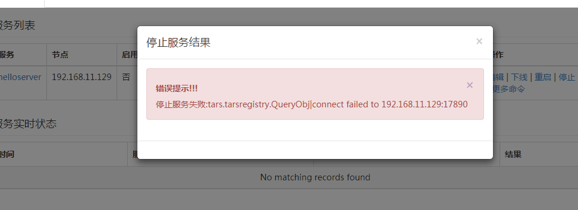
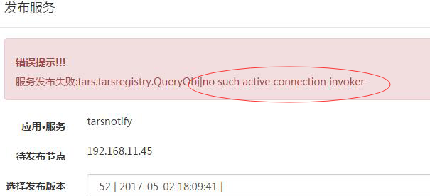
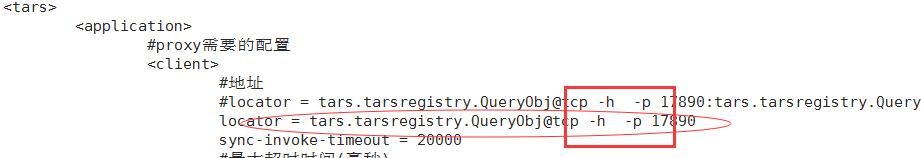

[点我查看中文版](Install.zh.md)

## 1. You can't deploy service on IP 127.0.0.1 for the following reasons:

Firstly, each service has at least one obj to serve foreign clients;

Secondly, each service has a obj for administration, it binds to ip 127.0.0.1 and the same port which servant obj binds to.

## 2. Tars consists of RPC framework, basic services, web management system, etc.

The RPC framework supports C++ and Java. ??? Each language has its related baselib, idl generate-code tools, and implementation of client's and server's code.

The C++ stuff only supports run on linux, the Java's supports run on linux & windows.

The basic framework is developed by C++, on linux.

## 3. The software and tools that Tars depends must be prepared before deploy Tars, see [Install.md](Install.md).

## 4. The steps of deploying Tars must follow the specified order described in [Install.md](Install.md)

## 5. Mysql can be installed from source code or by yum. Be care that Tars will search mysql library at the path /usr/local/mysql/ by default .
If mysql is installed in different path, please modify the CMakeLists.txt in `build` directory before compiling.

## 6. After executing of tars_start.sh, please execute command `ps -ef|grep tars` to check that the core service processes of Tars are alive, ie, tarsregistry, tarsAdminRegistry, tarsnode, tarsconfig and tarspatch.

## 7. If you haven't set sql_mode in file my.cnf which mysql used, then when deploy tars web management system, you'll see the tips `Deploy failed! Contact admin please.`.

## 8. You should compile tars java framework at first, because web management system depends on some jar package offered by tars java framework.

## 9. There are two kinds of framework services: core services(required), must be deployed by yourself. The others are general services, can be published via management system.

The core services: 
arsAdminRegistry, tarsregistry, tarsnode, tarsconfig, tarspatch

The general services:
arsstat, tarsproperty,tarsnotify, tarslog，tarsquerystat，tarsqueryproperty

The command `make framework-tar` pack core services, the core services can't be seen on management system except tarsconfig and tarspatch.

When you deploy general services via web management platform, be care of selection of the name and protocol of the obj.

## 10. The paths in which services deployed as below:
Log file path: /usr/local/app/tars/app_log/${Application}/${ServiceName}/, such as /usr/local/app/tars/app_log/Test/HelloServer/

Executable file path: /usr/local/app/tars/tarsnode/data/${Application}.${ServiceName}/bin/, such as /usr/local/app/tars/tarsnode/data/Test.HelloServer/bin/

Template config file path: /usr/local/app/tars/tarsnode/data/${Application}.${ServiceName}/conf/, such as /usr/local/app/tars/tarsnode/data/Test.HelloServer/conf/

Cache file path: /usr/local/app/tars/tarsnode/data/${Application}.${ServiceName}/data/, such as /usr/local/app/tars/tarsnode/data/Test.HelloServer/data/

## 11. How to check logs: for example, there will be a log file named Test.HelloServer.log in directory /usr/local/app/tars/app_log/Test/HelloServer/. If something failed, please check it.

## 12. When deploy java service, please select tars.tarsjava.default as template.

## 13. If you upload file which size is larger than 50MB, modify spring-context-mvc.xml as below:

The source path is web/src/main/resources/conf-spring, deploy path is WEB-INF/classes.

## 14. Check query conditon if you have problem with monitor data.

## 15. messy code in resin.

No such problem in English environment.

## 16. Can not find dependents when compile mvn.

Compile framework first.

## 17 Failed because can't connect to registry.

Check the core services are alive, ie, tarsregistry、tarsAdminRegistry、tarsnode、tarsconfig、tarspatch.
If any of them is not exist, check the db configuration.

Then check whether rsync process exists.

Finally check error logs of tarsnode.

Check section 4.3 of Install.md about web management system installation, the correct configuration is as following:

one of the error configurations is as following:

