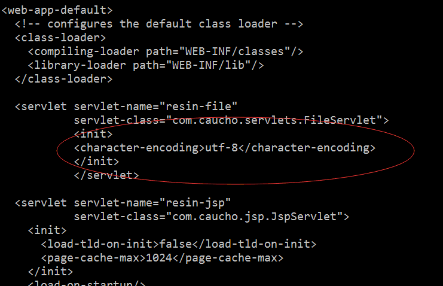

[Click me switch to English version](Install_faq.en.md)

## 1. 部署ip不能为127.0.0.1，原因如下：

第一，每个服务一般都有一个或者多个对外服务的obj，obj要对外提供访问，不能用127.0.0.1;

第二，每个服务都有一个管理的obj，它使用的ip是127.0.0.1，端口和obj的端口一样;

## 2. Tars主要包括rpc开发框架、框架基础服务、web管理系统。

其中，rpc开发框架支持c++和java两种语言，这两种语言都有自己的基础库、idl代码生成工具、客户端和服务端实现，互不依赖。

其中c++目前支持在linux下编译运行，java可以在linux、windows下开发编译调试。

框架基础服务是由c++开发的，在linux下运行。

## 3. Tars依赖的软件或者工具，在部署Tars时，必须事先安装好，参见:Install.md.

## 4. Tars部署安装步骤要按Install.md文档先后顺序进行。

## 5. mysql可以源码安装，也或者通过yum等工具来安装，注意的是Tars编译时默认使用的mysql开发库路径：include的路径为/usr/local/mysql/include，lib的路径为/usr/local/mysql/lib/。

若mysql开发库的安装路径不在默认路径，则需要修改build目录下CMakeLists.txt文件中的mysql相关的路径，再编译。

(注意，有些低版本的mysql安装后，include的路径为/usr/local/mysql/include/mysql，lib的路径为/usr/local/mysql/lib/mysql/，也需要改CMakeLists.txt)。

## 6. 执行tars_start.sh脚本后，需要确定一下tars核心基础服务的进程是否是活的，可以使用命令:ps -ef|grep tars，看看tarsregistry、tarsAdminRegistry、tarsnode、tarsconfig、tarspatch进程是否存在：

## 7. 没有对mysql使用的my.cnf的sql_mode进行设置的话，在tars web前台部署时，会出现"部署申请失败!请联系管理员"的提示信息。

## 8. 编译web管理系统源码前，要编译tars java框架源码，因为web依赖tars java的一些jar包。

## 9. 框架服务的安装分两种：一种是核心基础服务(必须的)，必须手工部署的，另一种是普通基础服务，通过管理平台发布的(和普通服务一样）。

手工部署的核心基础服务：tarsAdminRegistry, tarsregistry, tarsnode, tarsconfig, tarspatch

通过管理平台部署的普通基础服务：tarsstat, tarsproperty,tarsnotify, tarslog，tarsquerystat，tarsqueryproperty

make framework-tar这个命令打包的是tars核心基础服务，核心基础服务除tarsconfig和tarspatch可以在管理平台上看到部署情况外，另外几个是看不到的。

普通基础服务通过web管理平台部署时，要注意部署的Obj名称和协议的选择。

## 10. 服务部署的相关路径，如下
服务打的日志路径在/usr/local/app/tars/app_log/服务的应用名/服务的服务名/目录下，例如:/usr/local/app/tars/app_log/Test/HelloServer/
服务的可执行文件在/usr/local/app/tars/tarsnode/data/服务的应用名.服务的服务名/bin/下,例如:/usr/local/app/tars/tarsnode/data/Test.HelloServer/bin/
服务的模版配置文件在/usr/local/app/tars/tarsnode/data/服务的应用名.服务的服务名/conf/下,例如:/usr/local/app/tars/tarsnode/data/Test.HelloServer/conf/
服务的缓存信息文件在/usr/local/app/tars/tarsnode/data/服务的应用名.服务的服务名/data/下,例如:/usr/local/app/tars/tarsnode/data/Test.HelloServer/data/

## 11. 查看日志的方法，例如：/usr/local/app/tars/app_log/Test/HelloServer/目录下会有Test.HelloServer.log, 发布失败的话，可以看看里面有什么错误日志，其日志级别为ERROR。

## 12. java的服务部署时，模版配置要选择tars.tarsjava.default。

## 13. 上传发布包超过50M的问题，修改spring-context-mvc.xml文件，如下：

源代码路径为web/src/main/resources/conf-spring，部署的时候实际路径WEB-INF/classes

## 14. 服务监控数据展示问题，注意查询条件

## 15.resin 显示乱码问题

修改/usr/local/app/resin/conf/app-default.xml

修改后清除浏览器缓存

## 16，mvn 编译的时候，无法找到tars依赖项

需要先编译框架再mvn 编译war包

## 17 发布失败显示无法链接registry 

首先，确定核心基础服务tarsregistry、tarsAdminRegistry、tarsnode、tarsconfig、tarspatch的进程是否是活的，比如用ps -ef|grep tars命令查看，如果进程不存在，看看是否是db配置信息有问题

然后，确定rsync进程是否存在

最后，查看tarsnode的日志，看看有什么错误日志。

看看Install.md的第4.3节中的安装web管理系统部分，是否正确配置，如下：

错误的示例如下：

## 18 发布失败，发现上传tars java的war包大小有问题

检查一下部署web的机器是否安装了unzip 

