# Contents
> * [1.Introduction ](#main-chapter-1)
> * [2.Design Principles](#main-chapter-2)
> * [3.Architecture ](#main-chapter-3)
> * [4.Characters](#main-chapter-4)

# 1. Introduction

Tars is a open-source microservice platform. It contains a high-performance RPC framework and a service management platform.
Based on Tars, you can develop a reliable microservice system efficiently.

Tars is an open-source version of TAF which has being used in Tencent for years.
The name, Tars, comes from the robot in the movie Interstellar.
In the movie, Tars has a friendly interactive mode - everyone who first meets him can interact with him easily.
The robot Tars can accomplish missions efficiently, even under hard conditions.

The open-source project Tars carries the same mission as robot Tars does.
It is designed for high reliability, high performance, and efficient service management.
By significantly reducing system operation work, developers can focus on business logic and meet fast changes of user requirements.

Right now, thousands of services in Tencent have been developed with TAF, running on tens of thousands of machines.

# 2. Design Principles

Tars manages services in microservice style.
Tars partitions the system into abstraction layers:

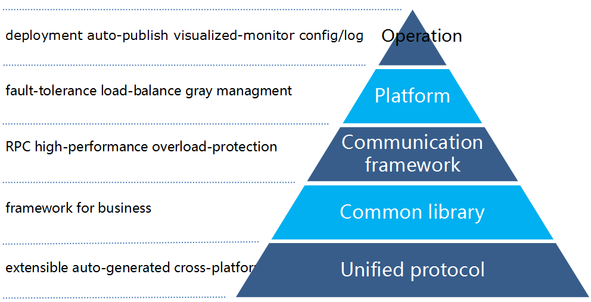

As shown in the picture, the bottom layer is the protocol layer which unifies bussiness communication protocols by providing an IDL (Interface Definition Language) file. 
The goal of the protocol layer is the interoperability of diverse communication with standard protocols.
The design of this conceptual framework characterizes and standardizes the communication functions of frameworks without regard to their underlying network structure and technology.

Tars supplies tools to compile IDL files and auto generate cross-platform, extensible protocol codes.
Now developers can focus on protocol field content to describe the business logic.
They're more productive because there's no need to consider the implement details such as cross-platform ability, compatibility, and extensibility.

Platform layer in the middle provides common-used libraries and RPC framework.
Developers can use them to implement systems with high-performance and high-availability.
These libraries and framework are extensively tested and proven to be stable and efficient. 
Furthermore, they are well integrated with the management platform, making system maintenance and operation cheerful.
In a distributed platform, there are tough problems in operation. For example, fault-tolerance, load-balance, capacity management and service-update.
With tools include in platform layer, developer can handle these problems easily.

The top layer is operation layer. It provides tools for SRE(Site Reliability Engineering) to deploy, publish, configure and monitor services. It also provides nice features such as elastic scheduling.

# 3. Architecture
## 3.1. Topology

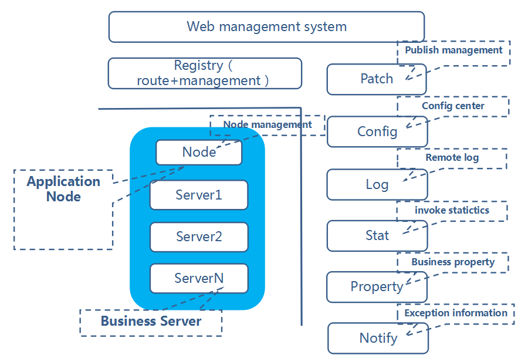

A platform built with Tars can be divided into two major parts: Service nodes and common framework nodes.

Before our introduction, we clarify two the following terminology:
Node: An OS instance. It can be physical machine, virtual machine.
Server: An instance of a service. A server runs on a node.

Service nodes:

Service node is a node in which server run. It can be physical machine, virtual machine.
In a platform built with Tars, the number of service nodes can be thousands.

On every service node, there is a tarsnode and N(N >= 0) servers. Tarsnode manages servers. It can stop, start, publish and monitor them. Meanwhile, it accepts heartbeat from servers.

Common framework nodes:

Except service nodes, there are common framework nodes.

The number of common framework nodes is fixed. Platform operators need to deploy them in multiple machines at multiple places for failure tolerance. Different common service needs different number of nodes. For example, if servers print a huge amount for logs, the number of log service should be increased.

Common framework nodes can be classified as several categories:

tarsweb: Monitor runtime status of service nodes, and publish, deploy, start or stop servers.

tarsregistry: Tarsweb uses tarsregistry to publish, start or stop servers. Tarsregistry also provides naming service. It also accepts heartbeat messages from servers. One server can query address(IP/port) of servers of other services through tarsregistry.

tarspatch: Tarspatch provides publish management service. Tarsweb uses it to publish specified version of services to server;

tarsconfig: Tarsconfig works as configuration center. It manages service configuration files of all servers.

tarslog: Tarslog provides remote log service. Logs from servers are sent to tarslog. Tarslog stores these logs for further use.

tarsstat: Tarsstat statistics information from servers such as workload, response time, out of time request ratio. Monitor service uses these information to discover abnormal server and makes warnings.

tartproperty: Beyond statistics from tarsstat, user can define business related properties for servers such as memory usage, queue size, cache hit-rate. Monitor service uses these information to discover abnormal server and make warnings.

tarsnotify: Tarsnotify statistics abnormal information from server such as db failure, to discover abnormal server and make warning.

In summary, in order to deploy and operate a server, tarsnode on every service node must keep in touch with common framework services.

## 3.2. service interaction flow chart

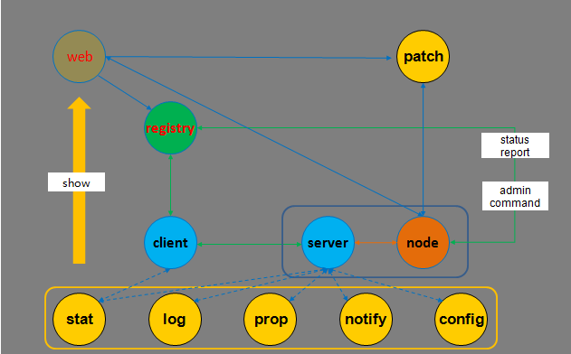

When the platform is in operation, servers cooperate with each other. Interaction among servers can be classified into two categories: a) Interaction among servers; b) Interaction between servers and common framework services.

Procedure for publishing services: upload new package to be patched via web system. If success, developer issues request to publish the package to specified servers. Then tarsregistry notifies tarsnode to transfer the package to local host. Finally, tarsnode shutdown the old server and starts a new one.

Administration commands: Developers can send administration commands to a specified server via tarsweb. Tarsweb sends the commands to the right tarsnode through tarsregistry. Then tarsnode sends the commands to the server.

Heartbeat: when a server is running, it sends heartbeat message to tarsnode periodically. Then tarsnode forwards the message to tarsregistry.

Information report: when a server is running, it sends statistics information to tarsstat periodically. It also prints logs to tarslog, sends property information to tarsproperty and sends abnormal information to tarsnofity.

Client visit server: When a client try to visit a service, it needs to connect to a server and call remote functions by specifying servant object name, server ip and port. Servers registered these information to tarsregistry in advance. The client queries these information from tarsregistry and visit a server.

## 3.3. web management system( tarsweb )

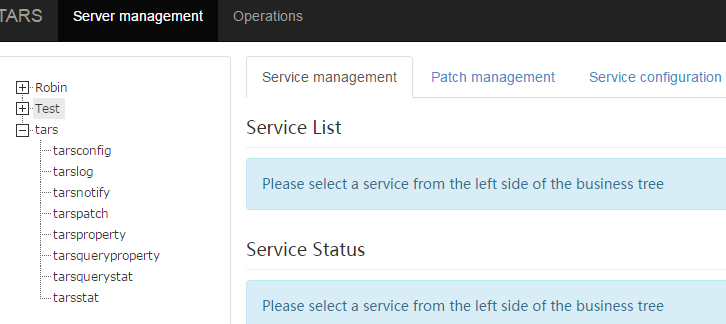

It contains function as below:

- business management: Service management, deploy, publish, monitor, property monitor.
- operation management: service deploy, scale up, templates management.

## 3.4. service architecture

The core server and client architecture:

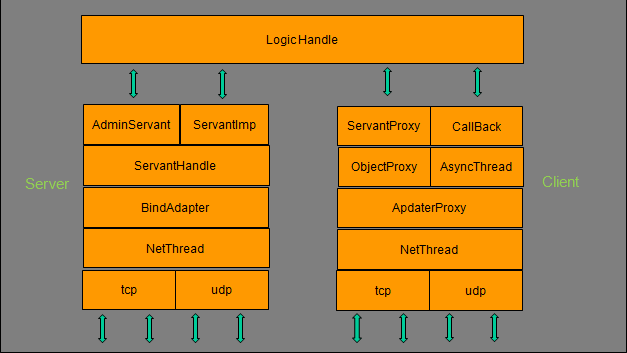

Server side:
NetThread: It receives and sends packets. It manages connections and works in multiple threads using EPOLL ET mode. Both TCP and UDP connection are supported.

BindAdapter：  It binds port for the server. It also manages binding info for servant.

ServantHandle： Business threads, dispatch message for servant object according to object name.

AdminServant： The servant for Administration.

ServantImp：The basic class for business logic which inherited from Servant.

NetThread: It receives and sends packets. It manages connections and works in multiple threads using EPOLL ET mode. Both TCP and UDP connection are supported.
                
AdapterProxy：The proxy for a specific server. It maintains a connection to a server and manage requests.

ObjectProxy：  The proxy for a remote object. It is responsible for routing, load balancing and fault tolerance.

ServantProxy： The proxy for remote calls, supports sync, asynchronous, one-way request. It also supports tars procotol and non-tars protocol.

AsyncThread：  The thread that process response for asynchronous requests.

Callback：Base class for callback of client logic.

# 4. Characters
## 4.1. tars protocol

Tars protocol is an implementation for IDL language. It is binary, extensible and cross-platform. Thus, servant objects implemented in different languages can communicate with each other through RPC calls.

It supports two data types: basic type and composite type
协议支持的类型分两种，基本类型和复杂类型。

Basic type include: void, bool, byte, short, int, long, float, double, string, unsigned byte, unsigned short, and unsigned int.

Composite type include: enum, const, struct, vector, and map.

For example:

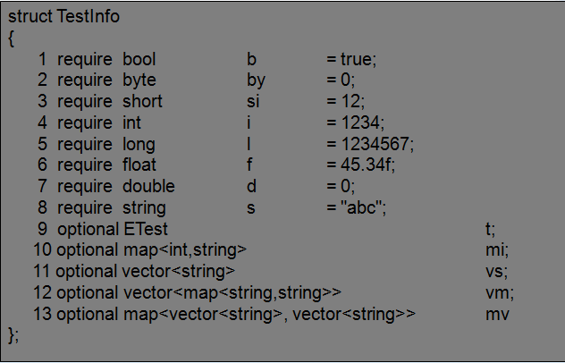

## 4.2. invoke mode

Developers define service interface via IDL. Tars generates codes for communication between client and server. Service only needs to implement service logic and client uses the generated code to call the service.
The invoke modes split to 3 kinds:
 sync : client issues a request and wait until response arrived or timeout.
 async: client issues a request with a callback and return immediately without waiting, when response arrived, callback is executed.
 one-way: client issues a request withou callback or waiting, it does not care about response.

## 4.3. load balance
The framework uses name service for service register and discovery. Client gets server address list via name service, then it uses a specified load balance policy to call servers.

The supported load balance policies are round-robin, hash, weighted policy.

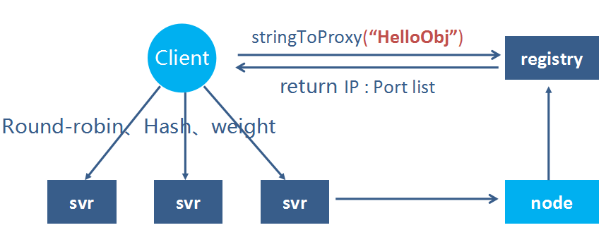

## 4.4. Fault tolerance
It's implemented with two ways: name service excluded and client shielding.

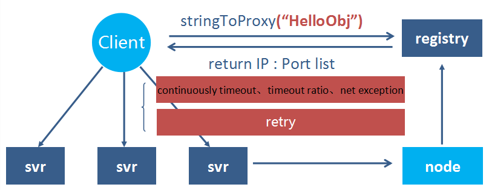

name service excluded:
Servers send heartbeat to name service, if some server failed, name service will exclude it from address list.
This policy needs server heartbeat and client pull address list, it'll take effect in one minute.

Client shielding:

In order to exclude failed server more timely, client shields servers based on request results from the servers. More specifically, when a client call a server and the requests are continuously timeout for several times, the client removes the server from the active server list. The client tries to reconnect to the shielded server after a while. If the server is reconnected, client moves it to the active server list and sends requests to it.

## 4.5. overload protection
To avoid overloading the system because of burst requests or machine fault, tars handles this scenario in the framework. In order to improve system throughput, server uses request queue to process request asynchronously. Server monitors the length of the queue. If the length exceeds a threshold, the server refuses new requests. If a request stays in the queue for a long time, the server drops the request, too.

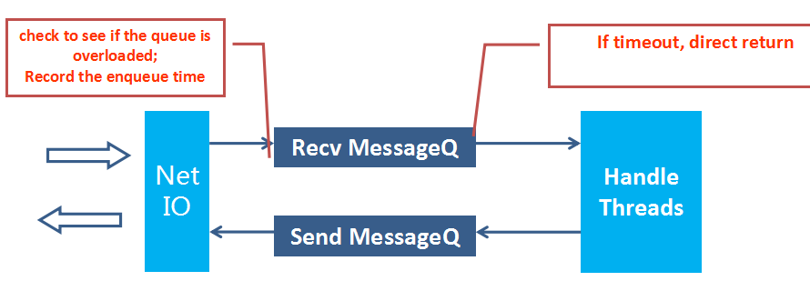

## 4.6. Request tracing
 The framework provided functions for tracing a specific request of a service, the traced request is labeled. The label is forwarded to server which is called because of the labeled request. Servers report logs for traced request to log server. User can analysis logs for traced request and diagnose problems.

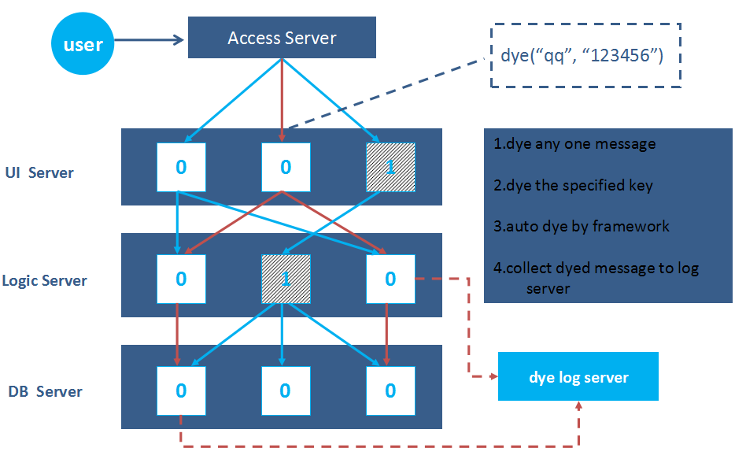

## 4.7. IDC group
In order to reduce response time of calls among servers and minimize influence of network failure,
tars groups server according to their locations. When a client queries servers of a service, tars return servers in nearest locations.

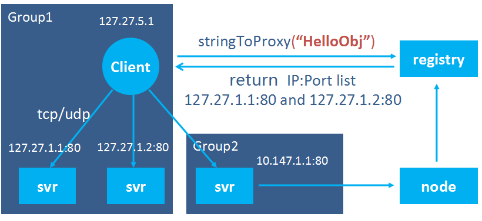

See details in [tars_idc_set.md](docs-en/tars_idc_set.md#1-idc-grouping-logic-introduction-).

## 4.8. SET group
To facilitate service management, tars groups servers into sets. Clients in a set can only send request to servers in the same set. Thus, servers in different sets can be isolated and operators can manage user requests in a finer way.

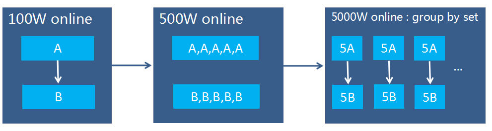

See details in [tars_idc_set.md](docs-en/tars_idc_set.md#2-set-grouping-logic-introduction-).

## 4.9. Monitor data

The framework supports following data report function in order to monitor the quality of service process and business running status:

1.It reports invoke statistics among servers to let user check flow, delay, timeout, exception about services.

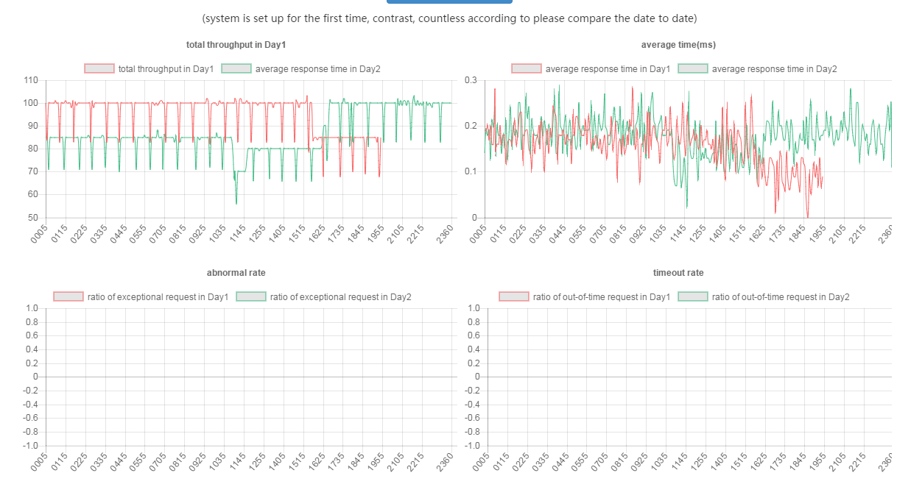

2. It reports user-defined properties to tarsproperty. Thus developer can check the status of a server or service. The user-defined properties can be memory use, queue length, cache hit rate, etc.

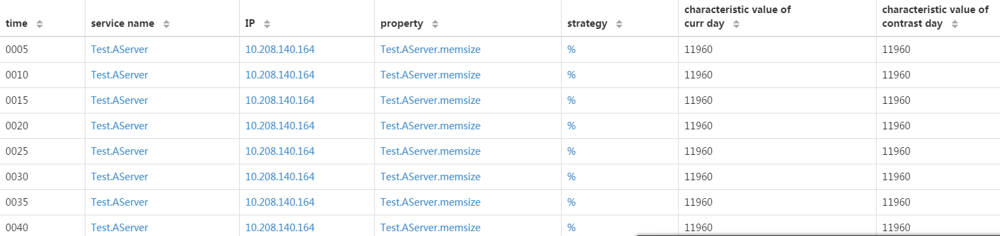

3.It reports server status change and exception. Developers can check the time a server is published, restarted, crashed.

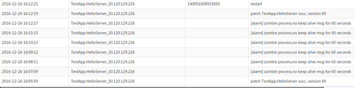

## 4.10. Centralized configuration
Server configurations are managed by tarsweb. Developer can change configurations in a webpage making the change easily and the change is safer. Developer can check history of configuration changes and rollback to previous version. 

Configuration file is classified into several categories: application configuration, SET configuration, service configuration and node configuration.

Application configuration is at the top level, it's the common configuration for services.

Set configuration is the common configuration for services under a specific set, it complements  application configuration.

Service configuration is for all server of a specific service, it can refer to application configuration.

Server configuration is a specified server. Service configuration and server configuration are combined together and use by the server.

See details in [tars_config.md](https://github.com/TarsCloud/TarsFramework/blob/master/docs-en/tars_config.md).
