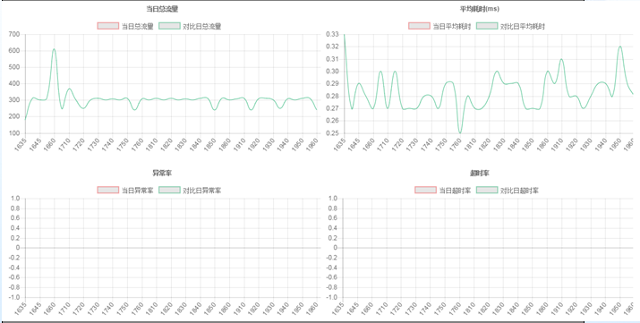
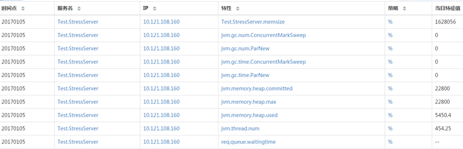

[Click me switch to English version](Introduction.en.md)

# 目录
> * [1.介绍](#main-chapter-1)
> * [2.设计思路](#main-chapter-2)
> * [3.整体架构](#main-chapter-3)
> * [4.平台特性](#main-chapter-4)

# 1. 介绍

Tars是基于名字服务使用Tars协议的高性能RPC开发框架，同时配套一体化的服务治理平台，帮助个人或者企业快速的以微服务的方式构建自己稳定可靠的分布式应用。

Tars是将腾讯内部使用的微服务架构TAF（Total Application Framework）多年的实践成果总结而成的开源项目。Tars这个名字来自《星际穿越》电影中机器人Tars，
电影中Tars有着非常友好的交互方式，任何初次接触它的人都可以轻松的和它进行交流，同时能在外太空、外星等复杂地形上，超预期的高效率的完成托付的所有任务。
拥有着类似设计理念的Tars也是一个兼顾易用性、高性能、服务治理的框架，目的是让开发更简单，聚焦业务逻辑，让运营更高效，一切尽在掌握。

目前该框架在腾讯内部，有100多个业务、1.6多万台服务器上运行使用。

# 2. 设计思想

Tars的设计思路是采用微服务的思想对服务进行治理，同时对整个系统的各个模块进行抽象分层，将各个层次之间相互解耦或者松耦合，如下图：

最底的协议层，设计思路是将业务网络通信的协议进行统一，以IDL(接口定义语言)的方式，开发支持多平台、可扩展、协议代码自动生成的统一协议。在开发过程中，开发人员只需要关注通讯的协议字段的内容，不需要关注其实现的细节，大大减轻了开发服务时需要考虑的协议是否能跨平台使用、是否可能需要兼容、扩展等问题。

中间的公共库、通讯框架、平台层，设计思路是让业务开发更加聚焦业务逻辑的本身。因此，从使用者的角度出发，封装了大量日常开发过程中经常使用的公共库代码和远程过程调用，让开发使用更简单方便；从框架本身的角度出发，做到高稳定性、高可用性、高性能，这样才能让业务服务运营更加放心；从分布式平台的角度出发，解决服务运营过程中，遇到的容错、负载均衡、容量管理、就近接入、灰度发布等问题，让平台更加强大。

最上面的运营层，设计思路是让运维只需要关注日常的服务部署、发布、配置、监控、调度管理等操作。

# 3. 整体架构
## 3.1. 架构拓扑图

整体架构的拓扑图主要分为2个部分：服务节点与公共框架节点。

服务节点:

服务节点可以认为是服务所实际运行的一个具体的操作系统实例，可以是物理主机或者虚拟主机、云主机。随着服务的种类扩展和规模扩大，服务节点可能成千上万甚至数以十万计。
每台服务节点上均有一个Node服务节点和N(N>=0)个业务服务节点，Node服务节点会对业务服务节点进行统一管理，提供启停、发布、监控等功能，同时接收业务服务节点上报过来的心跳。

公共框架节点:

除了服务节点以外的服务，其他服务节点均归为一类。

公共框架节点，数量不定，为了自身的容错容灾，一般也要求在在多个机房的多个服务器上进行部署，具体的节点数量，与服务节点的规模有关，比如，如果某些服务需要打较多的日志，就需要部署更多的日志服务节点。

又可细分为如下几个部分：

Web管理系统：在Web上可以看到服务运行的各种实时数据情况，以及对服务进行发布、启停、部署等操作；

Registry（路由+管理服务）：提供服务节点的地址查询、发布、启停、管理等操作，以及对服务上报心跳的管理，通过它实现服务的注册与发现；

Patch（发布管理）：提供服务的发布功能；

Config（配置中心）：提供服务配置文件的统一管理功能；

Log（远程日志）：提供服务打日志到远程的功能；

Stat（调用统计）：统计业务服务上报的各种调用信息，比如总流量、平均耗时、超时率等，以便对服务出现异常时进行告警；

Property（业务属性）：统计业务自定义上报的属性信息，比如内存使用大小、队列大小、cache命中率等，以便对服务出现异常时进行告警；

Notify（异常信息）：统计业务上报的各种异常信息，比如服务状态变更信息、访问db失败信息等，以便对服务出现异常时进行告警；

原则上要求全部的节点之间网络互通，至少每台机器的node能够与公共框架节点之间都是可以连通的。

## 3.2. 服务交互流程图

框架服务在整个系统中运行时，服务之间的交互分：业务服务之间的交互、业务服务与框架基础服务之间的交互。

服务发布流程：在Web系统上传server的发布包到patch，上传成功后，在web上提交发布server请求，由registry服务传达到node，然后node拉取server的发布包到本地，拉起server服务。

管理命令流程：Web系统上的可以提交管理server服务命令请求，由registry服务传达到node服务，然后由node向server发送管理命令。

心跳上报流程：server服务运行后，会定期上报心跳到node，node然后把服务心跳信息上报到registry服务，由registry进行统一管理。

信息上报流程：server服务运行后，会定期上报统计信息到stat，打印远程日志到log，定期上报属性信息到property、上报异常信息到notify、从config拉取服务配置信息。

Client访问Server流程：client可以通过server的对象名Obj间接访问server，Client会从registry上拉取server的路由信息（如ip、port信息），然后根据具体的业务特性（同步或者异步，tcp或者udp方式）访问server(当然client也可以通过ip/port直接访问server)。

## 3.3. web管理系统

web管理系统主要包含以下功能：

- 业务管理：包括已部署的服务，以及服务管理、发布管理、服务配置、服务监控、特性监控等；

- 运维管理：包括服务部署、扩容、模版管理等；

## 3.4. 服务结构图

框架核心的服务端与客户端实现结构图如下:

服务端：

NetThread：    收发包，连接管理，多线程(可配置），采用epoll ET触发实现，支持tcp/udp；

BindAdapter：  绑定端口类，用于管理Servant对应的绑定端口的信息操作；

ServantHandle：业务线程类，根据对象名分派Servant的对象和接口调用；

AdminServant： 管理端口的对象；

ServantImp：   继承Servant的业务处理基类（Servant：服务端接口对象的基类）；

客户端：

NetThread：    收发包，连接管理，多线程(可配置），采用epoll ET触发实现，支持tcp/udp；

AdapterProxy： 具体服务器某个节点的本地代理，管理到服务器的连接，以及请求超时处理；

ObjectProxy：  远程对象代理，负责路由分发、负载均衡、容错，支持轮询/hash/权重；

ServantProxy： 远程对象调用的本地代理，支持同步/异步/单向，Tars协议和非Tars协议；

AsyncThread：  异步请求的回应包处理线程；

Callback：     具体业务Callback的处理基类对象；

# 4. 平台特性
## 4.1. tars协议
tars协议采用接口描述语言（Interface description language，缩写IDL）来实现，它是一种二进制、可扩展、代码自动生成、支持多平台的协议，使得在不同平台上运行的对象和用不同语言编写的程序可以用RPC远程调用的方式相互通信交流，
主要应用在后台服务之间的网络传输协议，以及对象的序列化和反序列化等方面。

协议支持的类型分两种，基本类型和复杂类型。

基本类型包括：void、bool、byte、short、int、long、float、double、string、unsigned byte、unsigned short、unsigned int；

复杂类型包括：enum、const、struct、vector、map，以及struct、vector、map的嵌套。

例如:

## 4.2. 调用方式
通过IDL语言协议，可以定义服务提供的接口，并自动生成客户端和服务端的相关通信代码，服务端只需实现业务逻辑即可对外提供服务，客户端通过自动生成的代码即可调用服务，调用方式支持三种模式：

同步调用：客户端发出调用请求后等待服务返回结果后再继续逻辑；

异步调用：客户端发出调用请求后继续其他业务逻辑，服务端返回结果又由回调处理类处理结果；

单向调用：客户端发出调用请求后就结束调用，服务端不返回调用结果；

## 4.3. 负载均衡
框架通过名字服务来实现服务的注册与发现，Client通过访问名字服务获取到被调服务的地址信息列表，Client再根据需要选择合适的负载均衡方式来调用服务，

负载均衡支持轮询、hash、权重等多种方式。

## 4.4. 容错保护
容错保护通过两种方式实现：名字服务排除和Client主动屏蔽。

名字服务排除的策略：

业务服务主动上报心跳给名字服务，使名字服务知道服务部署的节点存活情况，当服务的某节点故障时，名字服务不在返回故障节点的地址给Client，达到排除故障节点的目标。名字服务排除故障需要通过服务心跳和Client地址列表拉取两个过程，故障排除时间在1分钟左右

Client主动屏蔽：

为了更及时的屏蔽故障节点，Client根据调用被调服务的异常情况来判断是否有故障来更快进行故障屏蔽。具体策略是，当client调用某个svr出现调用连续超时，或者调用的超时比率超过一定百分比，client会对此svr进行屏蔽，让流量分发到正常的节点上去。对屏蔽的svr节点，每隔一定时间进行重连，如果正常，则进行正常的流量分发。

## 4.5. 过载保护
为了防止业务因为访问量突增或服务器故障造成系统整体的繁忙，进而导致全部服务的不可用，框架内部做相应设计来应对。实现请求队列，服务调用通过非阻塞方式实现异步系统，从而达到提升系统处理能力的目的。并且对队列的长度进行监控，当超过某个阀值，则拒绝新的请求。对请求设置超时时间，当请求包从队列里读取出来是判断请求是否超时，如果超时则不做处理。

## 4.6. 消息染色
框架提供了对某服务某接口的特定请求进行染色的能力，染色的消息可以透传到后面需要访问的所有服务上，对染色的请求，服务自动把日志上报到特定的染色日志服务器上，使用者只需在染色服务器上即可分析请求访问的路径，方便跟踪定位问题。
如下：

## 4.7. IDC分组
为了加快服务间的访问速度，减少跨地区、跨机房调用带来的网络资源消耗，减少网络故障带来的影响，框架提供了跨地区、跨机房，就近接入的功能。

详细介绍参见docs目录下的[tars_idc_set.md](docs/tars_idc_set.md#1-idc分组逻辑介绍-)

## 4.8. SET分组
为了方便对业务服务部署管理进行标准化和容量化，框架提供了Set部署能力，set之间没有调用关系，互不干扰，故障隔离，提高运维效率和服务可用性。

详细介绍参见docs目录下的[tars_idc_set.md](docs/tars_idc_set.md#2-set分组逻辑介绍-)

## 4.9. 数据监控
为了更好反映和监控小到服务进程、大到业务的运行质量情况，框架支持以下数据上报的功能:

1.提供了服务模块间调用信息统计上报的功能，方便用户查看服务的流量、延时、超时、异常等情况；

2.提供了用户自定义属性数据上报的功能，方便用户查看服务的某些维度或者指标，比如内存使用情况、队列大小、cache命中率等；

3.提供了服务状态变更和异常信息上报的功能，方便用户查看服务的何时发布过、重启过、宕过以及遇到的异常致命错误等；

## 4.10. 集中配置
对业务配置进行集中管理并且操作web化，使配置修改更容易，通知更及时，配置变更也更安全；对配置变更进行历史记录，让配置可以轻松回退到前一版本。配置拉取服务化，服务只需调用配置服务的接口即可获取到配置文件。

为了能灵活管理配置文件，配置文件分为几个级别：应用配置、Set配置、服务配置和节点配置。

应用配置为最高一级的配置文件，它是多个服务配置提炼出来的公共配置，服务配置通过引用它来使用其配置内容。

Set配置是具体一个Set分组下所有服务的公共配置，在应用配置的基础上进行补充追加。

服务配置是具体一个服务下所有节点的公共配置，可以引用应用配置。

节点配置是一个应用节点的个性化配置，它和服务配置合并成为具体一个服务节点的配置。

详细介绍可以参见docs目录下的[tars_config.md](https://github.com/TarsCloud/TarsFramework/blob/master/docs/tars_config.md)
