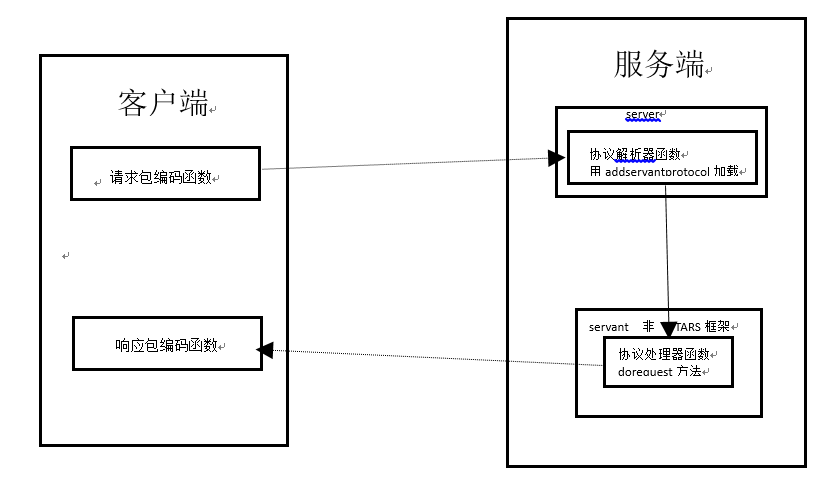

# 其他协议支持

## 概述
TARS服务框架默认情况下只支持TARS自有的tars协议，但是在实际的应用场景中，需要在TARS服务框架中支持其他协议，例如HTTP，这种情况下就不能用通信器来发送据，需要业务自己来实现这部分代码。对于自定义的协议， 处理方式也类似

具体程序示例，参见cpp/examples/httpDemo/.

开发第三方协议服务端,要实现协议解析器并将其加载到服务中,同时需要建立一个非TAF框架的服务对象,该类继承于Servant类,通过重载Servant类中的doRequest方法来建立协议处理器。
而客户端要访问服务，需要通过调用proxy的rpc函数，在调用之前，要为proxy设置请求包编码函数和响应包解码函数。



图中的黑色线代表了数据流向：数据（客户端）-〉请求包的编码器（客户端）-〉协议解析器（服务端）-〉doRequest协议处理器（服务端）-〉生成返回数据（服务端）-〉响应包的解码器（客户端）-〉响应数据（客户端）

其中请求包的编码器（客户端）负责对客户端发送的数据进行打包，协议解析器（服务端）负责对收到的数据进行解析并交给协议处理器（服务端）去处理并生成返回数据，而响应包的解码器（客户端）负责对返回的数据进行解码。

## 	服务端Http协议实例


/usr/local/tars/cpp/script/create_tars_server.sh TestApp HttpServer Http

在目录下会生成六个文件，将http.tars 删除（因为不是tars协议），然后手动的实现一些方法

以HelloServer为例，需要支持http协议

在HttpImp中修改继承自Servant类的doRequest方法，该方法为第三方服务的处理器，该处理器负责处理协议解析器传送给其的数据，并负责生成返回给客户端的response

HttpImp.h
```cpp
#ifndef _HttpImp_H_
#define _HttpImp_H_

#include "servant/Application.h"

/**
 *
 *
 */
class HttpImp : public Servant
{
public:
    /**
     *
     */
    virtual ~HttpImp() {}

    /**
     *
     */
    virtual void initialize();

    /**
     *
     */
    virtual void destroy();

    /**
     *
     */
    int doRequest(TarsCurrentPtr current, vector<char> &buffer);

};
/////////////////////////////////////////////////////
#endif
```
HttpImp.cpp
```cpp
#include "HttpImp.h"
#include "servant/Application.h"

using namespace std;

//////////////////////////////////////////////////////
void HttpImp::initialize()
{
    //initialize servant here:
    //...
}

//////////////////////////////////////////////////////
void HttpImp::destroy()
{
    //destroy servant here:
    //...
}

int HttpImp::doRequest(TarsCurrentPtr current, vector<char> &buffer)
{
    TC_HttpRequest request; 
    vector<char> v = current->getRequestBuffer();
    string sBuf;
    sBuf.assign(&v[0],v.size());
    request.decode(sBuf);
    TC_HttpResponse rsp;
    string s="hello";
    rsp.setResponse(s.c_str(),s.size());
    rsp.encode(buffer);
   
    return 0;
}
```


在其中HttpServer类的initialize()，加载服务对象HttpImp，并设置第三方协议解析器parse。
我们在函数中实现HttpProtocol::parse函数，用于解析协议。
```cpp
#ifndef _HttpServer_H_
#define _HttpServer_H_

#include <iostream>
#include "servant/Application.h"

using namespace tars;

/**
 *
 **/
class HttpServer : public Application
{
public:
    /**
     *
     **/
    virtual ~HttpServer() {};

    /**
     *
     **/
    virtual void initialize();

    /**
     *
     **/
    virtual void destroyApp();
};

extern HttpServer g_app;

////////////////////////////////////////////
#endif
```

```cpp
#include "HttpServer.h"
#include "HttpImp.h"

using namespace std;

HttpServer g_app;

/////////////////////////////////////////////////////////////////
struct HttpProtocol
{
    /**
     * 解析http请求
     * @param in
     * @param out
     *
     * @return int
     */
    static int parseHttp(string &in, string &out)
    {
        try
        {
            //判断请求是否是HTTP请求
            bool b = TC_HttpRequest ::checkRequest(in.c_str(), in.length());
            //完整的HTTP请求
            if(b)
            {
                out = in;
                in  = "";
                //TLOGDEBUG("out size: " << out.size() << endl);
                return TC_EpollServer::PACKET_FULL;
            }
            else
            {
                return TC_EpollServer::PACKET_LESS;
            }
        }
        catch(exception &ex)
        {
            return TC_EpollServer::PACKET_ERR;
        }

        return TC_EpollServer::PACKET_LESS;             //表示收到的包不完全
    }

};

void
HttpServer::initialize()
{
    //initialize application here:
    //...

    addServant<HttpImp>(ServerConfig::Application + "." + ServerConfig::ServerName + ".HttpObj");
    addServantProtocol(ServerConfig::Application + "." + ServerConfig::ServerName + ".HttpObj",&HttpProtocol::parseHttp);
}
/////////////////////////////////////////////////////////////////
void
HttpServer::destroyApp()
{
    //destroy application here:
    //...
}
/////////////////////////////////////////////////////////////////
int
main(int argc, char* argv[])
{
    try
    {
        g_app.main(argc, argv);
        g_app.waitForShutdown();
    }
    catch (std::exception& e)
    {
        cerr << "std::exception:" << e.what() << std::endl;
    }
    catch (...)
    {
        cerr << "unknown exception." << std::endl;
    }
    return -1;
}
/////////////////////////////////////////////////////////////////
```


