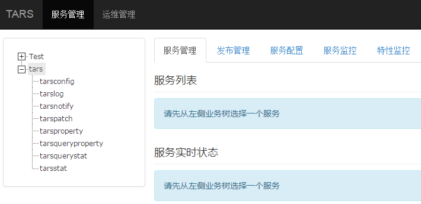
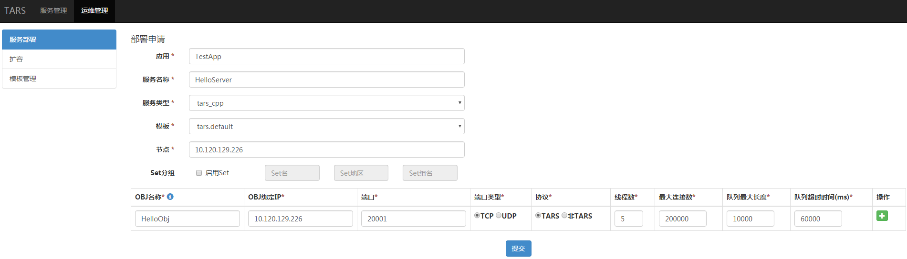
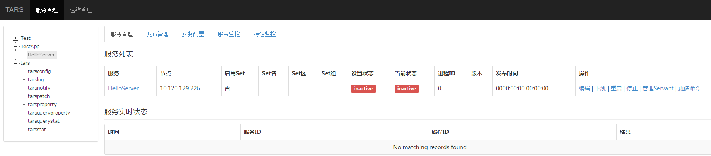

# 目录
> * [1.环境搭建] (#main-chapter-1)
> * [2.服务命名] (#main-chapter-2)
> * [3.Tars管理系统] (#main-chapter-3)
> * [4.服务部署] (#main-chapter-4)
> * [5.服务开发] (#main-chapter-5)
> * [6.服务发布] (#main-chapter-6)

# 1. 环境搭建  <a id="main-chapter-1"></a>

Tars C++环境搭建参考tars_install.md
 
# 2. 服务命名  <a id="main-chapter-2"></a>

使用Tars框架的服务，其的服务名称有三个部分：

APP：    应用名，标识一组服务的一个小集合，在Tars系统中，应用名必须唯一。例如：TestApp；

Server： 服务名，提供服务的进程名称，Server名字根据业务服务功能命名，一般命名为：XXServer，例如HelloServer；

Servant：服务者，提供具体服务的接口或实例。例如:HelloImp；

说明：

一个Server可以包含多个Servant，系统会使用服务的App + Server + Servant，进行组合，来定义服务在系统中的路由名称，称为路由Obj，其名称在整个系统中必须是唯一的，以便在对外服务时，能唯一标识自身。

因此在定义APP时，需要注意APP的唯一性。

例如：TestApp.HelloServer.HelloObj。

# 3. Tars管理系统  <a id="main-chapter-3"></a>

用户登录成功后，会进入Tars管理系统，如下图



TARS管理系统的菜单树下，有以下功能：

- 业务管理：包括已部署的服务，以及服务管理、发布管理、服务配置、服务监控、特性监控等；

- 运维管理：包括服务部署、扩容、模版管理等；

# 4. 服务部署   <a id="main-chapter-4"></a>

服务部署，其实也可以在服务开发后进行，不过建议先做。

如下图：



-	“应用”指你的服务程序归在哪一个应用下，例如：“TestApp”。
-	“服务名称”指你的服务程序的标识名字，例如：“HelloServer”。
-	“服务类型”指你的服务程序用什么语言写的，例如：c++的选择“tars_cpp”。
-	“模版“ 指你的服务程序在启动时，设置的配置文件的名称，默认用”tars.default“即可。
-	“节点“ 指服务部署的机器IP。
-	“Set分组“ 指设置服务的Set分组信息，Set信息包括3部分：Set名、Set地区、Set组名。
-	“OBJ名称“ 指Servant的名称。
-	“OBJ绑定IP“ 指服务绑定的机器IP，一般与节点一样。
-	“端口“ 指OBJ要绑定的端口。
-	“端口类型“ 指使用TCP还是UDP。
-	“协议“ 指应用层使用的通信协议，Tars框架默认使用tars协议。
-	“线程数“ 指业务处理线程的数目。
-	“最大连接数“ 指支持的最大连接数。
-	“队列最大长度“ 指请求接收队列的大小。
-	“队列超时时间“ 指请求接收队列的超时时间。

点击“提交“，成功后，菜单数下的TestApp应用将出现HelloServer名称，同时将在右侧看到你新增的服务程序信息，如下图：



在管理系统上的部署暂时先到这里，到此为止，只是使你的服务在管理系统上占了个位置，真实程序尚未发布。

# 5. 服务开发  <a id="main-chapter-5"></a>

## 5.1. 创建服务

### 5.1.1. 运行tars脚本
``` shell
/usr/local/tars/cpp/script/create_tars_server.sh [App] [Server] [Servant]
```

本例中执行：/usr/local/tars/cpp/script/create_tars_server.sh TestApp HelloServer Hello

命令执行后，会在当前目录的TestApp/HelloServer/ 目录下，生成下面文件：
``` shell
HelloServer.h HelloServer.cpp Hello.tars HelloImp.h HelloImp.cpp makefile
```
这些文件，已经包含了最基本的服务框架和默认测试接口实现。

### 5.1.2. tars接口文件

定义tars接口文件的语法和使用，参见tars_tup.md。

如下：

Hello.tars：
``` cpp

module TestApp
{

interface Hello
{
    int test();
};

}; 


```
采用tars2cpp工具自动生成c++文件：/usr/local/tars/cpp/tools/tars2cpp hello.tars会生成hello.h文件，里面包含客户端和服务端的代码。

### 5.1.3. HelloImp是Servant的接口实现类

实现服务定义的tars件中的接口，如下：

HelloImp.h

```cpp

#ifndef _HelloImp_H_
#define _HelloImp_H_

#include "servant/Application.h"
#include "Hello.h"

/**
 * HelloImp继承hello.h中定义的Hello对象
 *
 */
class HelloImp : public TestApp::Hello
{
public:
    /**
     *
     */
    virtual ~HelloImp() {}

    /**
     * 初始化，Hello的虚拟函数，HelloImp初始化时调用
     */
    virtual void initialize();

    /**
     * 析构，Hello的虚拟函数，服务析构HelloImp退出时调用
     */
    virtual void destroy();

    /**
     * 实现tars文件中定义的test接口
     */
    virtual int test(tars::TarsCurrentPtr current) { return 0;};

};
/////////////////////////////////////////////////////
#endif

```
HelloImp.cpp:

```cpp

#include "HelloImp.h"
#include "servant/Application.h"

using namespace std;

//////////////////////////////////////////////////////
void HelloImp::initialize()
{
    //initialize servant here:
    //...
}

//////////////////////////////////////////////////////
void HelloImp::destroy()
{
    //destroy servant here:
    //...
}

```
### 5.1.4. HelloServer是服务的实现类

如下:

HelloServer.h:

```cpp
#ifndef _HelloServer_H_
#define _HelloServer_H_

#include <iostream>
#include "servant/Application.h"

using namespace tars;

/**
 * HelloServer继承框架的Application类
 **/
class HelloServer : public Application
{
public:
    /**
     *
     **/
    virtual ~HelloServer() {};

    /**
     * 服务的初始化接口
     **/
    virtual void initialize();

    /**
     * 服务退出时的清理接口
     **/
    virtual void destroyApp();
};

extern HelloServer g_app;

////////////////////////////////////////////
#endif

```
HelloServer.cpp
```cpp
#include "HelloServer.h"
#include "HelloImp.h"

using namespace std;

HelloServer g_app;

/////////////////////////////////////////////////////////////////
void
HelloServer::initialize()
{
    //initialize application here:

    //添加Servant接口实现类HelloImp与路由Obj绑定关系
    addServant<HelloImp>(ServerConfig::Application + "." + ServerConfig::ServerName + ".HelloObj");
}
/////////////////////////////////////////////////////////////////
void
HelloServer::destroyApp()
{
    //destroy application here:
    //...
}
/////////////////////////////////////////////////////////////////
int
main(int argc, char* argv[])
{
    try
    {
        g_app.main(argc, argv);
        g_app.waitForShutdown();
    }
    catch (std::exception& e)
    {
        cerr << "std::exception:" << e.what() << std::endl;
    }
    catch (...)
    {
        cerr << "unknown exception." << std::endl;
    }
    return -1;
}
/////////////////////////////////////////////////////////////////

```
## 5.2. 服务编译

进入代码目录,首先做
```shell
make cleanall
make	
make tar
``` 
## 5.3. 扩展功能

Tars框架提供了接口定义语言的功能，可以在tars文件中，增加一下接口和方法，扩展服务的功能。 

可以修改由create_tars_server.sh生成的tars文件，以下3个接口方法中，test是默认生成的，testHello是新增加的接口。
```cpp

module TestApp
{

interface Hello
{
    int test();
    int testHello(string sReq, out string sRsp);
};

}; 

```

使用/usr/local/tars/cpp/tools/tars2cpp hello.tars,重新生成hello.h。 

修改HelloImp.h/HelloImp.cpp，实现新的接口代码。 

其中HelloImp.h中继承Hello类的testHello方法： 
```cpp
virtual int testHello(const std::string &sReq, std::string &sRsp, tars::TarsCurrentPtr current);
```

HelloImp.cpp实现testHello方法：

```cpp
int HelloImp::testHello(const std::string &sReq, std::string &sRsp, tars::TarsCurrentPtr current)
{
    TLOGDEBUG("HelloImp::testHellosReq:"<<sReq<<endl);
    sRsp = sReq;
    return 0;
}
```
重新make cleanall;make;make tar，会重新生成HelloServer.tgz发布包。

## 5.4. 客户端同步/异步调用服务

在开发环境上，创建/home/tarsproto/[APP]/[Server]目录。 

例如：/home/tarsproto/TestApp/HelloServer在刚才编写服务器的代码目录下，

执行 make release 这时会在/home/tarsproto/TestApp/HelloServer目录下生成h、tars和mk文件。

这样在有某个服务需要访问HelloServer时，就直接引用HelloServer服务make release的内容，不需要把HelloServer的tars拷贝过来（即代码目录下不需要存放HelloServer的tars文件）。

建立客户端代码目录，如TestHelloClient/。 

编写main.cpp，创建实例并调用刚编写的接口函数进行测试。 

同步方式：

```cpp
#include <iostream>
#include "servant/Communicator.h"
#include "Hello.h"

using namespace std;
using namespace TestApp;
using namespace tars;

int main(int argc,char ** argv)
{
    Communicator comm;

    try
    {
        HelloPrx prx;
        comm.stringToProxy("TestApp.HelloServer.HelloObj@tcp -h 10.120.129.226 -p 20001" , prx);

        try
        {
            string sReq("hello world");
            string sRsp("");

            int iRet = prx->testHello(sReq, sRsp);
            cout<<"iRet:"<<iRet<<" sReq:"<<sReq<<" sRsp:"<<sRsp<<endl;

        }
        catch(exception &ex)
        {
            cerr << "ex:" << ex.what() << endl;
        }
        catch(...)
        {
            cerr << "unknown exception." << endl;
        }
    }
    catch(exception& e)
    {
        cerr << "exception:" << e.what() << endl;
    }
    catch (...)
    {
        cerr << "unknown exception." << endl;
    }

    return 0;
}
```
异步方式
```cpp
#include <iostream>
#include "servant/Communicator.h"
#include "Hello.h"

using namespace std;
using namespace TestApp;
using namespace tars;

class HelloCallBack : public HelloPrxCallback
{
public:
    HelloCallBack(){}

    virtual ~HelloCallBack(){}

    virtual void callback_testHello(tars::Int32 ret,  const std::string& sRsp)
    {
        cout<<"callback_testHello ret:"<< ret << "|sRsp:" << sRsp <<endl; 
    }

    virtual void callback_testHello_exception(tars::Int32 ret)
    {
        cout<<"callback_testHello_exception ret:"<< ret <<endl;
    }
};

int main(int argc,char ** argv)
{
    Communicator comm;

    try
    {
        HelloPrx prx;
        comm.stringToProxy("TestApp.HelloServer.HelloObj@tcp -h 10.120.129.226 -p 20001" , prx);

        try
        {
            string sReq("hello world");
            HelloPrxCallbackPtr cb = new HelloCallBack();
            prx->async_testHello(cb, sReq);
            cout<<" sReq:"<<sReq<<endl;
        }
        catch(exception &ex)
        {
            cerr<<"ex:"<<ex.what() <<endl;
        }
        catch(...)
        {
            cerr<<"unknown exception."<<endl;
        }
    }
    catch(exception& e)
    {
        cerr<<"exception:"<<e.what() <<endl;
    }
    catch (...)
    {
        cerr<<"unknown exception."<<endl;
    }

    getchar();

    return 0;
}
```
编写makefile,里面包含刚才通过make release生成的/home/tarsproto/APP/Server目录下的mk文件，如下：

```makefile
#-----------------------------------------------------------------------
APP         :=TestApp
TARGET      :=TestHelloClient
CONFIG      :=
STRIP_FLAG  := N

INCLUDE     += 
LIB         +=
#-----------------------------------------------------------------------
include /home/tarsproto/TestApp/HelloServer/HelloServer.mk
include /usr/local/tars/cpp/makefile/makefile.tars
#-----------------------------------------------------------------------
```
make出目标文件，上传到能访问服务器的环境中进行运行测试即可

# 6. 服务发布  <a id="main-chapter-6"></a>
在管理系统的菜单树下，找到你部署的服务，点击进入服务页面。 

选择“发布管理”，选中要发布的节点，点击“发布选中节点”，点击“上传发布包”，选择已经编译好的发布包，如下图：


 上传好发布包后，点击“选择发布版本”下拉框就会出现你上传的服务程序，选择最上面的一个（最新上传的）。如下图：

 

 点击“发布”，服务开始发布，发布成功后，出现下面的界面，如下图：

 
 
若失败的话，可能是命名问题，上传问题，以及其他环境问题。
