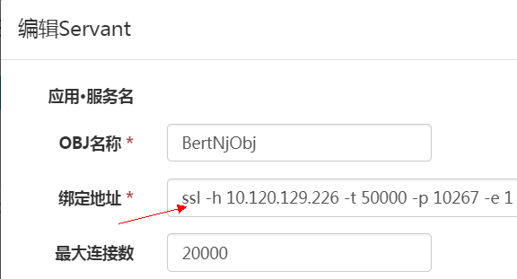

# tars tls通信支持

OpenSSL是一个极其健壮、功能齐全的TLS和SSL协议库，也是一个通用的密码算法库。它为我们的通信提供了安全性和完整性保证。tars结合OpenSSL库支持TLS是一个常用的重要功能。
TLS协议和应用层的HTTP结合，即支持了https协议。
另外，TLS功能和[tars鉴权功能](tars_auth.md)可以同时启用。
目前只有C++支持TLS功能，java即将支持。

## tars tls使用

tars tls的使用非常简单，你不需要修改一行代码，只需要更改配置文件。
只需要按照下面四个步骤设置：

### 1. 编译tars框架，支持tls
tars框架默认不开启tls，首先改动cpp/build/CMakeLists.txt，将第17行TARS_SSL定义改为1：
```cpp
set(TARS_SSL 1)
```
现在重新编译安装tars框架。
修改业务makefile，添加一行定义：
```cpp
TARS_SSL = 1
```
注意这一行**一定要放在include /usr/local/tars/cpp/makefile/makefile.tars上面**。重新编译打包业务程序并上传，暂不发布。

### 2. 修改被调用方的endpoint协议，将tcp或udp改为ssl
在tars服务平台，选中相应的服务，编辑servant，修改endpoint协议，将原先的tcp或udp改为ssl.



### 3. 修改被调用方的配置文件添加证书配置
一般来说，TLS使用单向认证，即客户端认证服务器。所以被调用方一定要提供证书。
不再截图，如果不知道怎么改私有模板，查看[tars鉴权](tars_auth.md)中的截图。在私有模板中添加配置如下：
```xml
<tars>
    <application>
        <serverssl>
           path=/certs/ # 证书所在目录
           ca=ca.pem # ca公有证书，不验证客户端可以不填写
           verifyclient=0 # 不验证客户端
           cert=server-cert.pem # 服务器public证书
           key=server-key.pem # 服务器private证书
        </serverssl>
    </application>
</tars>
```
现在，在web平台重启服务。

### 4. 修改调用方的配置文件添加证书
由于主调方从tars registry可以获取被调方的地址，所以被调方这里关于地址的配置不需要改，只要添加证书就好了。
一般来说主调方不需要提供证书，这里只要配置一下PKI的公钥证书用来验证服务器就可以了。如果被调方要求主调方提供证书，那就需要提供证书，第2节已经描述过，这里不再重复。修改主调方私有模板，tls证书配置如下：
```xml
<tars>
    <application>
        <clientssl>
           path=/certs/ # 证书所在目录
           ca=ca.pem # ca公有证书，验证服务器
        </clientssl>
    </application>
</tars>
```

现在，在web平台重启调用方。

没有修改一行代码（但需要重新编译链接），你的服务已经开始使用tls加密通信了。

