# Table of Contents
> * [Service Configuration Principle] (#main-chapter-1)
> * [Business Configuration Example] (#main-chapter-2)

# 1. Principle of service configuration <a id="main-chapter-1"></a>

## 1.1. Configuration Profile Data Structure

The configuration file information of the business service based on the Tars framework is consists of three levels: application configuration, Set application configuration, service and node configuration.

The application level is the highest level configuration file, which can be referenced under the same application (business);

The Set application configuration inherits from the application-level configuration, that is, a Set application configuration must have a corresponding application-level configuration;

Both the service and the node configuration can reference the application configuration information and the Set application configuration, and the node configuration inherits the content of the service configuration by default.

Priority: Node Configuration > Service Configuration > Set Application Configuration > Application Configuration

As shown below:

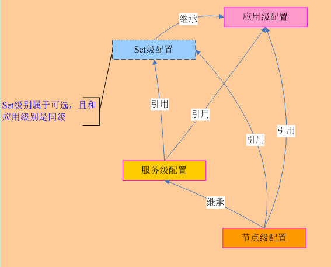

The Tars framework maintains these configuration information through two data tables, t_config_files and t_config_references.

The main information of the t_config_files table: the service configuration file name, the configuration file type, the service name of the configuration file, the set group to which the configuration file belongs, the node ip to which the configuration file belongs, and the index id value of the configuration file and the set group information of the service.

As shown below:

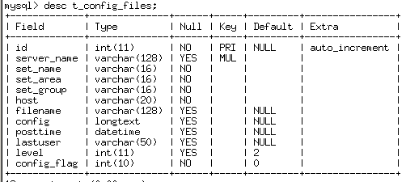

The main information of the t_config_references table: the index id of the configuration file and the configuration file index id referenced by the id.

As shown below:

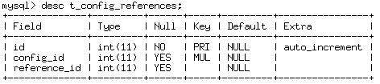

Note: The reference configuration file referred to in this article all denotes the application configuration file or the corresponding Set configuration file.

## 1.2. Principle of implementation

According to the above configuration file content structure, the Tars framework provides API for obtaining application-level configuration information and service-level configuration information (including obtaining reference configuration information at the same time) from the configServer service.

### 1.2.1. Obtain application level configuration

Currently, the service obtains application-level configuration information by using the addAppConfig interface provided in the framework, which is responsible for pulling the corresponding application configuration file from the configServer service to the local directory.
```
bool addAppConfig(const string &filename);
```
First, the application level configuration information is obtained from the configServer, and determine whether the business service contain the set group information. If yes, acquire the configuration information in the corresponding set packet, and finally the configuration information is saved in the local file.

Note that the set configuration has a higher priority than the application configuration does.

The main logic is as follows:

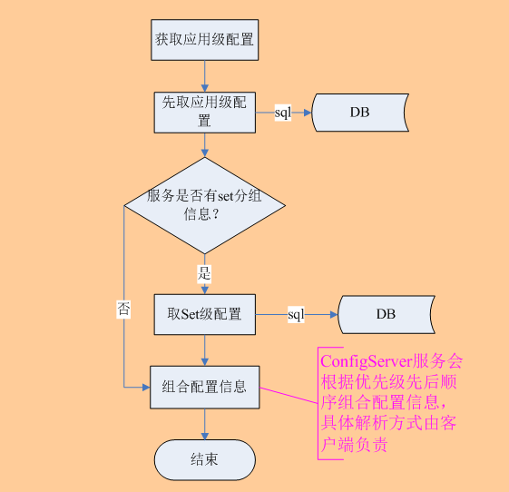

The result of pulling the application configuration is as follows:

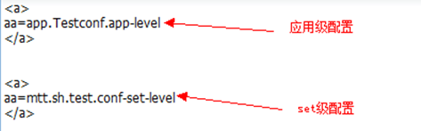

###1.2.2. Acquire service level configuration

At present, the service obtains the service level configuration information by using the addConfig interface provided in the framework, which is responsible for pulling the corresponding service configuration file from the configServer service to the local directory.
```
bool addConfig(const string &filename);
```
Obtaining service level configuration information is mainly divided into three steps:

1.First, Using service name, configuration file name, set group information, and configuration information level as retrieval conditions to obtain configuration information and index id whose configuration information level is "service level".

2.Secondly, the relation of obtaining corresponding configuration information index id (reference_id) which is referenced by index id in (1) from data table (t_config_referencses) is as follows:

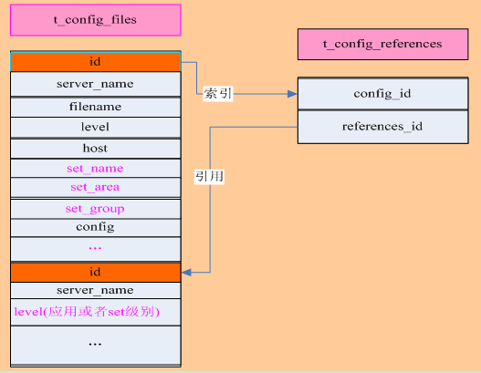

If there is reference information, the configuration information corresponding to the references_id in the data table t_config_files is retrieved, and the configuration file corresponding to the references_id is retrieved whether it contains "set level configuration information", and if so, the set level configuration information is acquired.

3.Combine the configuration information obtained in 2 and 2 in order, 2 is the first and 1 is the second.

4.Then, the service name, the configuration file name, the node ip of the service, and the configuration information level are used as search conditions, and the configuration information and the index id of the node level are obtained, and then steps 2 and 3 are repeated.

5.The order of composition of the service level configuration information finally returned to the business service is: service level reference configuration information + service level configuration information + node level reference configuration information + node level configuration information.

# 2. Business configuration example <a id="main-chapter-2"></a>

## 2.1. Application Configuration

Select the corresponding application (service) in the service tree, and select the "Application Configuration" page on the management interface opened on the right to add configuration, edit configuration, and so on. As shown below:

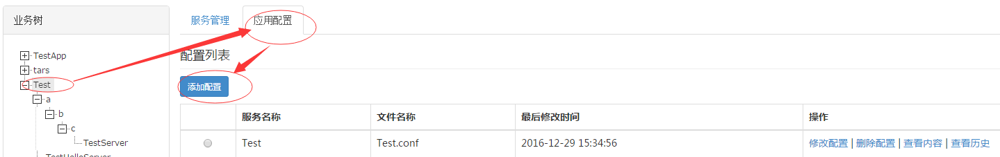

Add the application configuration Test.conf as shown below:

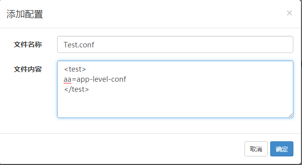

## 2.2. Set configuration

Select the corresponding Set group on the service tree, and select the “Set Configuration” page on the management interface opened on the right side to add configuration, edit configuration, etc., as shown below:

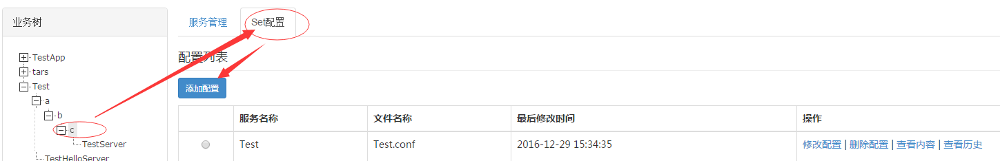

Add the application configuration Test.conf as shown below:

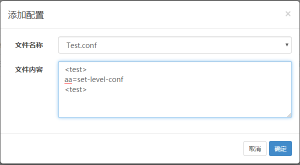

> * Note: The corresponding Set configuration can only be added if the corresponding application profile is added.

## 2.3. Service Configuration

In the service tree on the left, select the service which need to be maintained. Click the “Service Configuration” page in the management interface on the left to add, edit, and delete the service configuration. As shown below:

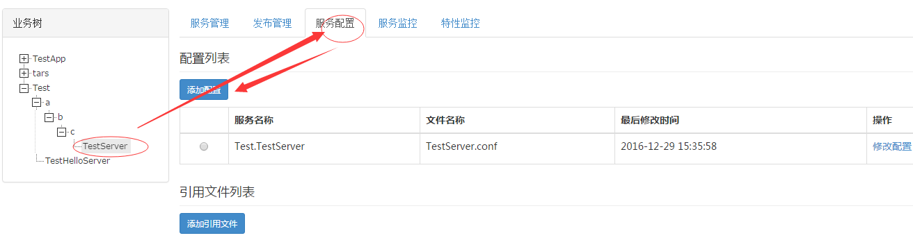

Add the application configuration Test.conf as shown below:

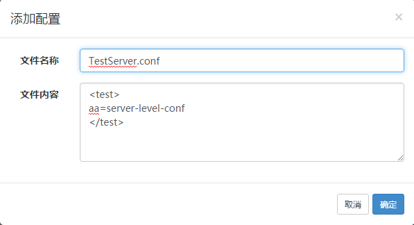

In the service configuration, you can refer to the configuration content of the upper level (that is, the content of the application configuration of the application (business) and the configuration content of the set) as shown below:

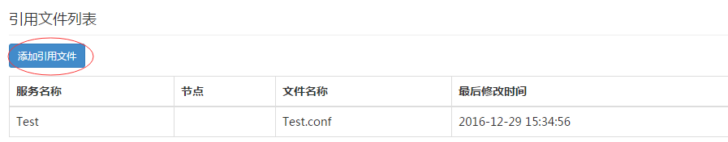

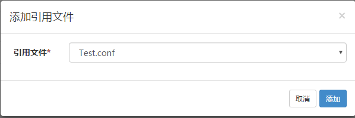
