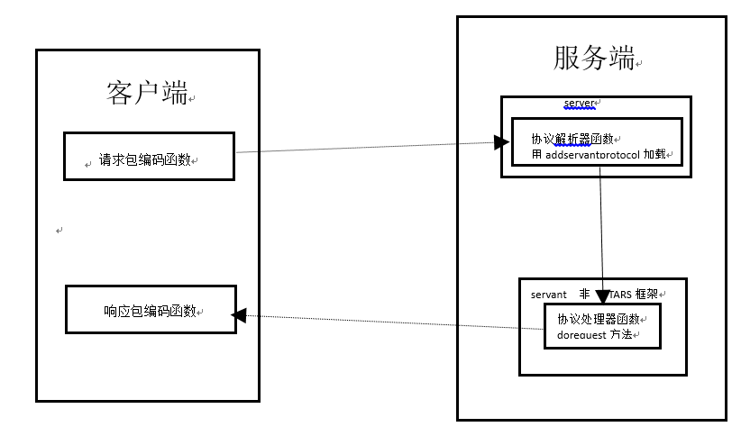

# Other protocol support
 
## Overview
The TARS service framework only supports TARS's own tars protocol by default. However, in actual application scenarios, other protocols, such as HTTP, need to be supported in the TARS service framework. In this case, the communicator cannot be used to send data. The business itself need to implement this part of the code. For custom protocols, the processing is similar.

For specific program examples, see cpp/examples/httpDemo/.

To develop a third-party protocol server end: you need to implement the protocol parser and load it into the service, and establish a non-TAF framework service object meanwhile, this class inherits from the Servant class and establishes the protocol processor by reloading the doRequest method in the Servant class. 
To access the service, the client needs to call the rpc function of proxy, before calling, set the request packet encoding function and the response packet decoding function for the proxy.



The black line in the figure represents the data flow direction: data (client) -> encoder of the request packet (client) -> protocol parser (server) -> doRequest protocol processor (server) -> generate return data (server) -> decoder of the response packet (client) -> response data (client)

The encoder of the request packet (client) is responsible for packaging the data sent by the client, and the protocol parser (server) is responsible for parsing the received data and sending to the protocol processor (server) for processing and generating the return data, and the decoder of the response packet (client) is responsible for decoding the returned data.

## 	Server Http protocol instance


/usr/local/tars/cpp/script/create_tars_server.sh TestApp HttpServer Http

Six files will be generated in the directory, delete http.tars (because it is not a tars protocol), and then some methods are manually implemented.

Take HelloServer as an example. You need to support the http protocol.

Modify the doRequest method inherited from the Servant class in HttpImp, which is the processor of the third-party service, this processor is responsible for processing the data sent to it by the protocol parser and generating the response returned to the client.

HttpImp.h
```cpp
#ifndef _HttpImp_H_
#define _HttpImp_H_

#include "servant/Application.h"

/**
 *
 *
 */
class HttpImp : public Servant
{
public:
    /**
     *
     */
    virtual ~HttpImp() {}

    /**
     *
     */
    virtual void initialize();

    /**
     *
     */
    virtual void destroy();

    /**
     *
     */
    int doRequest(TarsCurrentPtr current, vector<char> &buffer);

};
/////////////////////////////////////////////////////
#endif
```
HttpImp.cpp
```cpp
#include "HttpImp.h"
#include "servant/Application.h"

using namespace std;

//////////////////////////////////////////////////////
void HttpImp::initialize()
{
    //initialize servant here:
    //...
}

//////////////////////////////////////////////////////
void HttpImp::destroy()
{
    //destroy servant here:
    //...
}

int HttpImp::doRequest(TarsCurrentPtr current, vector<char> &buffer)
{
    TC_HttpRequest request; 
    vector<char> v = current->getRequestBuffer();
    string sBuf;
    sBuf.assign(&v[0],v.size());
    request.decode(sBuf);
    TC_HttpResponse rsp;
    string s="hello";
    rsp.setResponse(s.c_str(),s.size());
    rsp.encode(buffer);
   
    return 0;
}
```


The initialize() function of the HttpServer class is responsible for loading the service object HttpImp and setting the third-party protocol parser parse.
```cpp
#ifndef _HttpServer_H_
#define _HttpServer_H_

#include <iostream>
#include "servant/Application.h"

using namespace tars;

/**
 *
 **/
class HttpServer : public Application
{
public:
    /**
     *
     **/
    virtual ~HttpServer() {};

    /**
     *
     **/
    virtual void initialize();

    /**
     *
     **/
    virtual void destroyApp();
};

extern HttpServer g_app;

////////////////////////////////////////////
#endif
```

```cpp
#include "HttpServer.h"
#include "HttpImp.h"

using namespace std;

HttpServer g_app;

/////////////////////////////////////////////////////////////////
struct HttpProtocol
{
    /**
     * parse the heep request
     * @param in
     * @param out
     *
     * @return int
     */
    static int parseHttp(string &in, string &out)
    {
        try
        {
            //determine whether the request is a http request
            bool b = TC_HttpRequest ::checkRequest(in.c_str(), in.length());
            //intact http request
            if(b)
            {
                out = in;
                in  = "";
                //TLOGDEBUG("out size: " << out.size() << endl);
                return TC_EpollServer::PACKET_FULL;
            }
            else
            {
                return TC_EpollServer::PACKET_LESS;
            }
        }
        catch(exception &ex)
        {
            return TC_EpollServer::PACKET_ERR;
        }

        return TC_EpollServer::PACKET_LESS;             //the packet recieved is defective
    }

};

void
HttpServer::initialize()
{
    //initialize application here:
    //...

    addServant<HttpImp>(ServerConfig::Application + "." + ServerConfig::ServerName + ".HttpObj");
    addServantProtocol(ServerConfig::Application + "." + ServerConfig::ServerName + ".HttpObj",&HttpProtocol::parseHttp);
}
/////////////////////////////////////////////////////////////////
void
HttpServer::destroyApp()
{
    //destroy application here:
    //...
}
/////////////////////////////////////////////////////////////////
int
main(int argc, char* argv[])
{
    try
    {
        g_app.main(argc, argv);
        g_app.waitForShutdown();
    }
    catch (std::exception& e)
    {
        cerr << "std::exception:" << e.what() << std::endl;
    }
    catch (...)
    {
        cerr << "unknown exception." << std::endl;
    }
    return -1;
}
/////////////////////////////////////////////////////////////////
```


