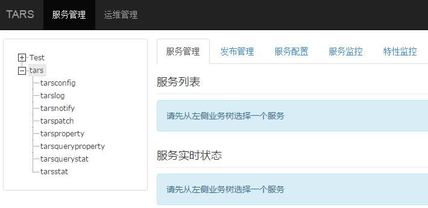

# Contents
> * [1.Environment construction] (#main-chapter-1)
> * [2.Service naming] (#main-chapter-2)
> * [3.Tars management system] (#main-chapter-3)
> * [4.Service deployment] (#main-chapter-4)
> * [5.Service development] (#main-chapter-5)
> * [6.Service release] (#main-chapter-6)

# 1. Environment construction  <a id="main-chapter-1"></a>

How to set up the Tars C++ environment, please refer to the article tars_install.md.

# 2. Service naming  <a id="main-chapter-2"></a>

The service name of the Tars framework consists of three parts:

APP：    Application name. it identifies a small set of service. In the Tars system, the app name must be unique. For example: TestApp.

Server： Service name. A process provides service. It's named according to the service function and generally named as XXServer. For example: HelloServer.

Servant：The name of provider. An interface or instance that provides a specific service. For example: HelloImp.

Instructions:

A Server can contain multiple Servant, and the system will use App + Server + Servant combination to define the routing name of the service in the system, called routing object. This name must be unique in the whole system, so that would uniquely identify itself when it externally served.

Therefore, when defining an App, you need pay attention to the uniqueness of the App.

For Example：TestApp.HelloServer.HelloObj.

# 3. Tars management system  <a id="main-chapter-3"></a>

When you login successfully, you will enter the Tars management system, as shown below:



Under the menu tree of the Tars management system, the following functions are available:

- Business management: Includes deployed services, service management, release management, service configuration, service monitoring, feature monitoring, etc.

- Operation and maintenance: Includes service deployment, capacity expansion, template management, etc.

# 4. Service deployment   <a id="main-chapter-4"></a>

Service deployment can actually be done after service development, but it is recommended to do it first.

As shown below：


-	"Application" refers to which application your service program belongs to, for example: "TestApp".
-   "Service name" refers to the identification name of your service program, for example: "HelloServer".
-	"Service type" refers to the language in which your service program is written, for example: C++ choice "tars_cpp".
-   "Template" refers to the name of the configuration file that is set when your service program starts. By default, "tars.default" can be used.
-	"Node" refers to the machine IP on which the service is deployed.
-   "Set group" refers to the group information of the set service. The Set information includes 3 parts: Set name, Set area, Set group name.
-   "OBJ name" refers to the name of the Servant
-   "OBJ binding IP" refers to the IP that is bound to the service, generally the same as the node.
-   "port" refers to the port to which OBJ is bounded.
-   "Port type" refers to Tcp or Udp.
-   "Protocol" refers to the communication protocol used by the application layer. The Tars framework uses the tars protocol by default.
-   "Number of Threads" refers to the number of business processing threads.
-   "Maximum number of connections" refers to the maximum number of connections supported.
-   "Maximum queue length" refers to the size of the request receiving queue.
-   "Queue timeout" refers to the timeout period for requesting receive queue.

Click "Submit", after success, the TestApp application under the menu will display the name of the HelloServer, and you will see the information of the new service program on the right side, as shown below.


The deployment on the management system is temporarily completed, so far, it just makes your service occupy a position on the management system, the real program has not been released yet.

# 5. Service development  <a id="main-chapter-5"></a>

## 5.1. Create service

### 5.1.1. Run Tars script

``` shell
/usr/local/tars/cpp/script/create_tars_server.sh [App] [Server] [Servant]
```

Executed in this example：/usr/local/tars/cpp/script/create_tars_server.sh TestApp HelloServer Hello

After the command is executed, the following file will be generated in the "TestApp/HelloServer/" of the current directory.

``` shell
HelloServer.h HelloServer.cpp Hello.tars HelloImp.h HelloImp.cpp makefile
```

These files already contain the most basic service framework and default test interface implementation.

### 5.1.2. Tars interface file

For the syntax and usage of the tars interface file, see tars_tup.md.

As follows：

Hello.tars：

``` cpp
module TestApp
{

interface Hello
{
    int test();
};

}; 
```

Automatically generate C++ files using the tars2cpp tool：

``` shell
/usr/local/tars/cpp/tools/tars2cpp hello.tars
``` 

Running this command will generate a hello.h file containing the client and server code.

### 5.1.3. HelloImp is the interface implementation class of Servant

Implement the interface test in file Hello.tars, as follows:

HelloImp.h

``` cpp

#ifndef _HelloImp_H_
#define _HelloImp_H_

#include "servant/Application.h"
#include "Hello.h"

/**
 * HelloImp inherits the Hello object defined in hello.h
 *
 */
class HelloImp : public TestApp::Hello
{
public:
    /**
     *
     */
    virtual ~HelloImp() {}

    /**
     * Initialization, Hello's virtual function, called when HelloImp is initialized
     */
    virtual void initialize();

    /**
     * Destructor, Hello's virtual function, called when HelloImp exits
     */
    virtual void destroy();

    /**
     * Implement the test interface defined in the Tars file
     */
    virtual int test(tars::TarsCurrentPtr current) { return 0;};

};
/////////////////////////////////////////////////////
#endif

```

HelloImp.cpp:

``` cpp

#include "HelloImp.h"
#include "servant/Application.h"

using namespace std;

//////////////////////////////////////////////////////
void HelloImp::initialize()
{
    //initialize servant here:
    //...
}

//////////////////////////////////////////////////////
void HelloImp::destroy()
{
    //destroy servant here:
    //...
}

```

### 5.1.4. HelloServer is the implementation class of the service

As follows:

HelloServer.h:

``` cpp
#ifndef _HelloServer_H_
#define _HelloServer_H_

#include <iostream>
#include "servant/Application.h"

using namespace tars;

/**
 * HelloServer inherits from the Application class in the Tars framework
 **/
class HelloServer : public Application
{
public:
    /**
     *
     **/
    virtual ~HelloServer() {};

    /**
     * Service initialization interface
     **/
    virtual void initialize();

    /**
     * Cleanup interface when the service exitsd
     **/
    virtual void destroyApp();
};

extern HelloServer g_app;

////////////////////////////////////////////
#endif

```

HelloServer.cpp:

```cpp
#include "HelloServer.h"
#include "HelloImp.h"

using namespace std;

HelloServer g_app;

/////////////////////////////////////////////////////////////////
void
HelloServer::initialize()
{
    //initialize application here:

    //Add the binding relationship between the HelloImp and the route Obj.
    addServant<HelloImp>(ServerConfig::Application + "." + ServerConfig::ServerName + ".HelloObj");
}
/////////////////////////////////////////////////////////////////
void
HelloServer::destroyApp()
{
    //destroy application here:
    //...
}
/////////////////////////////////////////////////////////////////
int
main(int argc, char* argv[])
{
    try
    {
        g_app.main(argc, argv);
        g_app.waitForShutdown();
    }
    catch (std::exception& e)
    {
        cerr << "std::exception:" << e.what() << std::endl;
    }
    catch (...)
    {
        cerr << "unknown exception." << std::endl;
    }
    return -1;
}
/////////////////////////////////////////////////////////////////

```

## 5.2. Compile

Enter the code directory, first do:

``` shell
make cleanall
make	
make tar
``` 

## 5.3. Extensions

The Tars framework provides an interface definition language that can be used in tars files to add interfaces and methods to extend the functionality of the service.

You can modify the tars file generated by create_tars_server.sh. In the following two interface methods, test is generated by default, and testHello is the newly added interface.

``` cpp
module TestApp
{

interface Hello
{
    int test();
    int testHello(string sReq, out string sRsp);
};

}; 
```

using /usr/local/tars/cpp/tools/tars2cpp hello.tars regenerate hello.h.

Modify HelloImp.h/HelloImp.cpp to implement the new interface code.

The testHello method that inherits the Hello class from HelloImp.h:

``` cpp
virtual int testHello(const std::string &sReq, std::string &sRsp, tars::TarsCurrentPtr current);
```

HelloImp.cpp implements the testHello method:

```cpp
int HelloImp::testHello(const std::string &sReq, std::string &sRsp, tars::TarsCurrentPtr current)
{
    TLOGDEBUG("HelloImp::testHellosReq:"<<sReq<<endl);
    sRsp = sReq;
    return 0;
}
```
Re-execute the following command to compile: 

``` shell
make cleanall
make
make tar
```

it will regenerate the HelloServer.tgz release package.

## 5.4. Client synchronous/asynchronous call service

On the development environment, create the /home/tarsproto/[APP]/[Server] directory.

For the example above：/home/tarsproto/TestApp/HelloServer.

Executing the command:
``` shell
make release 
```
it will generate .h, .tars and .mk files in the /home/tarsproto/TestApp/HelloServer directory.

In this way, when a service needs to access the HelloServer, it directly references the above file, and does not need to copy the .tars file of the HelloServer (that is, the tars file of the HelloServer does not need to be stored in the code directory).

Create a client code directory, like TestHelloClient/

Write file main.cpp, create an instance and call the interface function just written to test.

Synchronously：

```cpp
#include <iostream>
#include "servant/Communicator.h"
#include "Hello.h"

using namespace std;
using namespace TestApp;
using namespace tars;

int main(int argc,char ** argv)
{
    Communicator comm;

    try
    {
        HelloPrx prx;
        comm.stringToProxy("TestApp.HelloServer.HelloObj@tcp -h 10.120.129.226 -p 20001" , prx);

        try
        {
            string sReq("hello world");
            string sRsp("");

            int iRet = prx->testHello(sReq, sRsp);
            cout<<"iRet:"<<iRet<<" sReq:"<<sReq<<" sRsp:"<<sRsp<<endl;

        }
        catch(exception &ex)
        {
            cerr << "ex:" << ex.what() << endl;
        }
        catch(...)
        {
            cerr << "unknown exception." << endl;
        }
    }
    catch(exception& e)
    {
        cerr << "exception:" << e.what() << endl;
    }
    catch (...)
    {
        cerr << "unknown exception." << endl;
    }

    return 0;
}
```

Asynchronous:

```cpp
#include <iostream>
#include "servant/Communicator.h"
#include "Hello.h"

using namespace std;
using namespace TestApp;
using namespace tars;

class HelloCallBack : public HelloPrxCallback
{
public:
    HelloCallBack(){}

    virtual ~HelloCallBack(){}

    virtual void callback_testHello(tars::Int32 ret,  const std::string& sRsp)
    {
        cout<<"callback_testHello ret:"<< ret << "|sRsp:" << sRsp <<endl; 
    }

    virtual void callback_testHello_exception(tars::Int32 ret)
    {
        cout<<"callback_testHello_exception ret:"<< ret <<endl;
    }
};

int main(int argc,char ** argv)
{
    Communicator comm;

    try
    {
        HelloPrx prx;
        comm.stringToProxy("TestApp.HelloServer.HelloObj@tcp -h 10.120.129.226 -p 20001" , prx);

        try
        {
            string sReq("hello world");
            HelloPrxCallbackPtr cb = new HelloCallBack();
            prx->async_testHello(cb, sReq);
            cout<<" sReq:"<<sReq<<endl;
        }
        catch(exception &ex)
        {
            cerr<<"ex:"<<ex.what() <<endl;
        }
        catch(...)
        {
            cerr<<"unknown exception."<<endl;
        }
    }
    catch(exception& e)
    {
        cerr<<"exception:"<<e.what() <<endl;
    }
    catch (...)
    {
        cerr<<"unknown exception."<<endl;
    }

    getchar();

    return 0;
}
```

Edit the makefile, which contains the mk file in the /home/tarsproto/[APP]/[Server] directory that was just generated by make release, as follows:

```makefile
#-----------------------------------------------------------------------
APP         :=TestApp
TARGET      :=TestHelloClient
CONFIG      :=
STRIP_FLAG  := N

INCLUDE     += 
LIB         +=
#-----------------------------------------------------------------------
include /home/tarsproto/TestApp/HelloServer/HelloServer.mk
include /usr/local/tars/cpp/makefile/makefile.tars
#-----------------------------------------------------------------------
```

Make the target file, upload it to the environment where you can access the server and run the test.


# 6. Service release  <a id="main-chapter-6"></a>
In the menu tree of the management system, find the service you deployed, click to enter the service page.

first Select "Publish Management", then select the node to be published, then click "Publish Selected Node", and finally click "Upload Release Package", select the compiled package. As shown below:


 After the upload is successful, click the "Select Release Version" drop-down box and the service program you uploaded will appear. Select the top one (latest uploaded). As shown below:

 

 Click "Publish", the service starts to be released, after the release is successful, the following interface appears, as shown below:

 
 
If it fails, it may be a naming problem, an upload problem, and other environmental issues.
