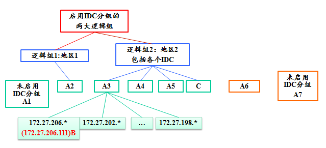
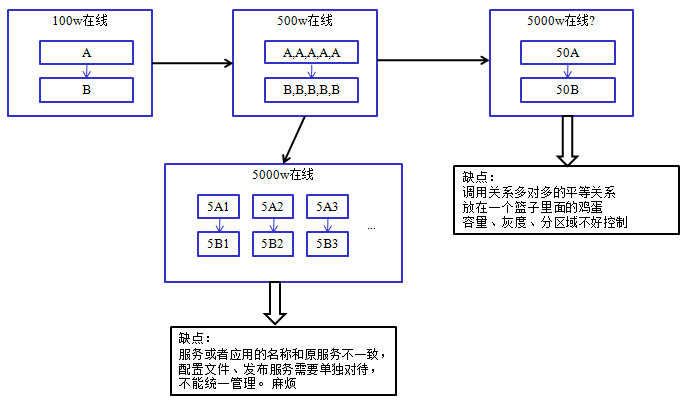
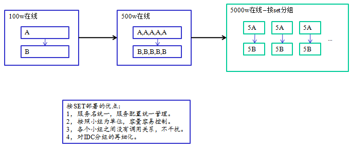
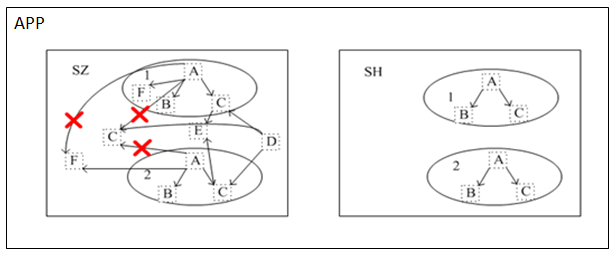

# Table of Contents
> * [Introduction to IDC grouping logic] (#main-chapter-1)
> * [Introduction to Set grouping logic] (#main-chapter-2)
> * [Invocation rules for IDC group and Set group] (#main-chapter-3)

# 1. IDC grouping logic introduction 

## 1.1. Meaning of the IDC group

> * According to the first three segments of the IP address to decide which specific computer room belongs to.
> * The information of which group the called service belongs to can be modified. If it is not specified, it will be matched according to the rules of the IP segment.

## 1.2. Change of group information

In the "service editing" of the management platform, it is changed by the operator, and then saved and stored in the Tars DB. The master Registry will read its own cache at regular intervals.

## 1.3. Execution flow of grouping logic

The main key will periodically take the adjusted Obj list information from the main control. After receiving the main request, the main control will complete the core logic of the IDC group.

The core process is as follows:

> * 1.First retrieve all the "active list" and "inactive list" of the service from the database.
> * 2.According to the client IP, the physical group of the caller is obtained, assuming GROUP_A
> * 3.Traverse the "activity list" and retrieve all IPs belonging to GROUP_A. If found, return these IPs to the client and exit; otherwise proceed to step 4.
> * 4.Traverse all logical groups according to the priority defined by t_group_priority. If the active IP is found in a logical group, these IPs are returned to the client and exited; otherwise, the next logical group is found, and if the active IP is still not found in all logical groups, then step 5 is performed.
> * 5.Traversing the "activity list" will belong to the group "-1", that is, the IP without the startup packet will be retrieved. If found, feed these IPs back to the user. If not found, proceed to step 6.
> * 6.Return the "activity list" retrieved from the database directly.

## 1.4. Example

The deployment of a service A (A1, A2, A3, A4, A5, A6, A7) in each region is shown in the figure above.

The caller service B (ip: 172.27.206.111) calls the A service, which can be called to: A3

The caller call service C calls the A service, which can be called to: A3, A4, A5

When the caller service C calls the A service, A3, A4, and A5 are stopped. The calls that can be called are: A2

When the caller service C calls the A service, A3, A4, A5, and A2 are stopped. The ones that can be called are: A1, A7

When the caller service C calls the A service, A3, A4, A5, A2, A1, and A7 are all stopped. The ones that can be called are: A6.

Description
> * The origin of the caller has determined the physical and logical groups of the keynote.
> * The callee can be modified and will affect the list of activities called by the caller.
> * Whether IDC grouping is enabled depends entirely on the callee! ! !

# 2. Set grouping logic introduction 

## 2.1. The meaning of the Set grouping

> * Set Name: Define a large Set name, which can be defined by the business name.
> * Set area: It can be divided according to the region, such as n, b (North and South), or by city, such as sh (Shanghai), sz (Shenzhen).
> * Set group name: The name of the group unit that can be actually repeated, generally 0, 1, 2, 3, 4, 5,...

## 2.2. Set grouping scene

Before the Set group is grouped, as shown below:

After the Set group, as shown below:

## 2.3. Calling logic rules for Set grouping

The following figure is an example:

The specific deployment situation is as follows:

Set Name|Set Area|Set Group Name|Service List
------|-----|------|----
APP |SZ |1 |A,B,C
APP |SZ |2 |A,B,C
APP |SZ |\*(wildcard) |C,E,D
APP |SH |1 |A,B,C
APP |SH |2 |A,B,C

1.A service calls B and C services, and three services exist in both 1, 2 Set packets. If the B service in 1 dies, A will not call the B service in 2, and will not call any B services in SH. Instead, it returns empty set to A  because they are not in the same SET.

2.For the C service exists in both the 1, 2 Set group and the wildcard group in the SZ area, if the C in 1 is dead, neither the C in the SZ area nor the C in the SZ area will be called. C in 2. The same as the F service, the A service in 1 will never call the F service in the wildcard group.

3.And for the A service in 2, the F service in the wildcard group can be called.

4.D service can call any C service in SZ (including wildcard group and specific SET service group)

5.For E services, C directly calls the E service in the wildcard group.

General principle of the call service:
> * 1.Both caller and callee must be enabled with SET grouping, and the SET full name must be the same.
> * 2.There is a callee in the SET (regardless of death and death), you can only call it in this SET. If there is no callee (it is also counted as dead), you can only call it in the public area of the local district. If it is not yet, you can only call the callee in the unenabled SET according to the IDC grouping principle. 1A->1C, 1A cannot->*C, 1A->1F, 1A cannot->*F, 2A->*F, C->E
> * 3.The wildcard group service can call any service in the SET and the wildcard group *D->*C+1C+2C
> * 4.If 1 is not met, it is called according to the IDC packet logic.

# 3. Calling rules for IDC grouping and Set grouping 

Number|client|server|rules
------|-----|------|----
1 |Enable Set |Enable Set |Find ip address in the same set, return empty if the same set has no available address
2 | Enable Set | Not enabled Set/Enable IDC | Addressed return address by IDC packet
3 | Enable Set | Not enabled Set / Not enabled IDC | Returns all available addresses
4 | Not enabled Set | Enable Set / Enable IDC | Addressed Address by IDC Packet
5 | Not enabled Set | Enable Set / Not enabled IDC | Return all available addresses
6 | Not enabled Set | Not enabled Set/Enable IDC | Addressed return address by IDC grouping
7 | Not enabled Set | Not enabled Set / Not enabled IDC | Returns all available addresses
