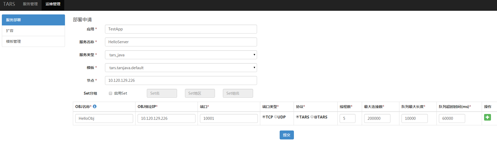
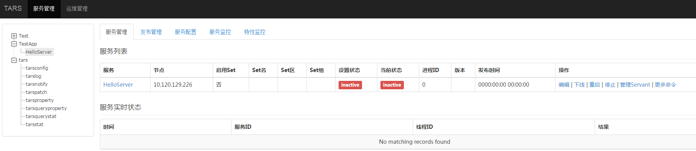
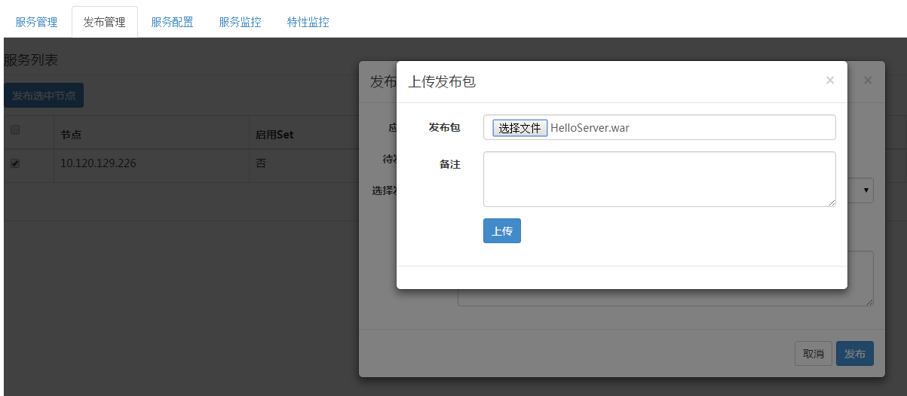
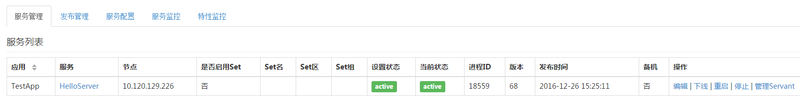

# Contents #
> * [Environment construction] (#main-chapter-1)
> * [Service development] (#main-chapter-2)
> * [Management system] (#main-chapter-3)
> * [Service naming] (#main-chapter-4)
> * [Service deployment] (#main-chapter-5)

# Quick start to the framework

## Environment construction <a id="main-chapter-1"></a>

###  Environmental dependence

- JDK1.8 or above
- Maven 2.2.1 or above

### Project construction 

First create a maven web project through IDE or maven.
Here is an example of eclipse: Click File -> New -> Project -> Maven Project -> maven-archetype-webapp, then enter groupId、artifactId. After the generation is completed, it can be imported through eclipse. The directory structure is as follows:

```
├── pom.xml
└── src
   ├── main
   │   ├── java
   │   │   └── tars
   │   │       └── test
   │   │          ├── HelloServant.java
   │   │          └── HelloServantImpl.java
   │   ├── resources
   │   │   └── servants.xml
   │   └── webapp
   └── test
       ├── java
       │   └── tars
       │       └── test
       │           └── TarsTest.java
       └── resources
```

### Dependent configuration
Add a dependency jar package by modifying pom.xml

- Framework dependency configuration

```xml
<dependency>
		<groupId>com.tencent.tars</groupId>
     	<artifactId>tars-server</artifactId>
     	<version>1.0.4</version>
     	<type>jar</type>
</dependency>
```

- Plugin dependency configuration

```xml
<plugin>
	<groupId>com.tencent.tars</groupId>
   	<artifactId>tars-maven-plugin</artifactId>
   	<version>1.0.4</version>
  	<configuration>
   		<tars2JavaConfig>
  			<tarsFiles>
   				<tarsFile>${basedir}/src/main/resources/hello.tars</tarsFile>
   			</tarsFiles>
  			<tarsFileCharset>UTF-8</tarsFileCharset>
   			<servant>true</servant>
  			<srcPath>${basedir}/src/main/java</srcPath>
  			<charset>UTF-8</charset>
   			<packagePrefixName>com.qq.tars.quickstart.server.</packagePrefixName>
  		</tars2JavaConfig>
   	</configuration>
</plugin>
```

## Service development <a id="main-chapter-2"></a>

### Interface file definition

The interface file is defined by the Tars interface description language. Create hello.tars file in the src/main/resources directory. its content is as follows:

hello.tars:

```
module TestApp 
{
	interface Hello
	{
	    string hello(int no, string name);
	};
};

```

### Interface file compilation

Tars provides plugins to compile and generate java code, only need to add java file configuration in tars-maven-plugin

```xml
<plugin>
	<groupId>com.tencent.tars</groupId>
	<artifactId>tars-maven-plugin</artifactId>
	<version>1.0.4</version>
	<configuration>
		<tars2JavaConfig>
			<!-- tars file location -->
			<tarsFiles>
				<tarsFile>${basedir}/src/main/resources/hello.tars</tarsFile>
			</tarsFiles>
			<!-- source file encoding  -->
			<tarsFileCharset>UTF-8</tarsFileCharset>
			<!-- generate server code -->
			<servant>true</servant>
			<!-- the encoding format of the generated file -->
			<charset>UTF-8</charset>
			<!-- generated file director -->
			<srcPath>${basedir}/src/main/java</srcPath>
			<!-- the prefix of the generated file -->
			<packagePrefixName>com.qq.tars.quickstart.server.</packagePrefixName>
		</tars2JavaConfig>
	</configuration>
</plugin>
```

Execute “mvn tars:tars2java” in the project root directory.

```java
@Servant
public interface HelloServant {

	public String hello(int no, String name);
}
```

### Service interface implementation

Create a new HelloServantImpl.java file and implement the HelloServant.java interface.

```java
public class HelloServantImpl implements HelloServant {

    @Override
    public String hello(int no, String name) {
        return String.format("hello no=%s, name=%s, time=%s", no, name, System.currentTimeMillis());
    }
}
```

### Service external configuration

Create a servants.xml configuration file under resources, the configuration exposure service will be loaded when the process starts, the configuration is as follows:

```xml
<?xml version="1.0" encoding="UTF-8"?>
<servants>
	<servant name="HelloObj">
		<home-api>com.qq.tars.quickstart.server.testapp.HelloServant</home-api>
		<home-class>com.qq.tars.quickstart.server.testapp.impl.HelloServantImpl</home-class>
	</servant>
</servants>
```


Note: In addition to this method, you can also use the spring mode to configure the service, see tars_java_spring.md for details.

### Service compilation and packaging

Execute "mvn package" in the project root directory to generate the war package, which can be published later in the management system.

### Client synchronous/asynchronous call service

- Build a client project.

- Add dependency.

```xml
<dependency>
	<groupId>com.tencent.tars</groupId>
   	<artifactId>tars-client</artifactId>
   	<version>1.0.4</version>
   	<type>jar</type>
</dependency>
```

- Add plugin.

```
  <plugin>
   	<groupId>com.tencent.tars</groupId>
   	<artifactId>tars-maven-plugin</artifactId>
   	<version>1.0.4</version>
   	<configuration>
   		<tars2JavaConfig>
   			<!-- tars file location -->
   			<tarsFiles>
   				<tarsFile>${basedir}/src/main/resources/hello.tars</tarsFile>
   			</tarsFiles>
   			<!-- source file encoding format -->
   			<tarsFileCharset>UTF-8</tarsFileCharset>
   			<!-- generate code, note:client call, need to be set to false here -->
   			<servant>false</servant>
   			<!-- the encoding format of the generated file -->
   			<charset>UTF-8</charset>
   			<!-- generated file directory -->
   			<srcPath>${basedir}/src/main/java</srcPath>
   			<!-- the prefix of the generated file -->
   			<packagePrefixName>com.qq.tars.quickstart.client.</packagePrefixName>
   		</tars2JavaConfig>
   	</configuration>
  </plugin>
```

- Generate code based on the tars interface file

​```
@Servant
public interface HelloPrx {
	public String hello(int no, String name);
      
      	public String hello(int no, String name, @TarsContext java.util.Map<String, String> ctx);
      
      	public void async_hello(@TarsCallback HelloPrxCallback callback, int no, String name);
      
      	public void async_hello(@TarsCallback HelloPrxCallback callback, int no, String name, @TarsContext java.util.Map<String, String> ctx);
}

```

- Synchronous call


```java
public static void main(String[] args) {
	CommunicatorConfig cfg = new CommunicatorConfig();
        //building a communicator
        Communicator communicator = CommunicatorFactory.getInstance().getCommunicator(cfg);
        //generate proxy objects through the communicator
        HelloPrx proxy = communicator.stringToProxy(HelloPrx.class, "TestApp.HelloServer.HelloObj");
        String ret = proxy.hello(1000, "HelloWorld");
        System.out.println(ret);
}
```
- Asynchronous call

```
public static void main(String[] args) {
	CommunicatorConfig cfg = new CommunicatorConfig();
        //building a communicator
        Communicator communicator = CommunicatorFactory.getInstance().getCommunicator(cfg);
        //generate proxy objects through the communicator
        HelloPrx proxy = communicator.stringToProxy(HelloPrx.class, "TestApp.HelloServer.HelloObj");
        proxy.async_hello(new HelloPrxCallback() {
        		
        	@Override
        	public void callback_expired() {
        	}
        		
        	@Override
        	public void callback_exception(Throwable ex) {
        	}
        		
        	@Override
        	public void callback_hello(String ret) {
        		System.out.println(ret);
        	}
        }, 1000, "HelloWorld");
}
```

## Management system <a id="main-chapter-3"></a>

Enter the Tars management system, as shown below:


Under the menu tree of the Tars management system, the following functions are available:

- Business management：Includes deployed services, service management, release management, service configuration, service monitoring, feature monitoring, etc.

- Operation and maintenance：Includes service deployment, capacity expansion, template management, etc.


## Service naming <a id="main-chapter-4"></a>

The service name of the Tars framework consists of three parts:

APP：    Application name. it identifies a small set of service. In the Tars system, the app name must be unique. For example: TestApp.

Server： Service name. A process provides service. It's named according to the service function and generally named as XXServer. For example: HelloServer.

Servant：The name of provider. An interface or instance that provides a specific service. For example: HelloImp.

Instructions:

A Server can contain multiple Servant, and the system will use App + Server + Servant combination to define the routing name of the service in the system, called routing object. This name must be unique in the whole system, so that would uniquely identify itself when it externally served.

Therefore, when defining an App, you need pay attention to the uniqueness of the App.

For Example：TestApp.HelloServer.HelloObj.

## Service deployment <a id="main-chapter-5"></a>

### Apply for deployment ###

Click on the main menu "Operation and Maintenance Management" -> "Service Deployment".

As shown below：



-	"Application" refers to which application your service program belongs to, for example: "TestApp".
-   "Service name" refers to the identification name of your service program, for example: "HelloServer".
-	"Service type" refers to the language in which your service program is written, for example: C++ choice "tars_cpp".
-   "Template" refers to the name of the configuration file that is set when your service program starts. By default, "tars.default" can be used.
-	"Node" refers to the machine IP on which the service is deployed.
-   "Set group" refers to the group information of the set service. The Set information includes 3 parts: Set name, Set area, Set group name.
-   "OBJ name" refers to the name of the Servant
-   "OBJ binding IP" refers to the IP that is bound to the service, generally the same as the node.
-   "port" refers to the port to which OBJ is bounded.
-   "Port type" refers to Tcp or Udp.
-   "Protocol" refers to the communication protocol used by the application layer. The Tars framework uses the tars protocol by default.
-   "Number of Threads" refers to the number of business processing threads.
-   "Maximum number of connections" refers to the maximum number of connections supported.
-   "Maximum queue length" refers to the size of the request receiving queue.
-   "Queue timeout" refers to the timeout period for requesting receive queue.

Click "Submit". After success, the TestApp application under the menu will display the name of the HelloServer, and you will see the information of the new service program on the right side, as shown below:



The deployment on the management system is temporarily completed, so far, just make your service occupy a position on the management system, the real program has not been released yet.

### Service release

In the menu tree of the management system, find the service you deployed, click to enter the service page.

First Select "Publish Management", then select the node to be published, then click "Publish Selected Node", and finally click "Upload Release Package", select the compiled package. As shown below:



 After the upload is successful, click the "Select Release Version" drop-down box and the service program you uploaded will appear. Select the top one (latest uploaded). As shown below:

 

 Click "Publish", the service starts to be released, after the release is successful, the following interface appears, as shown below:

 

If it fails, it may be a naming problem, an upload problem, or other environmental issues.
