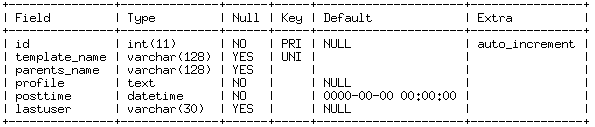

# table of contents
> * [1 Introducation of template configuration] (#main-chapter-1)
> * [2 Template configuration]     (#main-chapter-2)
>>* [2.1 tars.default template](#chapter-1)
>>* [2.2 tars.tarsconfig template] (#chapter-2)
>>* [2.3 tars.tarslog template] (#chapter-3)
>>* [2.4 tars.tarsnotify template] (#chapter-4)
>>* [2.5 tars.tarspatch template] (#chapter-5)
>>* [2.6 tars.tarsproperty template] (#chapter-6)
>>* [2.7 tars.tarsstat template] (#chapter-7)
>>* [2.8 tars.tarsquerystat template] (#chapter-8)
>>* [2.9 tars.tarsqueryproperty template] (#chapter-9)
>>* [2.10 tars.tarsjava.default template] (#chapter-10)

# 1. Introducation of template configuration <a id="main-chapter-1"></a>

A template configuration file must be designed when each Tars service starts running. The template configuration of the service deployed in the Tars web management system is organized by node. You need to create a template file by yourself if it is not on the web management system.

The template configuration file for the Tars framework is organized by the parent template, main template and private template template configuration.

The configuration file information of the parent template and main template is stored in the db_tars/t_profile_template data table. The table structure is as follows:



The private template information is stored in the profile field of the db_tars/t_server_conf data table.
# 2. Template configuration  <a id="main-chapter-2"></a>

Note that you need to modify the db.tars.com in the template to the machine that deploys the database.

## 2.1. tars.default template <a id="chapter-1"></a>

Template name:tars.default(every service template inherit this template directly or indirectly)

content:
```xml
<tars>
	<application>
		enableset=${enableset}
		setdivision=${setdivision}
		<client>
			locator=${locator}
			sync-invoke-timeout=3000
			async-invoke-timeout=5000
			refresh-endpoint-interval=60000
			stat=tars.tarsstat.StatObj
			property=tars.tarsproperty.PropertyObj
			report-interval=60000
			sample-rate=100000
			max-sample-count=50
			asyncthread=${asyncthread}
			modulename=${modulename}
		</client>
		<server>
			app=${app}
			server=${server}
			localip=${localip}
			local=${local}
			basepath=${basepath}
			datapath=${datapath}
			logpath=${logpath}
			logsize=10M
			config=tars.tarsconfig.ConfigObj
			notify=tars.tarsnotify.NotifyObj
			log=tars.tarslog.LogObj
			deactivating-timeout=3000
			logLevel=DEBUG
		</server>
	</application>
</tars>
```

## 2.2. tars.tarsconfig template <a id="chapter-2"></a>

Template name:tars.tarsconfig(inherit tars.default)

content:
```xml
<tars>
	<application>
		enableset=${enableset}
		setdivision=${setdivision}
		<client>
			locator=${locator}
			sync-invoke-timeout=3000
			async-invoke-timeout=5000
			refresh-endpoint-interval=60000
			report-interval=60000
			sample-rate=100000
			max-sample-count=50
			asyncthread=${asyncthread}
			modulename=${modulename}
		</client>
		<server>
			app=${app}
			server=${server}
			localip=${localip}
			local=${local}
			basepath=${basepath}
			datapath=${datapath}
			logpath=${logpath}
			logsize=10M
			config=tars.tarsconfig.ConfigObj
			notify=tars.tarsnotify.NotifyObj
			log=tars.tarslog.LogObj
			deactivating-timeout=3000
			logLevel=DEBUG
		</server>
	</application>
	<db>
		charset=utf8
		dbhost=db.tars.com
		dbname=db_tars
		dbpass=tars2015
		dbport=3306
		dbuser=tars
	</db>
</tars>
```

## 2.3. tars.tarslog template <a id="chapter-3"></a>

Template name:tars.tarslog(inherit tars.default)

content:
```xml
<tars>
	<application>
		enableset=${enableset}
		setdivision=${setdivision}
		<client>
			locator=${locator}
			sync-invoke-timeout=3000
			async-invoke-timeout=5000
			refresh-endpoint-interval=60000
			stat=tars.tarsstat.StatObj
			property=tars.tarsproperty.PropertyObj
			report-interval=60000
			sample-rate=100000
			max-sample-count=50
			asyncthread=${asyncthread}
			modulename=${modulename}
		</client>
		<server>
			app=${app}
			server=${server}
			localip=${localip}
			local=${local}
			basepath=${basepath}
			datapath=${datapath}
			logpath=${logpath}
			logsize=100000000
			config=tars.tarsconfig.ConfigObj
			notify=tars.tarsnotify.NotifyObj
			log=tars.tarslog.LogObj
			deactivating-timeout=3000
			logLevel=ERROR
		</server>
	</application>
	<log>
		logpath=/usr/local/app/tars/remote_app_log
		logthread=10
		<format>
			hour=xx
		</format>
	</log>
</tars>

```
## 2.4. tars.tarsnotify template <a id="chapter-4"></a>

Template name:tars.tarsnotify(inherit tars.default)

content:
```xml
<tars>
	sql=CREATE TABLE `${TABLE}` (   `id` int(11) NOT NULL AUTO_INCREMENT,  `application` varchar(128) DEFAULT '',  `server_name` varchar(128) DEFAULT NULL, `container_name` varchar(128) DEFAULT '' , `node_name` varchar(128) NOT NULL DEFAULT '',  `set_name` varchar(16) DEFAULT NULL,  `set_area` varchar(16) DEFAULT NULL,  `set_group` varchar(16) DEFAULT NULL,  `server_id` varchar(100) DEFAULT NULL,  `thread_id` varchar(20) DEFAULT NULL,  `command` varchar(50) DEFAULT NULL,  `result` text,  `notifytime` datetime DEFAULT NULL,  PRIMARY KEY (`id`),  KEY `index_name` (`server_name`),  KEY `servernoticetime_i_1` (`notifytime`),  KEY `indx_1_server_id` (`server_id`),  KEY `query_index` (`application`,`server_name`,`node_name`,`set_name`,`set_area`,`set_group`) ) ENGINE\=InnoDB DEFAULT CHARSET\=utf8
	<application>
		enableset=${enableset}
		setdivision=${setdivision}
		<client>
			locator=${locator}
			sync-invoke-timeout=3000
			async-invoke-timeout=5000
			refresh-endpoint-interval=60000
			report-interval=60000
			sample-rate=100000
			max-sample-count=50
			asyncthread=${asyncthread}
			modulename=${modulename}
		</client>
		<server>
			app=${app}
			server=${server}
			localip=${localip}
			local=${local}
			basepath=${basepath}
			datapath=${datapath}
			logpath=${logpath}
			logsize=10M
			config=tars.tarsconfig.ConfigObj
			notify=tars.tarsnotify.NotifyObj
			log=tars.tarslog.LogObj
			deactivating-timeout=3000
			logLevel=DEBUG
		</server>
	</application>
	<db>
		charset=utf8
		dbhost=db.tars.com
		dbpass=tars2015
		dbport=3306
		dbuser=tars
		dbname=db_tars
	</db>
	<hash>
		min_block=50
		max_block=200
		factor=1.5
		file_path=./notify
		file_size=50000000
		max_page_num=30
		max_page_size=20
	</hash>
</tars>

```
## 2.5. tars.tarspatch template <a id="chapter-5"></a>

Template name:tars.tarspatch(inherit tars.default)

content:
```xml
<tars>
	directory=/usr/local/app/patchs/tars
	uploadDirectory=/usr/local/app/patchs/tars.upload
	size=100M
	<application>
		enableset=${enableset}
		setdivision=${setdivision}
		<client>
			locator=${locator}
			sync-invoke-timeout=3000
			async-invoke-timeout=5000
			refresh-endpoint-interval=60000
			report-interval=60000
			sample-rate=100000
			max-sample-count=50
			asyncthread=${asyncthread}
			modulename=${modulename}
		</client>
		<server>
			app=${app}
			server=${server}
			localip=${localip}
			local=${local}
			basepath=${basepath}
			datapath=${datapath}
			logpath=${logpath}
			logsize=10M
			config=tars.tarsconfig.ConfigObj
			notify=tars.tarsnotify.NotifyObj
			log=tars.tarslog.LogObj
			deactivating-timeout=3000
			logLevel=DEBUG
		</server>
	</application>
</tars>
```

## 2.6. tars.tarsproperty template <a id="chapter-6"></a>

Template name:tars.tarsproperty(inherit tars.default)

content:
```xml
<tars>
	sql=CREATE TABLE `${TABLE}` (`stattime` timestamp NOT NULL default CURRENT_TIMESTAMP,`f_date` date NOT NULL default '1970-01-01', `f_tflag` varchar(8) NOT NULL default '',`master_name` varchar(128) NOT NULL default '',`master_ip` varchar(16) default NULL,`property_name` varchar(100) default NULL,`set_name` varchar(15) NOT NULL default '',`set_area` varchar(15) NOT NULL default '',`set_id` varchar(15) NOT NULL default '',`policy` varchar(20) default NULL,`value` varchar(255) default NULL, KEY (`f_date`,`f_tflag`,`master_name`,`master_ip`,`property_name`,`policy`),KEY `IDX_MASTER_NAME` (`master_name`),KEY `IDX_MASTER_IP` (`master_ip`),KEY `IDX_TIME` (`stattime`)) ENGINE\=Innodb
	<application>
		enableset=${enableset}
		setdivision=${setdivision}
		<client>
			locator=${locator}
			sync-invoke-timeout=3000
			async-invoke-timeout=5000
			refresh-endpoint-interval=60000
			report-interval=60000
			sample-rate=100000
			max-sample-count=50
			asyncthread=${asyncthread}
			modulename=${modulename}
		</client>
		<server>
			app=${app}
			server=${server}
			localip=${localip}
			local=${local}
			basepath=${basepath}
			datapath=${datapath}
			logpath=${logpath}
			logsize=10M
			config=tars.tarsconfig.ConfigObj
			notify=tars.tarsnotify.NotifyObj
			log=tars.tarslog.LogObj
			deactivating-timeout=3000
			logLevel=DEBUG
		</server>
	</application>
	<db>
		charset
		dbhost=db.tars.com
		dbname=tars
		dbport=3306
		dbuser=tars
		dbpass=tars2015
	</db>
	<multidb>
		<db1>
			dbhost=db.tars.com
			dbname=tars_property
			tbname=tars_property_
			dbuser=tars
			dbpass=tars2015
			dbport=3306
			charset=utf8
		</db1>
		<db2>
			dbhost=db.tars.com
			dbname=tars_property
			tbname=tars_property_
			dbuser=tars
			dbpass=tars2015
			dbport=3306
			charset=utf8
		</db2>
	</multidb>
	<hashmap>
		factor=1.5
		file=hashmap.txt
		insertInterval=5
		maxBlock=200
		minBlock=100
		size=10M
	</hashmap>
	<reapSql>
		Interval=10
		sql=insert ignore into t_master_property select  master_name, property_name, policy from ${TABLE}  group by  master_name, property_name, policy;
	</reapSql>
</tars>

```
 
## 2.7. tars.tarsstat template <a id="chapter-7"></a>

Template name:tars.tarsstat(inherit tars.default)

content:
```xml
<tars>
	sql=CREATE TABLE `${TABLE}`( `stattime` timestamp NOT NULL default CURRENT_TIMESTAMP,`f_date` date NOT NULL default '1970-01-01', `f_tflag` varchar(8) NOT NULL default '',`source_id` varchar(15) default NULL,`master_name` varchar(64) default NULL,`slave_name` varchar(64) default NULL,`interface_name` varchar(64) default NULL,`tars_version` varchar(16) NOT NULL default '',`master_ip` varchar(15) default NULL,`slave_ip` varchar(21) default NULL,`slave_port` int(10) default NULL,`return_value` int(11) default NULL,`succ_count` int(10) unsigned default NULL,`timeout_count` int(10) unsigned default NULL,`exce_count` int(10) unsigned default NULL,`interv_count` varchar(128) default NULL,`total_time` bigint(20) unsigned default NULL,`ave_time` int(10) unsigned default NULL,`maxrsp_time` int(10) unsigned default NULL,`minrsp_time` int(10) unsigned default NULL,PRIMARY KEY (`source_id`,`f_date`,`f_tflag`,`master_name`,`slave_name`,`interface_name`,`master_ip`,`slave_ip`,`slave_port`,`return_value`,`tars_version`),KEY `IDX_TIME` (`stattime`),KEY `IDC_MASTER` (`master_name`),KEY `IDX_INTERFACENAME` (`interface_name`),KEY `IDX_FLAGSLAVE` (`f_tflag`,`slave_name`), KEY `IDX_SLAVEIP` (`slave_ip`),KEY `IDX_SLAVE` (`slave_name`),KEY `IDX_RETVALUE` (`return_value`),KEY `IDX_MASTER_IP` (`master_ip`),KEY `IDX_F_DATE` (`f_date`)) ENGINE\=MyISAM DEFAULT CHARSET\=utf8
	enWeighted=1
	useolddatabase=0
	time_out=600
	<application>
		enableset=${enableset}
		setdivision=${setdivision}
		<client>
			locator=${locator}
			sync-invoke-timeout=3000
			async-invoke-timeout=5000
			refresh-endpoint-interval=60000
			report-interval=60000
			sample-rate=100000
			max-sample-count=50
			asyncthread=${asyncthread}
			modulename=${modulename}
		</client>
		<server>
			app=${app}
			server=${server}
			localip=${localip}
			local=${local}
			basepath=${basepath}
			datapath=${datapath}
			logpath=${logpath}
			logsize=10M
			config=tars.tarsconfig.ConfigObj
			notify=tars.tarsnotify.NotifyObj
			log=tars.tarslog.LogObj
			deactivating-timeout=3000
			logLevel=DEBUG
		</server>
	</application>
	<masteripGroup>
		tars.tarsstat;1.1.1.1
	</masteripGroup>
	<hashmap>
		masterfile=hashmap_master.txt
		slavefile=hashmap_slave.txt
		insertInterval=5
		enableStatCount=0
		size=8M
		countsize=1M
	</hashmap>
	<reapSql>
		interval=5
		insertDbThreadNum=4
	</reapSql>
	<multidb>
        <db1>
			dbhost=db.tars.com
			dbname=tars_stat
			tbname=tars_stat_
			dbuser=tars
			dbpass=tars2015
			dbport=3306
			charset=utf8
        </db1>
	</multidb>
</tars>

```
## 2.8. tars.tarsquerystat template <a id="chapter-8"></a>
Template name:tars.tarsquerystat(inherit tars.default)
``` 
<tars>
    <application>
    #whether to enable SET grouping
    enableset=${enableset}
    #full name of the SET group.(mtt.s.1)
    setdivision=${setdivision}
    <client>
        #address
        locator =${locator}
        #synchronous call timeout, default 3s(milliseconds)
        sync-invoke-timeout = 3000
        #asynchronous call timeout, default 5s(milliseconds)
        async-invoke-timeout =5000
        #the interval time to reacquire service list(milliseconds)
        refresh-endpoint-interval = 60000
        #call service between modules [optional]
        stat            = tars.tarsstat.StatObj
        #the service of attribute escalation [optional]
        property                    = tars.tarsproperty.PropertyObj
        #the interval time to report, default 60s(milliseconds)
        report-interval            = 60000
        #stat sampling ratio 1:n. For example, the sampling ratio is one thousandth when the sample-rate equal 1000
         sample-rate = 100000
        #the maximum number of samples in 1 minute
         max-sample-count = 50

        #the thread number of network asynchronous callback
        asyncthread      = ${asyncthread}
        #template name
        modulename      = ${modulename}
    </client>
        
    #define all bound IPs
    <server>
        #application name
        app      = ${app}
        #service name
        server  = ${server}
        #local ip
        localip  = ${localip}

        #local management socket[optional]
        local  = ${local}
        #service data directory, executable file, configuration file, etc.
        basepath = ${basepath}
        #
        datapath = ${datapath}
        #log path
        logpath  = ${logpath}
        #log size
        logsize = 10M
        #number of logs
        #   lognum = 10
        #configuration center address[optional]
        config  = tars.tarsconfig.ConfigObj
        #inofrmation centor address[optional]
        notify  = tars.tarsnotify.NotifyObj
        #remote LogServer[optional]
        log = tars.tarslog.LogObj
        #waiting time when closing the service
        deactivating-timeout = 3000
        #the default value of scroll log level
        logLevel=DEBUG
    </server>          
    </application>
    <countdb>
		<db1>
			dbhost=db.tars.com
		   	dbname=tars_stat
			tbname=tars_stat_
			dbuser=tars
			dbpass=tars2015
			dbport=3306
			charset=utf8
		</db1>
    </countdb>
    </tars>
>
```

## 2.9.tars.tarsqueryproperty template <a id="chapter-9"></a>
Template name:tars.tarsqueryproperty(inherit tars.default)
``` 
<tars>
    <application>
    #whether to enable SET grouping
    enableset=${enableset}
    #full name of the SET group.(mtt.s.1)
    setdivision=${setdivision}
    <client>
        #address
        locator =${locator}
        #synchronous call timeout, default 3s(milliseconds)
        sync-invoke-timeout = 3000
        #asynchronous call timeout, default 5s(milliseconds)
        async-invoke-timeout =5000
        #the interval time to reacquire service list(milliseconds)
        refresh-endpoint-interval = 60000
        #call service between modules [optional]
        stat            = tars.tarsstat.StatObj
        #the service of attribute escalation [optional]
        property                    = tars.tarsproperty.PropertyObj
        #the interval time to report, default 60s(milliseconds)
        report-interval            = 60000
        #stat sampling ratio 1:n. For example, the sampling ratio is one thousandth when the sample-rate equal 1000
         sample-rate = 100000
        #the maximum number of samples in 1 minute
         max-sample-count = 50

        #the thread number of network asynchronous callback
        asyncthread      = ${asyncthread}
        #template name
        modulename      = ${modulename}
    </client>
        
    #define all bound IPs
    <server>
        #application name
        app      = ${app}
        #service name
        server  = ${server}
        #local ip
        localip  = ${localip}

        #local management socket[optional]
        local  = ${local}
        #service data directory, executable file, configuration file, etc.
        basepath = ${basepath}
        #
        datapath = ${datapath}
        #log path
        logpath  = ${logpath}
        #log size
        logsize = 10M
        #number of logs
        #   lognum = 10
        #configuration center address[optional]
        config  = tars.tarsconfig.ConfigObj
        #inofrmation centor address[optional]
        notify  = tars.tarsnotify.NotifyObj
        #remote LogServer[optional]
        log = tars.tarslog.LogObj
        #waiting time when closing the service
        deactivating-timeout = 3000
        #the default value of scroll log level
        logLevel=DEBUG
    </server>          
    </application>
    <countdb>
		<db1>
			dbhost=10.121.108.158
			dbname=tars_property
			tbname=tars_property_
			dbuser=tars
			dbpass=tars2015
			dbport=3306
			charset=utf8
		</db1>
    </countdb>
    </tars>
>
```
## 2.10. tars.tarsjava.default template <a id="chapter-10"></a>

Template name:.tars.tarsjava.default(inherit tars.default, every service template of tarsjava inherit this template directly or indirectly)

content:
```xml
<tars>
	<application>
		enableset=${enableset}
		setdivision=${setdivision}
		<client>
			asyncthread=${asyncthread}
			locator=${locator}
			sync-invoke-timeout=3000
			async-invoke-timeout=5000
			refresh-endpoint-interval=60000
			stat=tars.tarsstat.StatObj
			property=tars.tarsproperty.PropertyObj
			report-interval=60000
			modulename=${modulename}
			sample-rate=1000000
			max-sample-count=10
		</client>
		<server>
			deactivating-timeout=2000
			openthreadcontext=0
			threadcontextnum=10000
			threadcontextstack=32768
			logLevel=DEBUG
			app=${app}
			server=${server}
			localip=${localip}
			local=${local}
			basepath=${basepath}
			datapath=${datapath}
			logpath=${logpath}
			loglevel=DEBUG
			logsize=15M
			log=tars.tarslog.LogObj
			config=tars.tarsconfig.ConfigObj
			notify=tars.tarsnotify.NotifyObj
			log=tars.tarslog.LogObj
			mainclass=com.qq.cloud.tars.server.startup.Main
			classpath=${basepath}/conf:${basepath}/lib
			jvmparams=-Dcom.sun.management.jmxremote.ssl\=false -Dcom.sun.management.jmxremote.authenticate\=false -Xms2000m -Xmx2000m -Xmn1000m -Xss1000k -XX:PermSize\=128M -XX:+UseConcMarkSweepGC -XX:CMSInitiatingOccupancyFraction\=60 -XX:+PrintGCApplicationStoppedTime -XX:+PrintGCDateStamps -XX:+CMSParallelRemarkEnabled -XX:+CMSScavengeBeforeRemark -XX:+UseCMSCompactAtFullCollection -XX:CMSFullGCsBeforeCompaction\=0 -verbosegc -XX:+PrintGCDetails -XX:ErrorFile\=${logpath}/${app}/${server}/jvm_error.log
			sessiontimeout=120000
			sessioncheckinterval=60000
			tcpnodelay=true
			udpbuffersize=8192
			charsetname=UTF-8
			backupfiles=bak1;bak2;bak3;conf
		</server>
	</application>
</tars>

```
