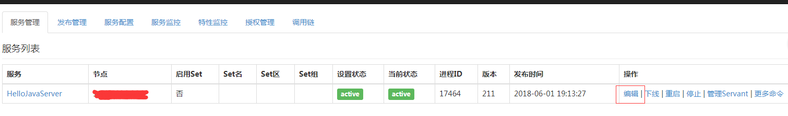
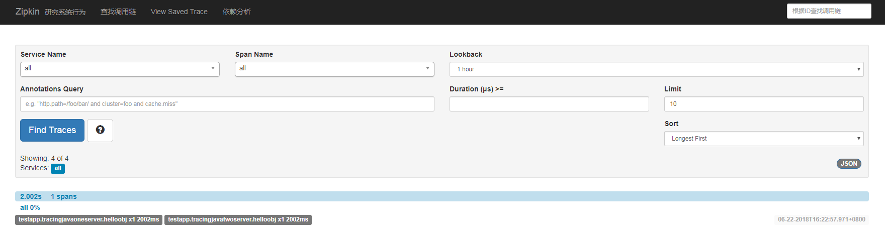
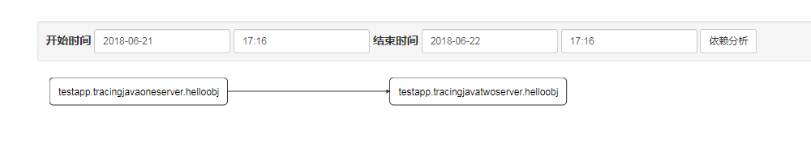

# tars Call Chain

## Problem Background

When a production system faces true high concurrency, or is decoupled into a large number of microservices, the key tasks that were previously easy to implement become difficult, and the call of each component in the distributed system needs to be analyzed. In this context, OpenTracing proposes a platform-independent, vendor-independent distributed tracking system standard semantic model and standard API. With the principle of embracing open source, it has given priority to supporting this set of solutions that are becoming the global distributed tracing unified concept and data standard.

## Design method

### Data collection

The tars framework internally uses the opentracing api to encapsulate the call chain data collection function and encapsulates the zipkin-brave implementation of the opentracing api.

#### Data tracking
 
- client send: If the current thread has a span, then create a new child span. If it does not exist, create a new tracer’s root span, the span type is client. For the call of tars rpc, fill the standard peer information in the span tag information and custom information.

- client receive: Closes the client span corresponding to the request, and needs to fill the standard defined span log information when an error occurs.

- server receive: If the request contains the call chain context information, share the span information transmitted, otherwise open a new span, the span type is server, and fills the custom information in the span tag.

- server send:  Close the corresponding server span. When the service is faulty, the standard span log information needs to be filled.

#### Data sampling

- Proportional collection: set the proportion in the configuration file, the current version only supports this method.
- Custom filtering collection method: the framework provides an interface that is implemented and registered by the user.
- Other sampling methods...

#### Report content

The span and span context information generated by each kind of data track is defined in the opentracing standard definition.

#### Client custom report

Users can report their own defined events and information in the business code through the custom interface provided by the framework.

### Data reporting

### Data reporting format

- The http serialized data reports through the http protocol and directly reports the data to the tracking system.
- Kafaka report: The serialized data is written into the kafka cluster, and then deserialized by the tracking system after reading kafka

### Data format

The reported data format is related to the specific call chain data collection instance (中文文档此处应该存在勘误，实例打成了示例). Different instances have different formats. The following is an example of quick integration of zipkin to demonstrate a strongly readable json format.

#### json format
 
```json
[
	{
	"traceId": "16661f6cb5d58903", #trace id, required
	"id": "16661f6cb5d58903", #span id，required
	"parentId": "89e051d5394b90b1", #parent span id，optional
	"king": "client",
	"name": "encode", #service function name
	"timestamp": 1510043590522358, #Initial time stamp
	"duration": 499867, #Span time, end timestamp minus start timestamp
	"localEndpoint": { #Main call information
			"serviceName": "tracer‐demo",
			"ipv4": "192.168.99.1",
			"port": 9090
	},
	"remoteEndpoint": {#information of which is called
			"serviceName": "tracer‐demo",
			"ipv4": "192.168.99.1",
			"port": 9090
	},
	"annotations": [ #span log，the events of cs, cr, sr, ss are all included
	{
			"value": "", #Transform the events except event to strings like key key1=value1 key2=value2.
			"timestamp": ""
	}
]
"tags": { #custom tag
	"${name of key}": "value",
	...
}
	"debug": true,
	"shared" true
}
]
```


#### Data analysis and display

The integrated zipkin system is built in the framework, users can query call chain data on the zipkin page.


## Tars-java Usage

At present, tars-java supports the call chain from version 1.5.0, and the cpp version is about to be released. The following is an example of integrated zipkin.

### Enable the call chain 

To enable the call chain function, user do not need to rewrite a line of business code, just add the specified service configuration.

Description of the operation steps:

1. On the tars management platform, select the service which need to open the call chain and click "Edit".
 
   

2.Select and edit the private template and fill the following:

```
<tars>
	<application>
		<server>
			samplerate=1   
			sampleaddress=http://localhost:9411/  
			sampletype=http  
			sampleencoding=json
		</server>
	</application>
</tars>
```

 Illustration:

| Parameter name            | Type   | Eligible Value Range                | Remarks                                       |
| --------------- | ---- | -------------------- | ---------------------------------------- |
| samplerate      | Float | [0,1]            | Sampling rate: ranging from 0 to 1. 0 means not sampling, sampling by percentage.              |
| sampleaddress   | String  | None                    | Report address of sampled data: If using the http mode, fill the url of the data collection web server, if using zipkin to collect the data, fill the url of the zipkin server. If the kafka method is used for reporting, fill the address of the kafka cluster. |
| sampletype      | String  | http, kafka, kafka08 | Sampling data reporting transmission mode: for the implementation of integrated zipkin, currently supports two transmission modes through http and kafka. Filling in with "http" means using the http protocol to report, and filling in with "kafka" means transferring the collected data to kafka. The "kafka08" option is for compatibility with kafka brokers below 0.10 version. For details, see the first note below. |
| sampleencodeing | String  | json,  proto            | Encoding format of sampling data report transmission: For the implementation of integrated zipkin, json and protocol buffer proto3 are supported. Filling in with "json" means using json encoding, and filling in with "proto" means using pb encoding. |

Notes:

> - When using kafka to transfer data, the default version of kafka-clients is 1.1.0. You need to ensure that the kafka brokers version is 0.10.x and above. For the kafka brokers version of 0.8.x~0.10, fill sampletype with "kafka08" and replaces the kafka-clients library in the pom.xml of the business code:
>
>   ```xml
>   <dependency>
>         <groupId>com.tencent.tars</groupId>
>         <artifactId>tars-core</artifactId>
>         <version>1.5.0</version>
>         <exclusions>  
>         	<exclusion>  
>         		<groupId>org.apache.kafka</groupId>  
>         		<artifactId>kafka-clients</artifactId>  
>         	</exclusion> 
>         </exclusions>
>   </dependency>
>   <dependency>
>   	<groupId>org.apache.kafka</groupId>  
>       <artifactId>kafka-clients</artifactId>
>       <version>0.8.2.2</version>
>   </dependency>
>   ```
>
>   ​
>
> - To use the proto buffer proto3 format for sampling data reporting, you need to ensure that the version of the zipkin server is 2.8.0 and above.
>
> - If you have a long-term need for the call chain function, it is recommended to create a new template file to fill in with the configuration content in the private template, and enable this template for services that need call chain tracking.

## Custom report information:

Tars-java allows users to report custom information in the business code to the call chain tracking system, which can be completed by calling the API provided by the framework. The usage examples are as follows:

Report key-value pair information:

```java
TraceContext.getInstance().tag("key", "value");
```

Key, value is a custom value.

Report event information:

```java
TraceContext.getInstance().log("an event has occurred");
```

Message content is custom content

## Call chain display

Now take the integrated zipkin as an example to show the reported data.

- Obtain the executable jar package of the zipkin server.

  Reference: https://github.com/openzipkin/zipkin

- Enable the zipkin server, the way of enabling the parameter settings, please refer to the zipkin official documentation.
- Configure xxx.xml in the foreground configuration file
```xml
trace_html=zipkin_address(include http://)
```
- The final result is shown below





Click on a single call chain to view details:


Call chain key-value information description:

| key                 | value                           |
| ------------------- | ------------------------------- |
| client.ipv4         | client ipv4 address.                      |
| client.port         | client port.                          |
| server.ipv4         | server ipv4 address.                      |
| server.port         | server port.                          |
| tars.interface      | server is called the interface name (or an obj for tars-java). |
| tars.method         | server is called the method name.                       |
| tars.protocol       | data encoding protocol.                         |
| tars.retcode        | return code of the call, 0 for success and non-zero for failure.              |
| tars.client.version | client tars version.                       |
| tars.server.version | server tars version.                       |


Dependency analysis display:



