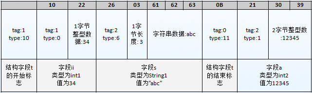
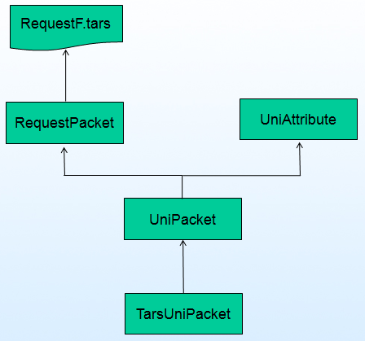

# Table of Contents
> * [TUP Overview] (#main-chapter-1)
> * [Tars Language] (#main-chapter-2)
> * [Tars Protocol] (#main-chapter-3)
> * [TUP use] (#main-chapter-4)
> * [Introduction to each version of the TUP interface] (#main-chapter-5)

# 1. TUP Overview <a id="main-chapter-1"></a>

## 1.1. What is TUP?

TUP (short for Tars Uni-Protocol), the Tars unified protocol, is a package based on the command layer protocol of the Tars code.

## 1.2. What can TUP do?

1.Support java, c++ and other languages

2.Support for serialization and deserialization of objects

3.Support protocol dynamic expansion

4.Provide put/get generic interface to quickly implement client/server codec

5.Serialized data can be used for network transmission or persistent storage

6.Support the server that directly calls Tars

## 1.3. What can't TUP do?

1.Only protocol encapsulation, no network layer

2.Data compression is not supported (can be processed at the business layer)

3.Does not support encryption protocol (can be processed at the business layer)

## 1.4. Dependencies and constraints

1.Dependent on the Tars protocol, the structure object used by the TUP must be generated by the Tars definition.

2.Depends on the code generation tools of various languages, such as: tars2cpp/tars2java, etc.

3.Tars-related interfaces encapsulated in TarsUniPacket (such as getTars.../setTars...), only need to be used when calling Tars service

4.During use, use UniPacket to complete the request and the corresponding data transfer, where ServantName (service object name) and FuncName (interface name) are parameters that must be set, otherwise the encoding fails.

5.It is not recommended to get/put too much data. If there is more data, it is recommended to form a struct in the tars file and then put/get into UniPacket to improve efficiency and reduce network packet size.

6.The result of UniPacket encoding includes the packet length information of the 4-byte network byte order in the packet header, and the length includes the packet header. After receiving the packet, the receiver needs to judge the packet length according to the content of the packet header. Finally confirmed that the packet is complete and transmitted, we introduce the decoding interface to decode the packet.

7.Tars c++ language string type interface can not contain binary data, binary data is transmitted with vector<char>

# 2. Tars language <a id="main-chapter-2"></a>

## 2.1. Interface file

The Tars language is a C++-like identifier language used to generate specific service interface files.

The Tars file is the communication interface between the client and the server in the Tars framework, and realizes the remote procedure call through the mapping of Tars.

Tars file extension must have a .tars extension

For structure definitions, extended fields can be supported, that is, fields can be added without affecting the resolution of the original structure, and can be used separately in places such as storage /protocol.

Case Sensitive

## 2.2. Lexical rules

### 2.2.1. Notes

Use the C++ annotation specification.
```
// indicates a comment line, /**/ indicates all the code in the comment range.
```
### 2.2.2. Keywords
```
void,struct,bool,byte,short,int,double,float,long,string,vector,map,key,routekey,module,interface,out,require,optional,false,true,enum,const
```
### 2.2.3. Identifier

All identifiers cannot have the 'tars_' symbol and must start with a letter and cannot conflict with the keyword.

## 2.3. Basic types

The basic types of support include the following:

void : can only be represented in the return value of the function

bool : boolean type, mapped to tars::Bool

byte : signed characters, mapped to tars::Char

short : signed short integer, mapped to tars::Short

int : signed integer, mapped to tars::Int32

long : signed long integer, mapped to tars::Int64

float : Map to tars::Float

double : Map to tars::Double

string : Map to std::string, java:String

unsigned byte : unsigned character, c++ mapped to unsigend char other versions tars::Short

unsigned short : unsigned short integer c++ mapped to unsigned short other versions tars::Int32

unsigned int : unsigned integer c++ mapped to unsigned int other versions tars::Int64

## 2.4. Complex types

### 2.4.1. Enumeration

The definition of the enumerated type is as follows:
```
enum TE
{
    E1,
    E2,
    E3
};
```
Description:

> * Enumeration type supports the value of the specified enumeration variable, for example, support: E1 = 1;

> * The first defined enumeration type value is 0, where E1 is 0;

> * For Enumeration type, after the tars file is defined and generated through tars2cpp, we will not only get the corresponding enum definition but also the etos and stoe functions which convert enumeration value to string or convert string to enumeration value, respectively. It is convenient when debugging code.

> * It is recommended that in the C++ tars file, all interfaces are returned as int, and the return value is defined in the tars file as an enumeration.

### 2.4.2. Constants

Constants can be defined in the Tars file, for example:
```
const int a = 0;

const string s = "abc";
```
Description:

> * Since map, vector does not describe the value of a constant, it does not support the definition of map, vector;

### 2.4.3. Structure

The structure is defined as follows:
```
struct Test
{
    0 require string s;
    1 optional int i = 23;
};

key[Test, s, i];
```
Description:

> * The first column of numbers indicates the tag of the field. Regardless of the structure increase or decrease field, the value of the field does not change and must correspond to the response field.

> * The value of Tag must be >=0 and <=255;

> * 'require' indicates that the field is mandatory;

> * 'optional' indicates that this field is optional;

> * For the 'optional' field, there can be a default value, the default value is not packaged by default when encoding;

'key' description:

> * Indicates the '<' symbol for structure. By default, Struct does not support the '<' operation. If the key is defined, it will generate '<' symbol.

'key' details:

> * key[Stuct, member...]:

> * Struct: indicates the name of the structure

> * Member: indicates the member variable of the structure and more than one variable is allowed;

> * Implement the comparison between Structs according to the order defined by the member variables in the key.

> * After generating '<' operator, the structure can be used as the key of map;

other instructions:

> * In the C++ language of Tars, for the structure, two member functions are provided for directly printing out the contents of the structure, which can be used for debugging and logging:

> * ostream& display(ostream& _os, int _level=0): directly prints the details of the structure, mainly for debugging;

> * ostream& displaySimple(ostream& _os, int _level=0): All member variables are automatically printed in the order separated by | for logging;

### 2.4.4. Sequence

The sequence is defined by vector as follows:
```
vector<int> vi;
```
### 2.4.5. Dictionary

The dictionary is defined by map as follows:
```
map<int, string> m;
```
Description:

> * Struct usually can not be used as the map key because it does not support '<' operation;

> * If the struct needs to be used as the map key, you should use key(defined in 2.4.3) to define the comparison order of the members in the struct;

### 2.4.6. Array

The array type can be defined in the structure, and the array is defined by [], as follows:
```
byte m[5];
```
Description:

> * For array types, the length of the array(mLen) is also generated in the C++ generated code.

> * After assigning an array, you must assign an array length at the same time.

> * Array types will be translated to vector<type> in non-c++ versions

> * byte m[5] is equivalent to defining vector&lt;byte&gt; m(5)

### 2.4.7 Pointer

The byte pointer type can be defined in the structure, and the pointer is defined by *, as follows:
```
byte *m;
```
When the pointer type is used, the memory block needs to be pre-allocated in advance. When the pointer needs memory, it points to the pre-allocated memory block by offset, which reduces the memory application during decoding.

Description:

> * For pointer types, mLen is generated in the c++ code to specify the pointer length.

> * Must assign a value to the length mLen after assigning a pointer

> * In non-c++ versions the pointer type will be translated to vector<type>

> * BufferReader must use MapBufferReader when reading data with pointer type, and need to set pointer to memory buffer in advance.

### 2.4.8 Nesting

Any struct, map, or vector can be nested;

## 2.5. Interface

The interface is defined as follows, for example:
```
interface Demo
{
    int get(out vector<map<int, string>> v);
    int set(vector<map<int, string>> v);
};
```
Description
> * indicates output parameters
> * After the interface is defined, the code such as synchronous interface and asynchronous interface are generated by an automatic code generation tool (such as tars2cpp).

## 2.6. Namespace

All structs, interfaces must be in the namespace, for example:
```
module MemCache
{
    struct key
    {
        0 require string s;
    };

    struct Value
    {
        0 require string s;
    };

    interface MemCacheI
    {
        int get(Key k, out Value v);
        int set(Key k, Value v);
    };
};
```
Description:
> * Namespaces cannot be nested;
> * Can reference other namespaces, for example: Demo1::Key

# 3. Tars Protocol <a id="main-chapter-3"></a>

## 3.1. Data Encoding

### 3.1.1. Basic structure

Each piece of data consists of two parts, as shown below:
```
| Header Information | Actual Data |
```
The header information includes the following parts:
```
| Type(4 bits) | Tag 1(4 bits) | Tag 2(1 byte) |
```
Tag 2 is optional. When the value of Tag does not exceed 14, it only needs to be represented by Tag 1. When the value of Tag exceeds 14 and is less than 256, Tag 1 is fixed to 15 and Tag 2 is used to indicate the value of Tag. . Tag does not allow greater than 255.

'Type' indicates the type, which is represented by 4 binary digits. The value ranges from 0 to 15. It is used to identify the type of the data. Different types of data, followed by the actual data length and format are not the same, see the type table.

Tag is represented by Tag 1 and Tag 2. The value ranges from 0 to 255, that is, the field ID of the data in the structure, used to distinguish different fields.

### 3.1.2. Encoding type table

Note that the types defined here and the types defined by the tars file are two different concepts. The type here is just the type that identifies the data store, not the type of the data definition.

Value | Type | Notes
------|----|----
0 | int1| followed by 1 byte integer data
1|int2| followed by 2 bytes of integer data
2|int4| followed by 4 bytes of integer data
3|int8|close to 8 bytes of integer data
4|float|following 4 bytes of floating point data
5|double|following 8 bytes of floating point data
6|String1|Following 1 byte length, followed by content
7|String4| followed by 4 bytes in length, followed by the content
8|Map|Follow an integer data to indicate the size of the Map, followed by the list of [key, value] pairs
9|List|Follow an integer data to represent the size of the List, followed by a list of elements
10|Custom Structure Start|Custom Structure Start Mark
11|Custom structure end|Custom structure end flag, Tag is 0
12|Number 0| indicates the number 0, followed by the data
13|SimpleList|Simple list (currently used in byte array), followed by a type field (currently only supports byte), followed by an integer data representation length, followed by byte data

### 3.1.3. Detailed description of each type

1.Basic types (including int1, int2, int4, int8, float, double)

The header information is followed by the numeric data. 'char' and 'bool' are also considered integers. There is no distinction between all integer data, that is, a 'short' value can be assigned to an int.

2.Number 0

The header information does not follow the data, indicating a value of 0. The value of 0 for all basic types can be represented as such.

This is because the probability of the occurrence of the number 0 is relatively large, so a type is added separately to save space.

3.String (including String1, String4)

String1 is the length of a byte (the length data does not include header information), followed by the content.

String4 is similar.

4.Map

Immediately following an integer data (including header information) indicates the size of the Map, and then follows the [Key data (Tag is 0), Value data (Tag is 1)] pair list.

5.List

Immediately followed by an integer data (including header information) indicating the size of the List, followed by a list of elements (Tag is 0)

6.Custom structure begins

Custom structure start flag, followed by field data, fields are sorted in ascending order of tags

7.End of custom structure

Custom structure end flag, Tag is 0

### 3.1.4 Object persistence

Persistence for custom structures is identified by a start and end flags.

For example, the following structure definition:
```
struct TestInfo
{
    1 require int ii = 34;
    2 optional string s = "abc";
};

struct TestInfo2
{
    1 require TestInfo t;
    2 require int a = 12345;
};
```
Among them, the default TestInfo2 structure encoding results are:



## 3.2. Message format

The underlying TUP protocol is completely defined by Tars, which is consistent with the underlying data packet definition of Tars. The required field is the required field of TUP, and optional is the additional field needed to access the Tars service.

### 3.2.1. Request package
```
/ / Request the package body
struct RequestPacket
{
    1 require short iVersion; //version number
    2 optional byte cPacketType; //package type
    3 optional int iMessageType; //message type
    4 require int iRequestId; //Request ID
    5 require string sServantName; //servant name
    6 require string sFuncName; / / function name
    7 require vector<byte> sBuffer; //binary buffer
    8 optional int iTimeout; //timeout time (ms)
    9 optional map<string, string> context; //business context
    10 optional map<string, string> status; //framework protocol context
    };
```
### 3.2.2. Response package
```
/ / Response body
struct ResponsePacket
{
    1 require short iVersion; //version number
    2 optional byte cPacketType; //package type
    3 require int iRequestId; / / request ID
    4 optional int iMessageType; //message type
    5 optional int iRet; / / return value
    6 require vector<byte> sBuffer; //binary stream
    7 optional map<string, string> status; //protocol context
    8 optional string sResultDesc; //Result description
};

//return value
const int TAFSERVERSUCCESS = 0; //Server side processing succeeded
const int TAFSERVERDECODEERR = -1; //Server-side decoding exception
const int TAFSERVERENCODEERR = -2; //Server-side encoding exception
const int TAFSERVERNOFUNCERR = -3; //There is no such function on the server side
const int TAFSERVERNOSERVANTERR = -4; //The server does not have the Servant object
const int TAFSERVERRESETGRID = -5; // server grayscale state is inconsistent
const int TAFSERVERQUEUETIMEOUT = -6; // server queue exceeds limit
const int TAFASYNCCALLTIMEOUT = -7; // Asynchronous call timeout
const int TAFINVOKETIMEOUT = -7; //call timeout
const int TAFPROXYCONNECTERR = -8; //proxy link exception
const int TAFSERVEROVERLOAD = -9; //Server overload, exceeding queue length
const int TAFADAPTERNULL = -10; //The client routing is empty, the service does not exist or all services are down.
const int TAFINVOKEBYINVALIDESET = -11; //The client is illegally called by the set rule
const int TAFCLIENTDECODEERR = -12; //Client decoding exception
const int TAFSERVERUNKNOWNERR = -99; //The server is in an abnormal position
```
# 4. TUP uses <a id="main-chapter-4"></a>

## 4.1. Class structure diagram



## 4.2. Use of classes

1.RequestPacket: The base class of the request packet and the response packet is generated by the tars file definition, which is consistent with the basic package of the Tars service, and is generally not directly used.

2.UniAttribute: attribute class, the user may be performed by the object class operation, add properties and get property, class provides a put / get generic interface, can achieve encoding and decoding. The encoded serialized byte stream can be used for compression, encryption, network transmission or persistent storage, deserializing the original object when needed.

3.UniPacket: Request response packet class, inherited from UniAttribute, you can add the requested attribute value, set the remote object and method name to be requested, and send it to the server after encoding. After decoding, the server can obtain the attribute parameter for processing. After the server processes the request, the result is also returned by the object of the class, and the client decodes and obtains the processing result.

4.TarsUniPacket: Tars request response packet class, inherited from UniPacket, used when calling Tars remote service. After adding attributes and setting related attributes, the user encodes the request packets and sends them to the Tars service for processing. The Tars server receives the request of the TUP protocol, and returns the packet to the client after returning the packet with the object group of the class. After the client receives the packet, the class is used for decoding processing to obtain the result.

## 4.3. Calling the Tars service using the TUP protocol

1.When the client calls, the TarsUniPacket object is used to perform parameter setting of the request packet and input parameter assignment. The request parameter information that must be specified includes:
```
setRequestId(); set the message id, increment

setServantName(""); set the remote object name

setFuncName(""); set the remote interface name

setTarsPacketType(); package type version, TUP defaults to 3
```
For a specific remote interface call, you only need to assign the input parameters through the put interface. The property name is the parameter name defined by the tars interface, for example, for the interface:
```
int testFunc(string inputString, int inputInt, out string outputString);
```
The way to enter parameter assignments is:
```
TarsUniPacket<> req;

req.put<string>("inputString", "testInput");

req.put<Int32>("inputInt", 12345);

req.encode(buff);
```
The TarsUniPacket object must set the property value for each input parameter defined by tars. Otherwise, the server will return an exception error that lacks a certain property value when processing the request. The output parameter can also be used as input, but it is not required.

The template type of the 'put' interface is the corresponding type defined by the tars parameter, except for the enumeration type. Int32 is used as the template type to assign the attribute value.

2.The TUP return packet is also decoded using the TarsUniPacket object. After decoding, the getTarsResultCode() interface is used to obtain the processing result of the tars service. zero is successful, non-zero is failed, and the cause of the failure can be obtained through the getTarsResultDesc() interface.

The output parameters of the returned successful result packet are obtained by using the output parameter name defined by tars as the attribute name, and the return value of the interface is obtained by using the attribute name of the empty string.

The way the interface returns the result is as follows:
```
TarsUniPacket<> rsp;

rsp.decode(recvBuff, recvLen);

if(rsp.getTarsResultCode() == 0)
{
    int ret = rsp.get<int32_t>("");                                                                     / / Get the return value
    string retString = rsp.get<string>("outputString"); //Get the output parameters
}
else
{
    cout << rsp.getTarsResultDesc() << endl;
}
```
# 5. TUP version interface introduction <a id="main-chapter-5"></a>

## 5.1. Linux c++

### 5.1.1. Class interface

UniAttribute class

Public interface |function description
------|--------
template<typename T> void put(const string& name, const T& t) |Add attribute values
template<typename T> void get(const string& name, T& t)|Get the attribute value
template<typename T> T get(const string& name)|Get the attribute value
template<typename T> void getByDefault(const string& name, T& t, const T& def)|Get the attribute value (ignoring the exception, def is the default)
template<typename T> T getByDefault(const string& name, const T& def)|Get the attribute value (ignoring the exception, def is the default)
void clear()|Clear all attribute values
void encode(string& buff)|Encode attribute object to byte stream
void encode(vector<char>& buff)|Encode attribute object to byte stream
void encode(char* buff, size_t & len)|Encode attribute object to byte stream
void decode(const char* buff, size_t len)|decodes the byte stream
void decode(const vector<char>& buff)|decodes the byte stream
const map<string, vector<char> >& getData() const|Get existing attributes
bool isEmpty()|Judge whether the attribute set is empty
size_t size()|Get the attribute collection size
bool containsKey(const string & key)|Judge whether the attribute exists

UniPacket class

Public interface |function description
------|--------
void setVersion(short iVer) |Set protocol version number
UniPacket createResponse()| generates a response packet through the request packet, and the generation process retrieves the request ID, object name, method name, etc. from the request packet into the response packet.
void encode(string& buff)|Encode object to byte stream
void encode(vector<char>& buff)|Encode object to byte stream
void encode(char* buff, size_t & len)|Encode object to byte stream
void decode(const char* buff, size_t len)|Decodes the byte stream, where len is passed into the buffer length and the length of the decoded result is output.
tars::Short getVersion() const|Get protocol version number
tars::Int32 getRequestId() const|Get the message ID
void setRequestId(tars::Int32 value)|Set the request ID
const std::string& getServantName() const|Get the object name
void setServantName(const std::string& value)|Set the object name (the object name cannot be empty when encoding, otherwise the encoding will fail)
const std::string& getFuncName() const|Get method name
void setFuncName(const std::string& value)|Set the method name (the method name cannot be empty when encoding, otherwise the encoding will fail)

TarsUniPacket class

Public interface |function description
------|--------
void setTarsVersion(tars::Short value) |Set protocol version
void setTarsPacketType(tars::Char value)|Set the call type
void setTarsMessageType(tars::Int32 value)|Set the message type
void setTarsTimeout(tars::Int32 value)|Set timeout
void setTarsBuffer(const vector<tars::Char>& value)|Set parameter encoding content
void setTarsContext(const map<std::string, std::string>& value)|Set the context
void setTarsStatus(const map<std::string, std::string>& value)|Set the state value of the special message
tars::Short getTarsVersion() const|Get protocol version
tars::Char getTarsPacketType() const|Get the call type
tars::Int32 getTarsMessageType() const|Get the message type
tars::Int32 getTarsTimeout() const|Get timeout
const vector<tars::Char>& getTarsBuffer() const|Get the parameter encoded content
const map<std::string, std::string>& getTarsContext() const|Get context
const map<std::string, std::string>& getTarsStatus() const|Get the status value of a special message
tars::Int32 getTarsResultCode() const|Get the result code of the Tars service processing, 0 is successful, non-zero is failed
string getTarsResultDesc() const|Get the description of the Tars service processing result

### 5.1.2. Use caution

An error in the above interface call will throw a runtime_error exception.

### 5.1.3. Examples of use

See the sample program under cpp/test/testServant/testTup/

## 5.2. Java

### 5.2.1. Class interface

UniAttribute class

UniPacket class

TarsUniPacket class

### 5.2.2. Use caution

1. Currently TUP supports basic types, TarsStruct, which already stores basic types or TarsStruct maps and lists. Only support byte[] for arrays, and throwing IllegalArgumentException for other types;

2. The put and get method calls will throw an ObjectCreateException exception;

### 5.2.3. Examples of use
