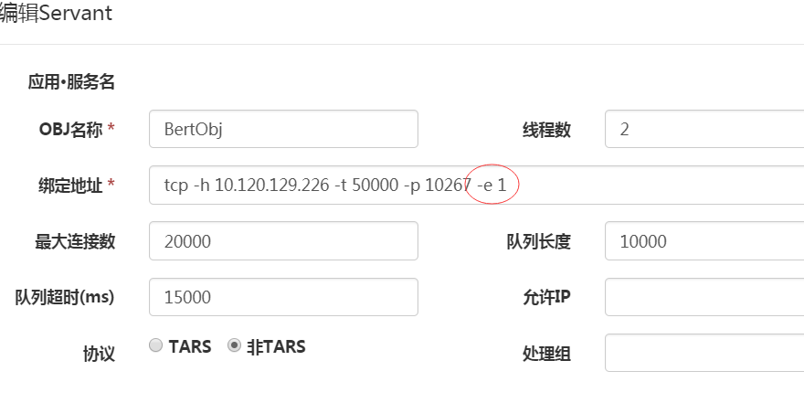
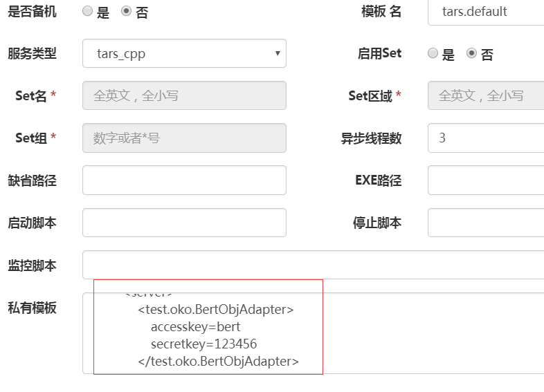
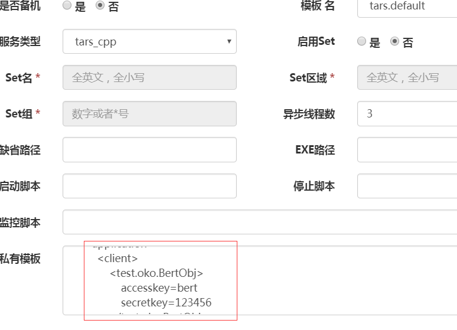

# tars鉴权功能

tars是一个强大的RPC框架，你只需要得到被调用方的tars协议文件，就可以使用tars框架编码，请求被调方服务。方便的同时也带来了一些安全隐患，如果我们的服务接口是敏感的，不希望敏感数据被随意请求访问。这样我们需要一个细化到服务的鉴权访问机制。
tars提供了这样的机制，你只需要设置账号密码，tars框架在网络层自动完成密码验证，对业务层完全透明。对于无法提供正确账号密码
的客户端，直接踢掉连接。

目前只有C++支持鉴权功能，java即将支持。

## tars鉴权使用

tars鉴权的使用非常简单，你不需要修改一行代码，只需要更改配置文件。
只需要按照下面三个步骤设置：

### 1. 修改被调用方的endpoint，开启鉴权机制
在tars服务平台，选中需要启用鉴权的服务，编辑servant，修改endpoint，添加-e 1.
-e及其参数表示是否开启鉴权，默认为0是不开启的，为1则是开启。



### 2. 修改被调用方的配置文件添加账号密码
注意，被调用方可以有多个adapter，每个需要鉴权的adapter都有自己独立的账号密码。
如图，对test.oko.BertObjAdapter设置账号bert，密码123456：



由于截图不全，实际私有模板内容如下：

```xml
<tars>
  <application>
    <server>
        <test.oko.BertObjAdapter>
            accesskey=bert
            secretkey=123456
        </test.oko.BertObjAdapter>
    </server>
  </application>
</tars>
```

现在，在web平台重启服务。

### 3. 修改调用方的配置文件添加账号密码
注意，调用方可以访问多个obj，每个需要鉴权的obj都有自己独立的账号密码。
如图，对test.oko.BertObj设置账号bert，密码123456：



由于截图不全，实际私有模板内容如下：

```xml
<tars>
  <application>
    <client>
        <test.oko.BertObj>
            accesskey=bert
            secretkey=123456
        </test.oko.BertObj>
    </client>
  </application>
</tars>
```

现在，在web平台重启调用方。

这样，你的服务就必须通过账号密码才可以访问了。

