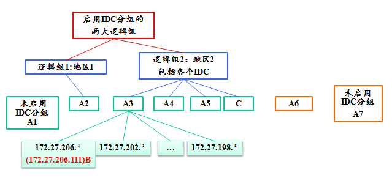
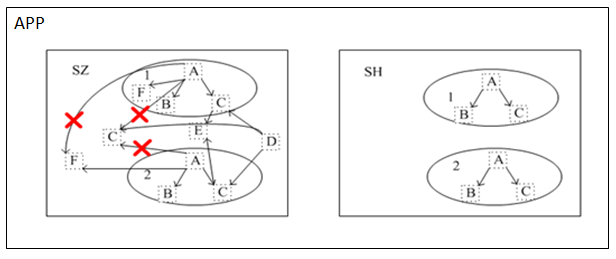

# 目录
> * [IDC分组逻辑介绍] (#main-chapter-1)
> * [Set分组逻辑介绍] (#main-chapter-2)
> * [IDC分组与Set分组的调用规则] (#main-chapter-3)

# 1. IDC分组逻辑介绍 

## 1.1. IDC组的含义

> * 按照IP地址的前三段定位出属于哪个具体的机房。
> * 被调服务属于哪个组的信息可以修改，如果不指定就按照IP段的规则来匹配。

## 1.2. 分组信息的更改

在管理平台的“服务编辑”中由操作者更改，更改后保存入Tars DB 中，主控Registry每隔一定时间会读取到自身的缓存中。

## 1.3. 分组逻辑的执行流程

主调会定期从主控中取被调的Obj列表信息，在接受到主调请求后，由主控Registry完成IDC分组的核心逻辑。

核心流程如下：
> * 1.首先从数据库中检索出该服务所有的“活动列表”和“非活动列表”
> * 2.根据客户端IP得出调用者所处的物理组，假设为GROUP_A
> * 3.遍历“活动列表”，将属于GROUP_A的所有IP检索出来。如果找到了，将这些IP返回给客户端，并退出；否则进行第4步。
> * 4.按照t_group_priority定义的优先级，遍历所有逻辑组。如果在某个逻辑组中，发现了活动IP，则将这些IP返回给客户端，并退出；否则查找下一个逻辑组,如果在所有的逻辑组仍然没有找到活动IP，则进行第5步。
> * 5.遍历“活动列表”，将属于组“-1”，也就是将没有启动分组的IP检索出来。如果找到了，将这些IP反馈给用户。如果没有找到，则进行第6步。
> * 6.将从数据库中检索出的“活动列表”直接返回。

## 1.4. 示例

某服务A(A1,A2,A3,A4,A5,A6,A7)在各个地区各个IDC的部署情况如上图。

主调服务B(ip:172.27.206.111)调用A服务，能调用到有：          A3

主调服务C调用A服务，能调用到有：                             A3,A4,A5

主调服务C调用A服务时，A3,A4,A5都停止，能调用到的有：         A2

主调服务C调用A服务时，A3,A4,A5,A2都停止，能调用到的有：      A1,A7

主调服务C调用A服务时，A3,A4,A5,A2,A1,A7都停止，能调用到的有：A6

说明
> * 主调的出身已经决定了主调的物理组和逻辑组。
> * 被调的出身可修改，将影响主调调用的活动列表。
> * 是否启用IDC分组，完全取决于被调！！！

# 2. Set分组逻辑介绍 

## 2.1. Set分组的含义

> * Set名:   定义一个大的Set名称，可以以业务名称来定义。
> * Set地区：可以按照地区来对划分，如n,b(南北)，也可以以城市来分，如sh(上海),sz(深圳)等。
> * Set组名：实际可以重复的组单元的名称，一般是 0,1,2,3,4,5,…

## 2.2. Set分组场景

没有Set分组之前，如下图：

有Set分组后，如下图：

## 2.3. Set分组的调用逻辑规则

以下图为例：

具体部署情况如下表：

Set名 |Set地区 |Set组名 |服务列表
------|-----|------|----
APP |SZ |1 |A,B,C,F
APP |SZ |2 |A,B,C
APP |SZ |\*(通配符) |C,E,D,F 
APP |SH |1 |A,B,C
APP |SH |2 |A,B,C

1.A服务调用B、C服务，且三个服务在1，2两个Set分组中都存在，如果1中B服务死掉，则A不会调用2中的B服务，更不会调用SH中的任何B服务,而是直接返回空集给A，因为不在同一个SET中。

2.而对于C服务既在1、2Set组中存在，又存在于SZ地区的通配组中，如果1中的C死了，则既不会去调用SZ地区下的C，也不会调用2中的C，同理相对于F服务，1中的A服务永远也不会调用通配组中的F服务。

3,而对于2中的A服务而言，则可调用通配组中的F服务

4,D服务则可调用SZ中任何C服务(包括通配组和具体SET服务组)

5,对于E服务，C则直接调用通配组中的E服务

调用总体原则：
> * 1.主被调双方都要启用SET分组，并且SET全名要一致。
> * 2.SET内有被调的(不管死活),只能调用本SET内的。如果没有被调(死的也算有)，则只能调用本地区的公共区域的，还没有的话，只能按照IDC分组原则调用未启用SET的。1A->1C, 1A 不能->*C, 1A->1F, 1A不能->*F, 2A->*F, C->E 
> * 3.通配组服务可调用SET内和通配组的任何服务*D->*C+1C+2C
> * 4.如果不满足1，则按照IDC分组逻辑调用。

# 3. IDC分组与Set分组的调用规则 

编号 |客户端 |服务端 |规则
------|-----|------|----
1 |启用Set |启用Set |寻找在同一set的ip地址，如果同一个Set没有可用地址，则返回空
2 |启用Set |没启用Set/启用IDC |按IDC分组的寻址返回地址
3 |启用Set |没启用Set/没启用IDC |返回所有可用的地址
4 |没启用Set |启用Set/启用IDC |按IDC分组的寻址返回地址
5 |没启用Set |启用Set/没启用IDC |返回所有可用的地址
6 |没启用Set |没启用Set/启用IDC |按IDC分组的寻址返回地址
7 |没启用Set |没启用Set/没启用IDC |返回所有可用的地址
