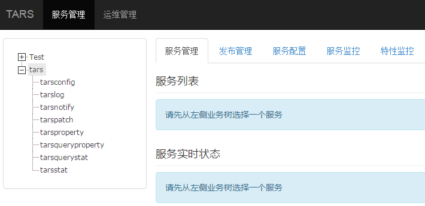
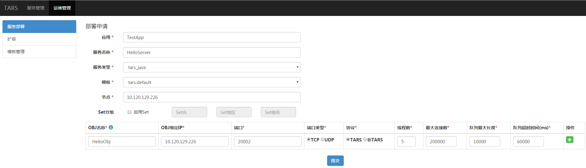
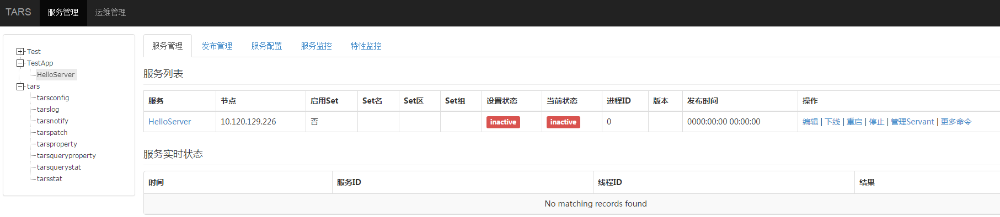
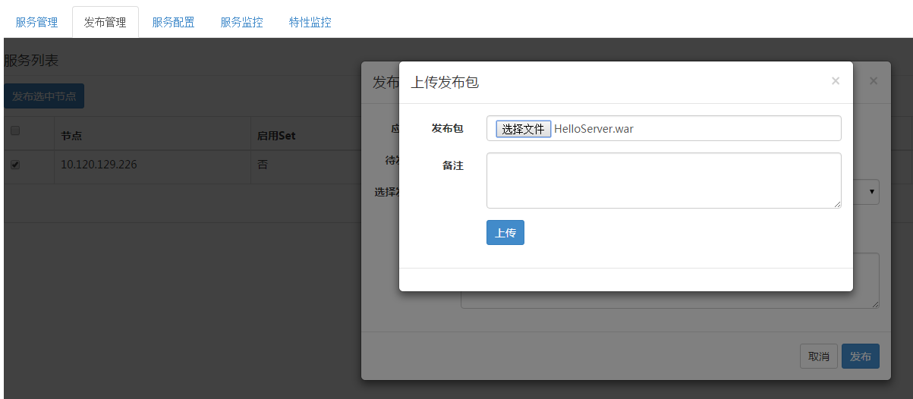
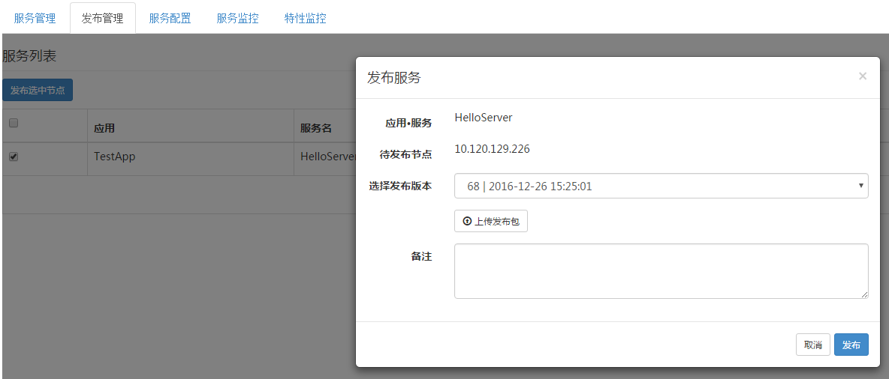
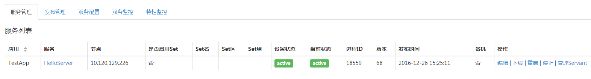

# 目录 #
> * [环境搭建] (#main-chapter-1)
> * [服务开发] (#main-chapter-2)
> * [管理系统] (#main-chapter-3)
> * [服务命名] (#main-chapter-4)
> * [服务部署] (#main-chapter-5)

# 框架快速入门

## 环境搭建 <a id="main-chapter-1"></a>

### 环境依赖 

- JDK1.8或以上版本
- Maven 2.2.1或以上版本

### 构建工程 

通过IDE或者maven创建一个maven web项目，
这里以eclipse为例，File -> New -> Project -> Maven Project -> maven-archetype-webapp，再输入groupId、artifactId，生成完成之后可以通过eclipse进行导入，目录结构如下
```
├── pom.xml
└── src
   ├── main
   │   ├── java
   │   │   └── tars
   │   │       └── test
   │   │          ├── HelloServant.java
   │   │          └── HelloServantImpl.java
   │   ├── resources
   │   │   └── servants.xml
   │   └── webapp
   └── test
       ├── java
       │   └── tars
       │       └── test
       │           └── TarsTest.java
       └── resources
```

### 依赖配置
在构建项目中pom.xml中添加依赖jar包

- 框架依赖配置
```xml
<dependency>
	<groupId>qq-cloud-central</groupId>
     	<artifactId>tars-server</artifactId>
     	<version>1.0.3</version>
     	<type>jar</type>
</dependency>
```
- 插件依赖配置
```xml
<plugin>
	<groupId>qq-cloud-central</groupId>
   	<artifactId>tars-maven-plugin</artifactId>
   	<version>1.0.3</version>
  	<configuration>
   		<tars2JavaConfig>
  			<tarsFiles>
   				<tarsFile>${basedir}/src/main/resources/hello.tars</tarsFile>
   			</tarsFiles>
  			<tarsFileCharset>UTF-8</tarsFileCharset>
   			<servant>true</servant>
  			<srcPath>${basedir}/src/main/java</srcPath>
  			<charset>UTF-8</charset>
   			<packagePrefixName>com.qq.tars.quickstart.server.</packagePrefixName>
  		</tars2JavaConfig>
   	</configuration>
</plugin>
```
## 服务开发 <a id="main-chapter-2"></a>

### 接口文件定义

接口文件定义是通过Tars接口描述语言来定义，在src/main/resources目录下建立hello.tars文件，内容如下
```
module TestApp 
{
	interface Hello
	{
	    string hello(int no, string name);
	};
};
```
### 接口文件编译

提供插件编译生成java代码，在tars-maven-plugin添加生成java文件配置
```xml
<plugin>
	<groupId>qq-cloud-central</groupId>
	<artifactId>tars-maven-plugin</artifactId>
	<version>1.0.3</version>
	<configuration>
		<tars2JavaConfig>
			<!-- tars文件位置 -->
			<tarsFiles>
				<tarsFile>${basedir}/src/main/resources/hello.tars</tarsFile>
			</tarsFiles>
			<!-- 源文件编码 -->
			<tarsFileCharset>UTF-8</tarsFileCharset>
			<!-- 生成服务端代码 -->
			<servant>true</servant>
			<!-- 生成源代码编码 -->
			<charset>UTF-8</charset>
			<!-- 生成的源代码目录 -->
			<srcPath>${basedir}/src/main/java</srcPath>
			<!-- 生成源代码包前缀 -->
			<packagePrefixName>com.qq.tars.quickstart.server.</packagePrefixName>
		</tars2JavaConfig>
	</configuration>
</plugin>
```
在工程根目录下执行mvn tars:tars2java
```java
@Servant
public interface HelloServant {

	public String hello(int no, String name);
}	
```
### 服务接口实现

新创建一个HelloServantImpl.java文件，实现HelloServant.java接口
```java
public class HelloServantImpl implements HelloServant {

    @Override
    public String hello(int no, String name) {
        return String.format("hello no=%s, name=%s, time=%s", no, name, System.currentTimeMillis());
    }
}
```

### 服务暴露配置

在resources下创建一个servants.xml的配置文件，服务编写后需要进程启动时加载配置暴露服务，配置如下
```xml		
<?xml version="1.0" encoding="UTF-8"?>
<servants>
	<servant name="HelloObj">
		<home-api>com.qq.tars.quickstart.server.testapp.HelloServant</home-api>
		<home-class>com.qq.tars.quickstart.server.testapp.impl.HelloServantImpl</home-class>
	</servant>
</servants>
```
说明：除了此方法之外，还可以采用spring模式来配置服务，详情见tars_java_spring.md。

### 服务编译打包

在工程根目录下执行 mvn package生成war包，后续可以管理系统进行发布。

### 客户端同步/异步调用服务

- 构建客户端工程项目
- 添加依赖
```xml
<dependency>
	<groupId>qq-cloud-central</groupId>
   	<artifactId>tars-client</artifactId>
   	<version>1.0.3</version>
   	<type>jar</type>
</dependency>    
```
- 添加插件
```xml	
<plugin>
   	<groupId>qq-cloud-central</groupId>
   	<artifactId>tars-maven-plugin</artifactId>
   	<version>1.0.3</version>
   	<configuration>
   		<tars2JavaConfig>
   			<!-- tars文件位置 -->
   			<tarsFiles>
   				<tarsFile>${basedir}/src/main/resources/hello.tars</tarsFile>
   			</tarsFiles>
   			<!-- 源文件编码 -->
   			<tarsFileCharset>UTF-8</tarsFileCharset>
   			<!-- 生成代码，PS：客户端调用，这里需要设置为false -->
   			<servant>false</servant>
   			<!-- 生成源代码编码 -->
   			<charset>UTF-8</charset>
   			<!-- 生成的源代码目录 -->
   			<srcPath>${basedir}/src/main/java</srcPath>
   			<!-- 生成源代码包前缀 -->
   			<packagePrefixName>com.qq.tars.quickstart.client.</packagePrefixName>
   		</tars2JavaConfig>
   	</configuration>
</plugin>
```
- 根据服务tars接口文件生成代码
```java
@Servant
public interface HelloPrx {
      
	public String hello(int no, String name);
      
      	public String hello(int no, String name, @TarsContext java.util.Map<String, String> ctx);
      
      	public void async_hello(@TarsCallback HelloPrxCallback callback, int no, String name);
      
      	public void async_hello(@TarsCallback HelloPrxCallback callback, int no, String name, @TarsContext java.util.Map<String, String> ctx);
}
```
- 同步调用
```java
public static void main(String[] args) {
	CommunicatorConfig cfg = new CommunicatorConfig();
        //构建通信器
        Communicator communicator = CommunicatorFactory.getInstance().getCommunicator(cfg);
        //通过通信器，生成代理对象
        HelloPrx proxy = communicator.stringToProxy(HelloPrx.class, "TestApp.HelloServer.HelloObj");
        String ret = proxy.hello(1000, "HelloWorld");
        System.out.println(ret);
}
```
- 异步调用
```java
public static void main(String[] args) {
	CommunicatorConfig cfg = new CommunicatorConfig();
        //构建通信器
        Communicator communicator = CommunicatorFactory.getInstance().getCommunicator(cfg);
        //通过通信器，生成代理对象
        HelloPrx proxy = communicator.stringToProxy(HelloPrx.class, "TestApp.HelloServer.HelloObj");
        proxy.async_hello(new HelloPrxCallback() {
        		
        	@Override
        	public void callback_expired() {
        	}
        		
        	@Override
        	public void callback_exception(Throwable ex) {
        	}
        		
        	@Override
        	public void callback_hello(String ret) {
        		System.out.println(ret);
        	}
        }, 1000, "HelloWorld");
}
```

## 管理系统 <a id="main-chapter-3"></a>

进入管理系统，如下图



管理系统的菜单树下，有以下功能：

- 业务管理：包括已部署的服务，以及服务管理、发布管理、服务配置、服务监控、特性监控等；

- 运维管理：包括服务部署、扩容、模版管理等；


## 服务命名 <a id="main-chapter-4"></a>

使用Tars框架的服务，其的服务名称有三个部分：

- APP：应用名，标识一组服务的一个小集合，在Tars系统中，应用名必须唯一。例如：TestApp；

- Server：服务名，提供服务的进程名称，Server名字根据业务服务功能命名，一般命名为：XXServer，例如HelloServer；

- Servant：服务者，提供具体服务的接口或实例。例如:HelloImp；

说明：

一个Server可以包含多个Servant，系统会使用服务的App + Server + Servant，进行组合，来定义服务在系统中的路由名称，称为路由Obj，其名称在整个系统中必须是唯一的，以便在对外服务时，能唯一标识自身。

因此在定义APP时，需要注意APP的唯一性。

例如：TestApp.HelloServer.HelloObj。


## 服务部署 <a id="main-chapter-5"></a>

### 部署申请 ###

点击主菜单“运维管理”－〉“服务部署”

如下图：



-	“应用”指你的服务程序归在哪一个应用下，例如：“TestApp”。
  -“服务名称”指你的服务程序的标识名字，例如：“HelloServer”。
  -“服务类型”指你的服务程序用什么语言写的，例如：java的选择“tars_java”。
  -“模版“ 指你的服务程序在启动时，设置的配置文件的名称，默认用”tars.tarsjavadefault“即可。
  -“节点“ 指服务部署的机器IP。
  -“Set分组“ 指设置服务的Set分组信息，Set信息包括3部分：Set名、Set地区、Set组名。
  -“OBJ名称“ 指Servant的名称。
  -“OBJ绑定IP“ 指服务绑定的机器IP，一般与节点一样。
  -“端口“ 指OBJ要绑定的端口。
  -“端口类型“ 指使用TCP还是UDP。
  -“协议“ 指应用层使用的通信协议，Tars框架默认使用tars协议。
  -“线程数“ 指业务处理线程的数目。
  -“最大连接数“ 指支持的最大连接数。
  -“队列最大长度“ 指请求接收队列的大小。
  -“队列超时时间“ 指请求接收队列的超时时间。

点击“提交“，成功后，菜单数下的TestApp应用将出现HelloServer名称，同时将在右侧看到你新增的服务程序信息，如下图：



在管理系统上的部署暂时先到这里，到此为止，只是使你的服务在管理系统上占了个位置，真实程序尚未发布。

### 服务发布

在管理系统的菜单树下，找到你部署的服务，点击进入服务页面。 

选择“发布管理”，选中要发布的节点，点击“发布选中节点”，点击“上传发布包”，选择已经编译好的发布包，如下图：



 上传好发布包后，点击“选择发布版本”下拉框就会出现你上传的服务程序，选择最上面的一个（最新上传的）。如下图：

 

 点击“发布”，服务开始发布，发布成功后，出现下面的界面，如下图：

 

若失败的话，可能是命名问题，上传问题，以及其他环境问题。

