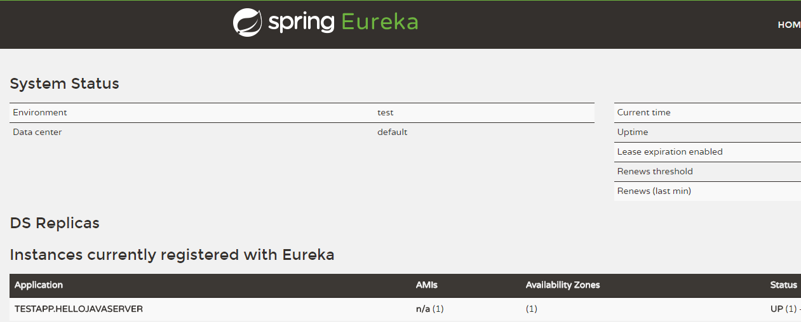

# Tars Java-Spring Cloud 集成说明

## 功能说明

​       Tars-java支持兼容Spring Cloud系统,用户可以将Tars-Java框架融入Spring Cloud。

## 环境依赖

​       在操作前需要满足以下条件：

- JDK 1.8或以上

- 如果要想使用服务发现功能，需要已运行Spring Cloud的Eureka Server实例，具体配置启动方法请参考Spring Cloud相关教程。

## 发布服务

  下面展示如何创建并发布一个服务。

- 首先添加创建一个maven工程，在项目的pom.xml文件中添加依赖配置：

```xml
<dependency>
    <groupId>com.tencent.tars</groupId>
    <artifactId>tars-spring-cloud-starter</artifactId>
    <version>1.4.0</version>
</dependency>
```

- 编写接口Tars文件，生成服务端接口代码，具体操作过程参考tars_java_quickstart.md文档的服务开发部分。

```java
@Servant
public interface HelloServant {

	public String hello(int no, String name);          
}
```

- 生成接口后需要对接口进行实现。实现接口中的方法，之后对整个实现类添加@TarsServant注解，该注解表明被修饰的类是一个Tars Servant，并需要在注解中表明该Servant名称，作为客户端调用Servant的标识,按照Tars规范，servant名称采用"Obj"结尾。

```java
@TarsServant(name="HelloObj")
public class HelloServantImpl implements HelloServant {

    @Override
    public String hello(int no, String name) {
        return String.format("hello no=%s, name=%s, time=%s", no, name,     System.currentTimeMillis());
    }
}
```

- 编写服务启动类，采用spring boot的启动方式，并且通过注解@EnableTarsConfiguration表明Tars-Java服务，并会尝试向Spring Cloud注册中心注册服务。


```java
@SpringBootApplication
@EnableTarsConfiguration
public class Application {

    public static void main(String[] args) {
        SpringApplication.run(Application.class, args);
    }
}
```
- 编写Spring Cloud配置文件，需要在配置文件中注明服务注册中心的地址和服务自身的信息等，在resources目录下的添加配置文件application.yml,示例如下:


```yml
eureka:
  client:
    serviceUrl:
      #服务注册中心的地址
	  defaultZone: http://localhost:8761/eureka/

#此标签下的都是tars-java特有的配置
tars:    
  #服务端配置
  server:
    #服务端口
    port: 18601 
    #应用名称，具体含义参考tars_java_quickstart.md的服务命名章节
    application: TestApp
    #服务名称，具体含义参考tars_java_quickstart.md的服务命名章节
    server-name: HelloJavaServer
    #指定服务日志路径，以实际情况为准
    log-path: /usr/local/tars-eureka-test/bin/log
    #指定数据文件路径，以实际情况为准
    data-path: /usr/local/tars-eureka-test/data
  #客户端配置
  client:
    async-invoke-timeout: 10000
    #服务发现中心地址，一般同注册中心地址,可不填
    locator: http://localhost:8761/eureka/
```
- 启动Application类，打开注册中心地址[http://localhost:8761](http://localhost:8761/)（以自己的实际情况为准，这是Eureka默认地址），可以看到Tars服务已经注册在Eureka上了：



 TESTAPP.HELLOJAVASERVER就是我们刚才注册的服务，其中TESTAPP对应配置文件中的应用名称（tars.server.application对应的属性），HELLOJAVASERVER对应配置文件中的服务名称（tars.server.server-name对应的属性）。Eureka上注册的名称为配置文件的应用名称加上服务名称，中间使用'.'号分割。Eureka页面上显示的服务名称为全部大写，但实际上还是我们配置文件中填写的名称。。

至此便开发完成了一个服务。

## 消费服务

下面展示如何发现并访问一个服务：

- 首先添加创建一个maven工程，在项目的pom.xml文件中添加依赖配置

  ```xml
  <dependency>
      <groupId>com.tencent.tars</groupId>
      <artifactId>tars-spring-cloud-starter</artifactId>
      <version>1.4.0</version>
  </dependency>
  ```


- 使用服务端接口Tars文件生成客户端访问接口，具体操作过程参考tars_java_quickstart.md文档的客户端开发部分。


```java
@Servant
public interface HelloPrx {

	public String hello(int no, String name);

	public String hello(int no, String name, @TarsContext java.util.Map<String, String> ctx);

	public void async_hello(@TarsCallback HelloPrxCallback callback, int no, String name);

	public void async_hello(@TarsCallback HelloPrxCallback callback, int no, String name, @TarsContext java.util.Map<String, String> ctx);
}
```

- 编写启动类，采用spring boot的启动方式。

  ```java
  @SpringBootApplication
  public class Application {
      public static void main(String[] args) {
          SpringApplication.run(Application.class, args);
          //消费服务...
      }
  }
  ```

- 编写配置文件application.yml，添加主控相关信息：

  ```
  eureka:
    client:
      serviceUrl:
        #服务注册中心的地址
        defaultZone: http://localhost:8761/eureka/
        #客户端不需要向spring cloud主控注册
        register-with-eureka: false
  ```

  ​

- 通过注解@TarsClient来自动加载客户端访问接口,需要通过注解的name属性指定要访问的Obj对象名称，名称由访问目标servant的应用名+“.”+服务名+"."+servant名称三段组成。示例中的名称就是上面服务注册的servant。持有该变量的类需要注册为spring bean：

```java
@Component
public class Client {
    @TarsClient(name = "TestApp.HelloJavaServer.HelloObj")
    private HelloPrx proxy;
}
```

- 调用目标方法


```java
proxy.hello(10, "hello");
```

