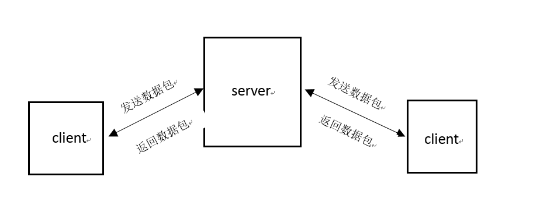


我们测试机器的配置如下图所示，我们共有三台配置相同的机器，其中两台作为客户端，一台作为服务端

机器配置如下

软件 |软件要求
------|--------
系统内核 |Linux  3.10.94 x86_64 x86_64 GNU/Linux
cpu 信息|3.30Ghz cpu*8
内存信息|16GB
网卡|千兆网卡
硬盘信息|7200rpm 机械硬盘

第一项测试我们测试机器的常规性能，我们在客户端机器上上部署了2个网络线程和5个业务线程，发送常规大小的业务数据测试
第二项测试我们测试tars的极限性能，我们分别在两台作为客户端的机器上上开了50个进程，每个进程下有16个线程，每个线程发送4字节大小的业务数据包，测试结果如下，

语言种类|客户端机器数量|进程数量|线程数量|字节包大小（B）|TPS（w/s）|平均耗时(ms)|cpu利用率|网卡入流量(Mb/s)|出流量(Mb/s)|网卡入包量(/s)|出包量(/s)
--------|------------|--------|-------|--------------|----------|-----------|--------|---------------|------------|-------------|-------
c++ |1 |1|1 |4   |0.7|0.13|3%|8M　　　　　|　7M|7214　　|　7220
c++ |1 |1|1 |1024|0.52|0.17|3%|53M　　　　|　50M|5677 　|　5666
c++ |2 |1|10|4   |11.39|0.17|28%|139.729M|	92.389M|127,267|127,923
c++ |2 |1|10|1024|6.73|0.29|19%|644.135M |	616.395M |95,424|95,823
c++ |2 |2|10|4   |20.05|0.20 |63%|238.542M|	158.658M|220,434|221,658
c++ |2 |2|10|1024|10.03|0.38|38%|972.232M |	930.256M |141,841|	142,388
c++ |2 |5|10|4   |27.22|0.37 |84%| 327.972M| 215.173M|306,896 |	300,099 
c++ |2 |5|10|1024|10.02|0.96|48% |974.102M	|932.277M |132,091|	133,574
c++ |2 |50|16|4|41|3.88|92% |463.815M|	313.112M|422,732|	431,050
java |1 |1|1 |4   |0.7|0.13|5%|8.424M　　　　　|　6.041M|7773　　|　7793
java|1 |1|1 |1024|0.52|0.17|8%|61.866M |59.951M|6674 　|　6700
java|2 |1|10|4   |9.83|0.18|34%|155.719M|	106.310M|156,681|	148,201
java|2 |1|10|1024|7.82|0.27|26%|694.184M|	669.369M|103,564|	104,158
java |2 |2|10|4   |20.42|0.20 |57%|254.149M|	183.307M|252,928|	259,064
java|2 |2|10|1024|10.03|0.38|41%|964.790M|	930.363M|141,965|	143,004
java|2 |5|10|4   |26.34|0.34 |77%| 244.887M	|186.358M|243,527|	254,967
java|2 |5|10|1024|10.11|0.97|48% |967.217M	|939.408M |132,421|	135,919
java|2 |50|16|4|38|4.27|82% |438.999M	|329.996M|413,046|	426,961

**测试结果仅供参考，实际结果会因为测试条件和测量方法的不同而产生影响**

