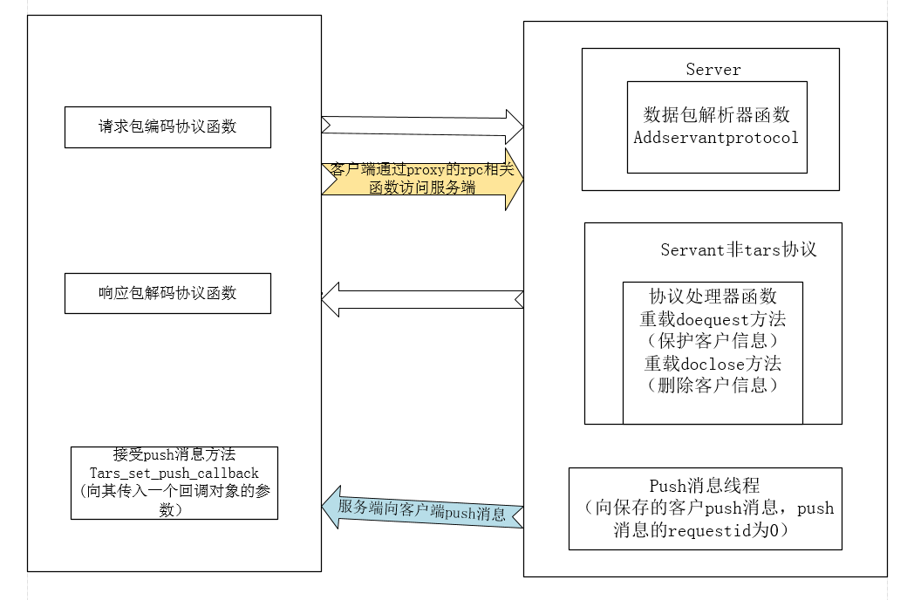
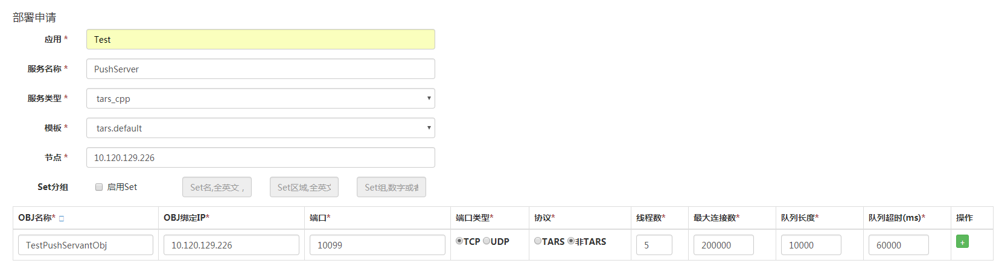
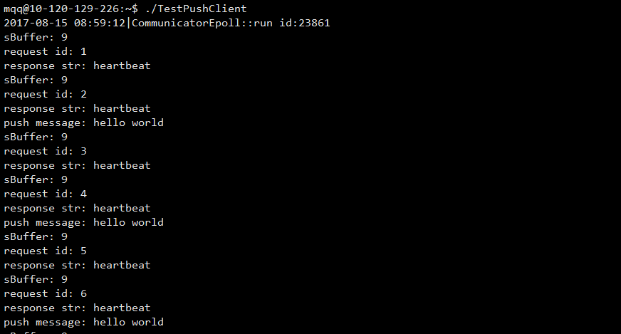

# Tars的push功能

# 目录
> * [1.环境和背景] 
> * [2.push模式的流程图] 
> * [3.服务端功能的实现] 
> * [4.客户端功能的实现] 
> * [5.测试结果] 


## 环境和背景

但是在实际的应用场景中，需要在TARS服务框架中支持其他服务端到客户端的push模式

具体程序示例，参见cpp/examples/pushDemo/.

## push模式的流程图
下面是push模式的示意图



- 黑色线代表了数据流向：数据（客户端）-〉请求包的编码器（客户端）-〉协议解析器（服务端）-〉doRequest协议处理器（服务端）-〉生成返回数据（服务端）-〉响应包的解码器（客户端）-〉响应数据（客户端）
- 黄色线代表客户端访问服务端
- 蓝色线代表服务端向客户端push消息
- 其中**请求包的编码器**（客户端）负责对客户端发送的数据进行打包编码，**协议解析器**（服务端）负责对收到的数据进行解包并交给*
- **协议处理器**（服务端）去处理并生成返回数据，而**响应包的解码器**（客户端）负责对返回的数据进行解码。

## Tars中实现服务端到客户端的push模式：

- 对于服务端，首先服务端需要按照开发第三方协议的模式（即非tars协议），实现协议包的解析器，并将其加载到服务中，同时需要建立一个非TARS框架的服务对象，该类继续继承TARS框架的Servant类，通过重载Servant类中的doRequest方法建立客户端和服务端之间的协议处理器，同时在该方法中保存连接到服务端的客户信息，以便服务端向客户端push消息，另外需要重载Servant类中的doClose方法，在服务器得知客户关闭连接后，释放doRequest方法中保存的客户信息，这样就可以不需要对该客户进行push消息。另外，服务端需要建立一个专门用于向客户端push消息的线程。
- 对应客户端，首先要按照第三方协议的模式，实现协议包的编解码函数，并将其设置到相应的ServantProxy代理的协议解析器中，通过ServantProxy类tars_set_protocol方法实现；然后需要自定义一个回调类，该类继承ServantProxyCallback类，（因为服务端push消息给客户端时，客户端收到消息是异步的，所以客户端对消息的处理以异步方法进行），同时需要重载其中的onDispatch方法，在该方法中，对客户端和服务端之间定义的协议进行解析处理；最后需要new一个上面自定义的回调类，然后将其作为参数传入到ServantProxy的tars_set_push_callback方法中。另外，客户端需要定期的发送消息给服务端（相当于心跳包），以便告诉服务端，客户端是存活的（因为服务端在一定时间内没收到来自客户端的消息，会自动关闭其之间的连接）。
另外，在服务端与客户端push模式交互之前，客户端要访问服务，需要通过调用ServantProxy类的rpc相关函数。

## 服务端功能的实现

### 服务端实现概述
首先我们按照第三方协议代码部署一个TestPushServant 服务
如下图所示在管理平台部署一个服务端



参考tars 支持第三方协议

- 其中TestPushServer类的initialize( ) 加载服务对象TestPushServantImp，并设置第三方协议解析器parse，这里解析器不做任何处理，把接收到的数据包原封不动的传给服务对象去处理（但通常情况下，要对数据进行解析后才交给服务对象去处理），
- 而TestPushServantImp重载继承自Servant类的doRequest方法，该方法为第三方服务的协议处理器，该处理器负责处理协议解析器传送给其的数据，并负责生成返回给客户端的response（本服务为echo服务，因此直接让response等于收到的数据包），同时保存客户的信息状态，以便让pushThread线程对客户进行push消息；
- 另外TestPushServantImp重载继承自Servant类的doClose方法，用于客户关闭连接或者连接超时后清除保存相关的客户信息。


### 服务端代码实现
TestPushServantImp.h
```cpp
#ifndef _TestPushServantImp_H_
#define _TestPushServantImp_H_

#include "servant/Application.h"
//#include "TestPushServant.h"

/**
 *
 *
 */
class TestPushServantImp : public  tars::Servant
{
public:
    /**
     *
     */
    virtual ~TestPushServantImp() {}

    /**
     *
     */
    virtual void initialize();

    /**
     *
     */
    virtual void destroy();

    /**
     *
     */
    virtual int test(tars::TarsCurrentPtr current) { return 0;};


    //重载Servant的doRequest方法
    int doRequest(tars::TarsCurrentPtr current, vector<char>& response);

    //重载Servant的doClose方法
    int doClose(tars::TarsCurrentPtr current);

};
/////////////////////////////////////////////////////
#endif
```
TestPushServantImp.cpp
```cpp
#include "TestPushServantImp.h"
#include "servant/Application.h"
#include "TestPushThread.h"

using namespace std;

//////////////////////////////////////////////////////
void TestPushServantImp::initialize()
{
    //initialize servant here:
    //...
}

//////////////////////////////////////////////////////
void TestPushServantImp::destroy()
{
    //destroy servant here:
    //...
}


int TestPushServantImp::doRequest(tars::TarsCurrentPtr current, vector<char>& response)
{
//保存客户端的信息，以便对客户端进行push消息
	(PushUser::mapMutex).lock();
	map<string, TarsCurrentPtr>::iterator it = PushUser::pushUser.find(current->getIp());
	if(it == PushUser::pushUser.end())
	{
		PushUser::pushUser.insert(map<string, TarsCurrentPtr>::value_type(current->getIp(), current));
		LOG->debug() << "connect ip: " << current->getIp() << endl;
	}
	(PushUser::mapMutex).unlock();
//返回给客户端它自己请求的数据包，即原包返回
	const vector<char>& request = current->getRequestBuffer();
	response = request;

	return 0;
}
//客户端关闭到服务端的连接，或者服务端发现客户端长时间未发送包过来，然后超过60s就关闭连接
//调用的方法
int TestPushServantImp::doClose(TarsCurrentPtr current)
{
	(PushUser::mapMutex).lock();
	map<string, TarsCurrentPtr>::iterator it = PushUser::pushUser.find(current->getIp());
	if(it != PushUser::pushUser.end())
	{
		PushUser::pushUser.erase(it);
		LOG->debug() << "close ip: " << current->getIp() << endl;
	}
	(PushUser::mapMutex).unlock();

	return 0;
}

```
TestPushThread.h
```cpp

#ifndef __TEST_PUSH_THREAD_H
#define __TEST_PUSH_THREAD_H

#include "servant/Application.h"

class PushUser
{
public:
	static map<string, TarsCurrentPtr> pushUser;
	static TC_ThreadMutex mapMutex;
};

class PushInfoThread : public TC_Thread, public TC_ThreadLock
{
public:
	PushInfoThread():_bTerminate(false),_tLastPushTime(0),_tInterval(10),_iId(0){}

	virtual void run();

	void terminate();

	void setPushInfo(const string &sInfo);

private:
	bool _bTerminate;
	time_t _tLastPushTime;
	time_t _tInterval;
	unsigned int _iId;
	string _sPushInfo;
};
#endif


```
TestPushThread.cpp
```cpp
#include "TestPushThread.h"
#include <arpa/inet.h>

map<string, TarsCurrentPtr> PushUser::pushUser;
TC_ThreadMutex PushUser::mapMutex;


void PushInfoThread::terminate(void)
{
	_bTerminate = true;
	{
	    tars::TC_ThreadLock::Lock sync(*this);
	    notifyAll();
	}
}

void PushInfoThread::setPushInfo(const string &sInfo)
{
	  unsigned int iBuffLength = htonl(sInfo.size()+8);
    unsigned char * pBuff = (unsigned char*)(&iBuffLength);

    _sPushInfo = "";
    for (int i = 0; i<4; ++i)
    {
        _sPushInfo += *pBuff++;
    }

    unsigned int iRequestId = htonl(_iId);
    unsigned char * pRequestId = (unsigned char*)(&iRequestId);

    for (int i = 0; i<4; ++i)
    {
        _sPushInfo += *pRequestId++;
    }

    _sPushInfo += sInfo;
}
//定期向客户push消息
void PushInfoThread::run(void)
{
	time_t iNow;

	setPushInfo("hello world");

	while (!_bTerminate)
	{
		iNow =  TC_TimeProvider::getInstance()->getNow();

		if(iNow - _tLastPushTime > _tInterval)
		{
			_tLastPushTime = iNow;

			(PushUser::mapMutex).lock();
			for(map<string, TarsCurrentPtr>::iterator it = (PushUser::pushUser).begin(); it != (PushUser::pushUser).end(); ++it)
			{
				(it->second)->sendResponse(_sPushInfo.c_str(), _sPushInfo.size());
				LOG->debug() << "sendResponse: " << _sPushInfo.size() <<endl;
			}
			(PushUser::mapMutex).unlock();
		}

		{
            TC_ThreadLock::Lock sync(*this);
            timedWait(1000);
		}
	}
}

```
TestPushServer.h
```cpp
#ifndef _TestPushServer_H_
#define _TestPushServer_H_

#include <iostream>
#include "servant/Application.h"
#include "TestPushThread.h"


using namespace tars;

/**
 *
 **/
class TestPushServer : public Application
{
public:
    /**
     *
     **/
    virtual ~TestPushServer() {};

    /**
     *
     **/
    virtual void initialize();

    /**
     *
     **/
    virtual void destroyApp();

    private:
    //用于push消息的线程
    PushInfoThread  pushThread;

};

extern TestPushServer g_app;

////////////////////////////////////////////
#endif

```

TestPushServer.cpp
```cpp
#include "TestPushServer.h"
#include "TestPushServantImp.h"

using namespace std;

TestPushServer g_app;

/////////////////////////////////////////////////////////////////

static int parse(string &in, string &out)
{
    if(in.length() < sizeof(unsigned int))
    {
        return TC_EpollServer::PACKET_LESS;
    }

    unsigned int iHeaderLen;

    memcpy(&iHeaderLen, in.c_str(), sizeof(unsigned int));

    iHeaderLen = ntohl(iHeaderLen);

    if(iHeaderLen < (unsigned int)(sizeof(unsigned int))|| iHeaderLen > 1000000)
    {
        return TC_EpollServer::PACKET_ERR;
    }

    if((unsigned int)in.length() < iHeaderLen)
    {
        return TC_EpollServer::PACKET_LESS;
    }

    out = in.substr(0, iHeaderLen);

    in  = in.substr(iHeaderLen);

    return TC_EpollServer::PACKET_FULL;
}


void
TestPushServer::initialize()
{
    //initialize application here:
    //...

    addServant<TestPushServantImp>(ServerConfig::Application + "." + ServerConfig::ServerName + ".TestPushServantObj");

    addServantProtocol("Test.TestPushServer.TestPushServantObj", parse);

    pushThread.start();

}
/////////////////////////////////////////////////////////////////
void
TestPushServer::destroyApp()
{
    //destroy application here:
    //...
    pushThread.terminate();
    pushThread.getThreadControl().join();

}
/////////////////////////////////////////////////////////////////
int
main(int argc, char* argv[])
{
    try
    {
        g_app.main(argc, argv);
        g_app.waitForShutdown();
    }
    catch (std::exception& e)
    {
        cerr << "std::exception:" << e.what() << std::endl;
    }
    catch (...)
    {
        cerr << "unknown exception." << std::endl;
    }
    return -1;
}
/////////////////////////////////////////////////////////////////
```

## 客户端实现

### 客户端实现概述
本节介绍客户端通过proxy的方式来访问服务端，具体步骤如下：
- 客户端首先建立通信器（Communicator _comm），并通过该通信器获取proxy，代码格式如下：

 ```cpp
  string sObjName = "Test.TestPushServer.TestPushServantObj";
  string sObjHost = "tcp -h 10.120.129.226 -t 60000 -p 10099";
	_prx = _comm.stringToProxy<ServantPrx>(sObjName+"@"+sObjHost);
```
-  编写proxy的请求包的编码器和响应包的解码器并设置，代码格式如下：
  ```
请求包的编码器格式：
static void FUN1(const RequestPacket& request, string& buff)
响应包的解码器格式：
static size_t FUN2(const char* recvBuffer, size_t length, list<ResponsePacket>& done)
proxy设置代码为：
ProxyProtocol prot;
prot.requestFunc = FUN1;
prot.responseFunc = FUN2 ;
_prx->tars_set_protocol(prot);
```
 - 同步方法或者异步方法访问服务端
 
	  - 同步方法通过调用proxy的rpc_call方法访问服务
   ```
	 virtual void rpc_call(uint32_t requestId, const string& sFuncName,const char* buff, uint32_t len, ResponsePacket& rsp);  
   ```
   其中参数requestId需要在一个object内唯一，可以通过proxy的 uint32_t tars_gen_requestid()接口获得一个该object内唯一的id。sFuncName主要用于框架层对接口调用的统计分析，可以缺省为""。buff为要发送的内容，len为buff的长度。rsp则为本次调用得到的ResponsePacket包。

    - 异步方法通过调用proxy的rpc_call_asyc方法访问服务
    
      ```
			virtual void rpc_call_async(uint32_t requestId, const string& sFuncName, const char* buff, uint32_t len,  const ServantProxyCallbackPtr& callback);
      ```
      其中参数requestId需要在一个object内唯一，可以通过proxy的 uint32_t tars_gen_requestid()接口获得一个该object内唯一的id。sFuncName为回调对象响应后调用的函数名。buff为要发送的内容，len为buff的长度。callback则为本次调用返回结果后，即服务端返回处理结果后，此回调对象会被响应。

- 设置接受服务端的push消息方法：
```
TestPushCallBackPtr cbPush = new TestPushCallBack();
_prx->tars_set_push_callback(cbPush);
 ``` 
  
### 客户端具体实现

main.cpp
```cpp
#include "servant/Application.h"
#include "TestRecvThread.h"
#include <iostream>

using namespace std;
using namespace tars;

int main(int argc,char**argv)
{
    try
    {
		RecvThread thread;
		thread.start();

		int c;
		while((c = getchar()) != 'q');

		thread.terminate();
		thread.getThreadControl().join();
    }
    catch(std::exception&e)
    {
        cerr<<"std::exception:"<<e.what()<<endl;
    }
    catch(...)
    {
        cerr<<"unknown exception"<<endl;
    }
    return 0;
}

```
TestRecvThread.h
```
#ifndef __TEST_RECV_THREAD_H
#define __TEST_RECV_THREAD_H

#include "servant/Application.h"

class TestPushCallBack : public ServantProxyCallback
{
public:
	virtual int onDispatch(ReqMessagePtr msg);
};
typedef tars::TC_AutoPtr<TestPushCallBack> TestPushCallBackPtr;

class RecvThread : public TC_Thread, public TC_ThreadLock
{
public:
	RecvThread();

	virtual void run();

	void terminate();
private:
	bool _bTerminate;

	Communicator _comm;

	ServantPrx  _prx;
};
#endif

```
TestRecvThread.cpp
```
#include "TestRecvThread.h"
#include <iostream>
#include <arpa/inet.h>

/*
 响应包解码函数，根据特定格式解码从服务端收到的数据，解析为ResponsePacket
*/
static size_t pushResponse(const char* recvBuffer, size_t length, list<ResponsePacket>& done)
{
	size_t pos = 0;
    while (pos < length)
    {
        unsigned int len = length - pos;
        if(len < sizeof(unsigned int))
        {
            break;
        }

        unsigned int iHeaderLen = ntohl(*(unsigned int*)(recvBuffer + pos));

        //做一下保护,长度大于M
        if (iHeaderLen > 100000 || iHeaderLen < sizeof(unsigned int))
        {
            throw TarsDecodeException("packet length too long or too short,len:" + TC_Common::tostr(iHeaderLen));
        }

        //包没有接收全
        if (len < iHeaderLen)
        {
            break;
        }
        else
        {
            ResponsePacket rsp;
			rsp.iRequestId = ntohl(*((unsigned int *)(recvBuffer + pos + sizeof(unsigned int))));
			rsp.sBuffer.resize(iHeaderLen - 2*sizeof(unsigned int));
		  ::memcpy(&rsp.sBuffer[0], recvBuffer + pos + 2*sizeof(unsigned int), iHeaderLen - 2*sizeof(unsigned int));

			pos += iHeaderLen;

            done.push_back(rsp);
        }
    }

    return pos;
}
/*
   请求包编码函数，本函数的打包格式为
   整个包长度（字节）+iRequestId（字节）+包内容
*/
static void pushRequest(const RequestPacket& request, string& buff)
{
    unsigned int net_bufflength = htonl(request.sBuffer.size()+8);
    unsigned char * bufflengthptr = (unsigned char*)(&net_bufflength);

    buff = "";
    for (int i = 0; i<4; ++i)
    {
        buff += *bufflengthptr++;
    }

    unsigned int netrequestId = htonl(request.iRequestId);
    unsigned char * netrequestIdptr = (unsigned char*)(&netrequestId);

    for (int i = 0; i<4; ++i)
    {
        buff += *netrequestIdptr++;
    }

    string tmp;
    tmp.assign((const char*)(&request.sBuffer[0]), request.sBuffer.size());
    buff+=tmp;
}

static void printResult(int iRequestId, const string &sResponseStr)
{
	cout << "request id: " << iRequestId << endl;
	cout << "response str: " << sResponseStr << endl;
}
static void printPushInfo(const string &sResponseStr)
{
	cout << "push message: " << sResponseStr << endl;
}

int TestPushCallBack::onDispatch(ReqMessagePtr msg)
{
	if(msg->request.sFuncName == "printResult")
	{
		string sRet;
		cout << "sBuffer: " << msg->response.sBuffer.size() << endl;
		sRet.assign(&(msg->response.sBuffer[0]), msg->response.sBuffer.size());
		printResult(msg->request.iRequestId, sRet);
		return 0;
	}
	else if(msg->response.iRequestId == 0)
	{
		string sRet;
		sRet.assign(&(msg->response.sBuffer[0]), msg->response.sBuffer.size());
		printPushInfo(sRet);
		return 0;
	}
	else
	{
		cout << "no match func!" <<endl;
	}
	return -3;
}

RecvThread::RecvThread():_bTerminate(false)
{
	string sObjName = "Test.TestPushServer.TestPushServantObj";
    string sObjHost = "tcp -h 10.120.129.226 -t 60000 -p 10099";

    _prx = _comm.stringToProxy<ServantPrx>(sObjName+"@"+sObjHost);

	ProxyProtocol prot;
    prot.requestFunc = pushRequest;
    prot.responseFunc = pushResponse;

    _prx->tars_set_protocol(prot);
}

void RecvThread::terminate()
{
	_bTerminate = true;
	{
	    tars::TC_ThreadLock::Lock sync(*this);
	    notifyAll();
	}
}

void RecvThread::run(void)
{
	TestPushCallBackPtr cbPush = new TestPushCallBack();
	_prx->tars_set_push_callback(cbPush);	

	string buf("heartbeat");

	while(!_bTerminate)
	{
		{
			try
			{
				TestPushCallBackPtr cb = new TestPushCallBack();
				_prx->rpc_call_async(_prx->tars_gen_requestid(), "printResult", buf.c_str(), buf.length(), cb);
			}
			catch(TarsException& e)
			{     
				cout << "TarsException: " << e.what() << endl;
			}
			catch(...)
			{
				cout << "unknown exception" << endl;
			}
		}

		{
            TC_ThreadLock::Lock sync(*this);
            timedWait(5000);
		}
	}
}

```


## 客户端测试结果

如果push 成功，结果如下




