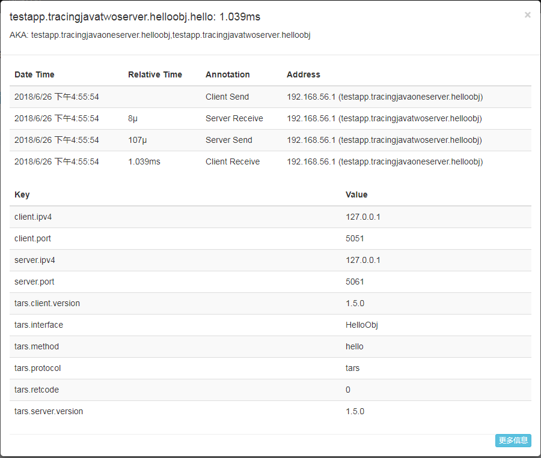

# tars 调用链

## 问题背景

当一个生产系统面对真正的高并发，或者解耦成大量微服务时，以前很容易实现的重点任务变得困难了，需要对分布式系统内各组件的调用情况进行分析，在此背景下，OpenTracing提出了与平台无关，厂商无关的分布式跟踪系统标准语义模型以及标准API，秉着拥抱开源的原则，优先支持了这套正在成为全球分布式追踪统一概念和数据标准的方案

## 设计使用方法

### 数据采集

tars框架内部采用opentracing api来封装调用链数据采集功能，并且封装了opentracing api的zipkin-brave实现。

#### 数据埋点

- client send: 如果当前线程存在span，那么创建一个新的子span,如果不存在，那么创建一个新的tracer的根span,span类型为client，对于tars rpc调用，span tag信息中填写标准的peer相关信息还有自定义信息。

- client receive: 关闭发起请求时对应的client span， 调用发生错误时需要填写标准定义的span log信息。
- server receive: 如果请求中包含调用链上下文信息，则共享传输过来的span信息，否则开启一个新的span，span类型为server， span tag中填写自定义信息。

- server send: 关闭对应的server span，服务发生错误时需要填写标准定义的span log信息。

#### 数据采集抽样

- 按比例采集，在配置文件中配置比例，当前版本只支持此种方式。
- 自定义过滤方法采集，框架提供接口，由用户自己实现并注册。
- 其他采样方式......

#### 上报内容

每一种埋点产生的span和Span Context信息,具体见opentracing标准定义。

#### 客户端自定义上报

用户可通过框架提供的自定义接口在业务代码中上报自己定义的事件和信息。

### 数据上报

### 数据上报格式

- http 序列化后的数据通过http协议上报数据，直接上报数据到跟踪系统。
- kafaka 上报 序列化后的数据写入到kafka集群中，再由跟踪系统读取kafka后反序列化

### 数据格式

上报数据格式和具体的调用链数据收集示例有关，不同的实例有不同的格式，以下以快速集成zipkin为例,展示出可读性强的json格式。

#### json格式

```json
[
	{
	"traceId": "16661f6cb5d58903", #trace id,必填
	"id": "16661f6cb5d58903", #span id，必填
	"parentId": "89e051d5394b90b1", #parent span id，选填
	"king": "client",
	"name": "encode", #服务函数名
	"timestamp": 1510043590522358, #起始时间戳
	"duration": 499867, #span的耗时，结束时间戳减去起始时间戳
	"localEndpoint": { #主调信息
			"serviceName": "tracer‐demo",
			"ipv4": "192.168.99.1",
			"port": 9090
	},
	"remoteEndpoint": {#被调信息
			"serviceName": "tracer‐demo",
			"ipv4": "192.168.99.1",
			"port": 9090
	},
	"annotations": [ #span log， cs, cr, sr, ss的事件都包含在这里面
	{
			"value": "", #对于event以外的事件转为key1=value1 key2=value2的字符串
			"timestamp": ""
	}
]
"tags": { #自定义tag
	"${key的名字}": "value",
	...
}
	"debug": true,
	"shared" true
}
]
```


#### 数据分析与展示

框架内置集成zipkin系统，可通过zipkin的页面查询调用链数据。


## tars-java 使用方法

目前tars -java从1.5.0版本开始支持调用链，cpp 版本即将放出，下面以集成zipkin为例介绍。

### 开启调用链 

开启调用链功能不需要改写一行业务代码，只需增加指定的服务配置即可。

操作步骤说明：

1. 在tars管理平台上选中要开启调用链的服务，点击“编辑”。

   

   2.选择编辑私有模版，填写以下内容：

```
<tars>
	<application>
		<server>
			samplerate=1   
			sampleaddress=http://localhost:9411/  
			sampletype=http  
			sampleencoding=json
		</server>
	</application>
</tars>
```

 说明：

| 参数名称            | 类型   | 可选值范围                | 备注                                       |
| --------------- | ---- | -------------------- | ---------------------------------------- |
| samplerate      | 浮点小数 | [0,1]   区间           | 采样率，范围为0~1。0代表不开启采样，按照百分比采样              |
| sampleaddress   | 字符串  | 无                    | 采样数据上报地址，如果采用http方式上报，填写数据收集web服务器的url，采用zipkin收集数据即填zipkin server的url，如果采用kafka方式上报，填写kafka集群的地址。 |
| sampletype      | 字符串  | http, kafka, kafka08 | 采样数据上报传输方式，对于集成zipkin的实现，目前支持通过http和kafka两种传输方式。填写"http"代表使用http协议上报，填写“kafka”表示将采集数据传输到kafka中。"kafka08"选项用于兼容0.10以下的kafka brokers，具体事项见下方注意第一条。 |
| sampleencodeing | 字符串  | json,  proto            | 采样数据上报传输编码格式，对于集成zipkin的实现，支持json和protocol buffer proto3两种格式，填写"json"表示采用json编码，填写“proto”表示采用pb编码。 |

注意：

> - 采用kafka方式传输数据时，默认采用的kafka-clients版本为1.1.0，需要保证kafka brokers版本为0.10.x及以上。对于0.8.x~0.10的kafka brokers版本，sampletype填写“kafka08”,并且在业务代码的pom.xml中替换kafka-clients库：
>
>   ```xml
>   <dependency>
>         <groupId>com.tencent.tars</groupId>
>         <artifactId>tars-core</artifactId>
>         <version>1.5.0</version>
>         <exclusions>  
>         	<exclusion>  
>         		<groupId>org.apache.kafka</groupId>  
>         		<artifactId>kafka-clients</artifactId>  
>         	</exclusion> 
>         </exclusions>
>   </dependency>
>   <dependency>
>   	<groupId>org.apache.kafka</groupId>  
>       <artifactId>kafka-clients</artifactId>
>       <version>0.8.2.2</version>
>   </dependency>
>   ```
>
>   ​
>
> - 采样数据上报编码方式若要采用proto buffer proto3格式，需要保证zipkin server的版本在2.8.0及以上。
>
> - 如果对于调用链功能有长期的需求，建议自己创建一个新的模版文件填入私有模版中的配置内容，并且为需要调用链追踪的服务启用这个模版。

## 自定义上报信息：

tars-java支持用户在业务代码中上报自定义的信息到调用链追踪系统中，通过调用框架提供的api即可完成，使用示例如下：

上报键值对信息：

```java
TraceContext.getInstance().tag("key", "value");
```

key, value为自定义值。

上报事件性信息：

```java
TraceContext.getInstance().log("an event has occurred");
```

消息内容为自定义内容

## 调用链展示

现在以集成zipkin为例展示所上报的数据。

- 获取zipkin server的可执行jar包。

  参考 https://github.com/openzipkin/zipkin

- 启动zipkin server,启动参数设置请参考zipkin官方文档说明。
- 配置前台配置文件中的xxx.xml
```xml
trace_html=zipkin_address(include http://)
```
- 最终效果如下图所示


点开单次调用链查看详细信息：




调用链key-value信息说明：

| key                 | value                           |
| ------------------- | ------------------------------- |
| client.ipv4         | 客户端ipv4地址。                      |
| client.port         | 客户端端口。                          |
| server.ipv4         | 服务端ipv4地址。                      |
| server.port         | 服务端端口。                          |
| tars.interface      | 服务端被调接口名（对于tars-java来说就是一个obj）。 |
| tars.method         | 服务端被调方法名。                       |
| tars.protocol       | 数据编码协议。                         |
| tars.retcode        | 调用返回码，0表示成功，非0为失败。              |
| tars.client.version | 客户端tars版本                       |
| tars.server.version | 服务端tars版本                       |


依赖分析展示：


